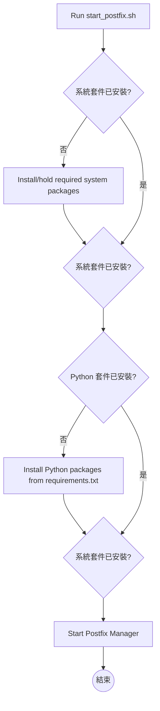
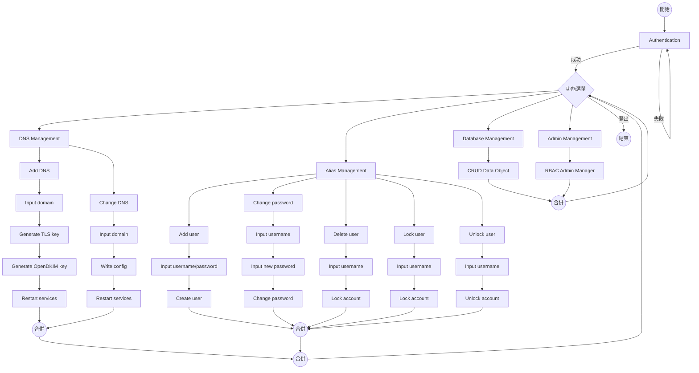

# PostfixManager - 自建郵件伺服器完整指南

> [!abstract] 文章摘要
> 本文詳細介紹如何使用 **PostfixManager** 工具快速架設完整的郵件伺服器，包含 Postfix、Dovecot、OpenDKIM 與 Certbot 等服務。從環境準備、安裝部署到用戶端設定，提供圖文並茂的完整操作手冊。

 **GitHub 專案**: [hsjinde/mail-server](https://github.com/hsjinde/mail-server)

---

## 目錄

1. [程式簡介與架構](#程式簡介與架構)
2. [適用環境](#適用環境)
3. [安裝與部署](#安裝與部署)
4. [系統操作指南](#系統操作指南)
5. [郵件用戶端設定](#郵件用戶端設定)
6. [常見問題排解](#常見問題排解)

---

## 程式簡介與架構

### 什麼是 PostfixManager？

PostfixManager 是一套自動化郵件伺服器管理工具，協助使用者快速部署與管理以下核心服務：

| 服務 | 功能說明 |
|------|----------|
| **Postfix** | SMTP 郵件傳輸代理，負責郵件發送與接收 |
| **Dovecot** | IMAP/POP3 郵件存取服務，提供用戶端連線 |
| **OpenDKIM** | 郵件數位簽章驗證，提升郵件可信度 |
| **Certbot** | 自動化管理 Let's Encrypt SSL/TLS 憑證 |

> [!tip] 核心優勢
> - ✅ 自動檢查並安裝必要套件
> - ✅ 簡易 Web 介面管理域名與用戶
> - ✅ 支援 DKIM、SPF、DMARC 郵件驗證機制
> - ✅ 一鍵啟動，降低架設門檻

### 系統流程圖

#### (1) 啟動與安裝流程



#### (2) PostfixManager 主程式架構



---

## 適用環境

| 項目 | 規格需求 |
|------|----------|
| **作業系統** | Ubuntu 20.04（建議 Linux 環境） |
| **Python 版本** | 3.8.10 |
| **權限需求** | 需具備 `sudo` 權限 |
| **網路需求** | 固定 IP 或動態 DNS 服務 |

> [!warning] 注意事項
> - 確保伺服器 25、465、587、993、995 等郵件相關埠未被防火牆阻擋
> - 建議使用獨立伺服器或 VPS，避免與現有服務衝突

---

## 安裝與部署

### 檔案結構確認

請確保下列檔案位於同一資料夾：

```
Your Folder/
├── PostfixManager         # 主程式（可執行檔）
── start_postfix.sh       # 啟動與安裝腳本
├── requirements.txt       # Python 依賴套件
└── db.sqlite3             # 資料庫檔案
```

### 安裝步驟

#### 步驟 1：開啟終端機並切換至資料夾

```bash
cd /path/to/your/folder
```

#### 步驟 2：執行安裝與啟動腳本

```bash
chmod +x PostfixManager start_postfix.sh 
sudo ./start_postfix.sh
```

> [!note] 腳本功能
> - 自動檢查並安裝缺少的系統套件
> - 自動安裝 `requirements.txt` 內的 Python 依賴
> - 啟動 PostfixManager 主程式

#### 步驟 3：Postfix 安裝設定

執行腳本後，會出現 Postfix 設定畫面：

**選擇郵件伺服器類型：**

-20260617T051205Z-3-001/V 1.0.2(pakage)/assets/Postfix-1.png)

> 請選擇 **Internet Site**，讓郵件可以直接透過 SMTP 發送與接收。

**設定系統郵件名稱：**

-20260617T051205Z-3-001/V 1.0.2(pakage)/assets/Postfix-2.png)

> 輸入您的完整網域名稱（FQDN），例如 `mail.yourdomain.com`

#### 步驟 4：啟動成功畫面

安裝完成後，會看到類似以下畫面：

-20260617T051205Z-3-001/V 1.0.2(pakage)/assets/run_start_postfix.png)

> [!success] 啟動成功
> 看到 `Starting development server at http://0.0.0.0:8000/` 表示服務已成功啟動！

---

## 系統操作指南

### 使用者登入 (Authentication)

#### 登入畫面

-20260617T051205Z-3-001/V 1.0.2(pakage)/assets/Authentication-1.png)

點擊 **登入** 按鈕進入帳號密碼輸入頁面。

#### 輸入帳號密碼

-20260617T051205Z-3-001/V 1.0.2(pakage)/assets/Authentication-2.png)

| 欄位 | 預設值 |
|------|--------|
| Username | `admin` |
| Password | `Aa123456` |

> [!danger] 安全提醒
> 首次登入後請立即修改預設密碼！

#### 修改管理員密碼

1. 進入 Django 管理後台，選擇要修改的管理員帳號：

-20260617T051205Z-3-001/V 1.0.2(pakage)/assets/admin_Management-1.png)

2. 點擊密碼欄位的 **this form** 連結：

-20260617T051205Z-3-001/V 1.0.2(pakage)/assets/admin_Management-2.png)

3. 輸入新密碼並確認：

-20260617T051205Z-3-001/V 1.0.2(pakage)/assets/admin_Management-3.png)

> [!tip] 密碼規則
> - 至少 8 個字元
> - 不能與個人資訊太相似
> - 不能是常見密碼
> - 不能純數字

---

### 域名管理 (DNS Management)

登入後主畫面會顯示系統狀態資訊：

| 顯示項目 | 說明 |
|----------|------|
| **CURRENT USER** | 目前登入的使用者帳號 |
| **CURRENT DOMAIN IN USE** | 當前管理的網域名稱 |
| **SYSTEM MESSAGE** | 系統提示訊息 |
| **DNS COUNT** | 已管理的域名數量 |

-20260617T051205Z-3-001/V 1.0.2(pakage)/assets/DNS_Management-1.png)

#### 新增域名

1. 輸入欲新增的域名，點擊 **Create & Use**：

-20260617T051205Z-3-001/V 1.0.2(pakage)/assets/DNS_Management-Add_DNS-1.png)

2. 域名建立完成後會顯示在列表中：

-20260617T051205Z-3-001/V 1.0.2(pakage)/assets/DNS_Management-Add_DNS-2.png)

3. 系統會自動生成 DNS 記錄資訊，請記錄下來：

-20260617T051205Z-3-001/V 1.0.2(pakage)/assets/DNS_Management-Add_DNS-3.png)

#### DNS 記錄類型說明

| 記錄類型 | 用途 | 範例 |
|----------|------|------|
| **A Record** | 將域名指向伺服器 IP | `mail.yourdomain.com → 192.168.1.100` |
| **MX Record** | 指定郵件伺服器 | `yourdomain.com → mail.yourdomain.com (priority: 10)` |
| **TXT (SPF)** | 防止郵件偽造 | `v=spf1 mx a ip4:您的IP ~all` |
| **TXT (DKIM)** | 數位簽章驗證 | `v=DKIM1; k=rsa; p=MIGfMA0...` |
| **TXT (DMARC)** | 郵件驗證政策 | `v=DMARC1; p=quarantine; rua=mailto:dmarc@yourdomain.com` |

#### Cloudflare DNS 設定範例

> [!example] 以 Cloudflare 為例

**步驟 1：新增 A Record**

-20260617T051205Z-3-001/V 1.0.2(pakage)/assets/Cloudflare-A.png)

> ⚠️ **重要**：郵件伺服器的 A Record 務必 **關閉 Cloudflare 代理功能**（灰色雲朵）

**步驟 2：新增 MX Record**

-20260617T051205Z-3-001/V 1.0.2(pakage)/assets/Cloudflare-MX.png)

**步驟 3：新增 DMARC 記錄**

-20260617T051205Z-3-001/V 1.0.2(pakage)/assets/Cloudflare-dmarc.png)

**步驟 4：新增 DKIM 記錄**

-20260617T051205Z-3-001/V 1.0.2(pakage)/assets/Cloudflare-domainkey.png)

**步驟 5：新增 SPF 記錄**

-20260617T051205Z-3-001/V 1.0.2(pakage)/assets/Cloudflare-srf.png)

#### DNS 設定驗證

完成設定後，可使用以下指令驗證：

```bash
# 檢查 A 記錄
nslookup mail.yourdomain.com

# 檢查 MX 記錄
nslookup -type=MX yourdomain.com

# 檢查 TXT 記錄
nslookup -type=TXT yourdomain.com 8.8.8.8
nslookup -type=TXT _dmarc.yourdomain.com 8.8.8.8
nslookup -type=TXT mail._domainkey.yourdomain.com 8.8.8.8
```

> [!info] DNS 生效時間
> DNS 記錄修改後通常需要 **1-24 小時** 才會完全生效，建議等待後再進行郵件測試。

#### 切換使用中的域名

點擊域名列表中的 **Use** 按鈕即可切換：

-20260617T051205Z-3-001/V 1.0.2(pakage)/assets/DNS_Management-Change_DNS.png)

---

### 別名管理 (Alias Management)

別名管理用於建立郵件帳號（如 `user1@yourdomain.com`）。

-20260617T051205Z-3-001/V 1.0.2(pakage)/assets/Alias_Management.png)

#### 新增別名帳號

輸入帳號與密碼，點擊 **Create**：

-20260617T051205Z-3-001/V 1.0.2(pakage)/assets/Alias_Management-Add_user-1.png)

建立成功後會顯示在列表中：

-20260617T051205Z-3-001/V 1.0.2(pakage)/assets/Alias_Management-Add_user-2.png)

#### 更改密碼

點擊 **Change PWD** 按鈕進入密碼修改頁面：

-20260617T051205Z-3-001/V 1.0.2(pakage)/assets/Alias_Management-Change_password.png)

#### 鎖定/解鎖帳號

- **鎖定**：暫停該帳號收發信功能
- **解鎖**：恢復帳號功能

-20260617T051205Z-3-001/V 1.0.2(pakage)/assets/Alias_Management-Lock_user.png)

-20260617T051205Z-3-001/V 1.0.2(pakage)/assets/Alias_Management-UnLock_user.png)

> [!note] 鎖定狀態指示
> - 🟢 綠色圓點：帳號正常
> - 🔴 紅色圓點：帳號已鎖定

#### 刪除帳號

點擊 **Delete** 按鈕，確認後即可刪除：

-20260617T051205Z-3-001/V 1.0.2(pakage)/assets/Alias_Management-Delete_user.png)

> [!danger] 警告
> 刪除帳號為不可逆操作，請謹慎執行！

---

### 資料庫管理 (Database Management)

提供資料庫查詢、備份與還原功能，確保郵件與帳號資訊安全。

---

### 使用者管理 (Admin Management)

管理系統管理員帳號，包含新增、修改密碼、刪除等功能（參考上方「修改管理員密碼」段落）。

---

## 郵件用戶端設定

### Microsoft Outlook 設定

#### 步驟 1：新增資料檔

-20260617T051205Z-3-001/V 1.0.2(pakage)/assets/outlook_setting-1.png)

1. 開啟 Outlook，點選「工具」>「帳戶設定」>「資料檔」>「新增」
2. 選擇「Office Outlook 個人資料檔」，點選「確定」

#### 步驟 2：新增電子郵件帳號

選擇「網際網路電子郵件」：

-20260617T051205Z-3-001/V 1.0.2(pakage)/assets/outlook_setting-2.png)

#### 步驟 3：手動設定伺服器

勾選「手動設定伺服器或其他伺服器類型」：

-20260617T051205Z-3-001/V 1.0.2(pakage)/assets/outlook_setting-3.png)

#### 步驟 4：輸入帳號資訊

-20260617T051205Z-3-001/V 1.0.2(pakage)/assets/outlook_setting-5.png)

| 欄位 | 設定值 |
|------|--------|
| 您的名稱 | 自訂顯示名稱 |
| 電子郵件地址 | `別名@域名`（如 `user1@piplup-software.org`） |
| 帳戶類型 | IMAP（建議）或 POP3 |
| 內送郵件伺服器 | `mail.您的域名` |
| 外寄郵件伺服器 | `mail.您的域名` |
| 使用者名稱 | 別名 |
| 密碼 | 登入密碼 |

#### 步驟 5：進階設定

-20260617T051205Z-3-001/V 1.0.2(pakage)/assets/outlook_setting-6.png)

| 設定項目 | 值 |
|----------|-----|
| 內送伺服器 (POP3) | **995**（勾選 SSL） |
| 外寄伺服器 (SMTP) | **587**（選擇 TLS） |

> [!tip] 連線安全
> - 內送伺服器建議使用 **SSL/TLS** 加密
> - 外寄伺服器建議使用 **STARTTLS**

#### 步驟 6：新增自訂資料夾

-20260617T051205Z-3-001/V 1.0.2(pakage)/assets/outlook_setting-7.png)

右鍵點選帳號名稱，可新增「收件匣」、「寄件備份」等自訂資料夾。

---

## 常見問題排解

### Q: 執行腳本時出現權限不足？

**A:** 請加上 `sudo` 執行腳本：

```bash
sudo ./start_postfix.sh
```

### Q: 缺少某些套件或版本不符？

**A:** 腳本會自動安裝，若失敗可手動安裝：

```bash
sudo apt update
sudo apt install -y postfix dovecot-core dovecot-imapd dovecot-pop3d opendkim opendkim-tools certbot
```

### Q: PostfixManager 無法啟動？

**A:** 請確認：
1. 執行檔存在於同一資料夾
2. 具有執行權限：`chmod +x PostfixManager`
3. Python 版本符合需求（3.8.10）

### Q: 郵件無法發送/接收？

**A:** 請檢查：
1. DNS 記錄是否正確設定並生效
2. 防火牆是否開放相關埠（25, 465, 587, 993, 995）
3. SSL/TLS 憑證是否有效
4. DKIM/SPF/DMARC 記錄是否正確

### Q: 如何備份資料庫？

**A:** 使用資料庫管理功能進行備份，或直接複製 `db.sqlite3` 檔案。

---

## 結語

PostfixManager 提供了一套完整的郵件伺服器解決方案，從自動化安裝到 Web 介面管理，大幅降低了自建郵件伺服器的門檻。透過正確的 DNS 設定與安全機制（DKIM、SPF、DMARC），您可以擁有穩定且可信的郵件服務。

> [!tip] 延伸閱讀
> - [Postfix 官方文件](http://www.postfix.org/documentation.html)
> - [Dovecot 設定指南](https://doc.dovecot.org/)
> - [OpenDKIM 說明](http://opendkim.org/)
> - [Let's Encrypt 憑證申請](https://letsencrypt.org/)

---

*本文基於 [hsjinde/mail-server](https://github.com/hsjinde/mail-server) 專案撰寫，如有問題歡迎至 GitHub 提出 Issue。*
