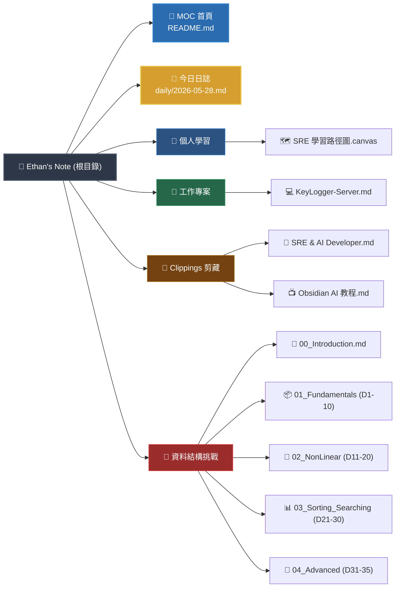

# 🗂️ Ethan's Second Brain (數位花園首頁)

歡迎來到你的 Obsidian 數位花園！這個首頁（Map of Content, MOC）將作為你整個知識庫的導航地圖。

> [!info] 👤 關於園主 Ethan
> Ethan 是一位 **SRE 工程師 / AI 系統開發者**，專注於 RNN 查詢優化研究、高可用架構設計，並以 SRE 思維構建自動化與智能化的基礎設施。
> 🔗 詳細個人履歷與技術棧：[[Clippings/SRE Engineer & AI Systems Developer]]

---

## 🗺️ 筆記地圖與目錄整理

依照你目前的筆記資料夾結構，我為你整理並分類了以下四大板塊：

### 1. 🎓 個人學習與基礎學科 (Personal Learning)
專注於 SRE 技能樹成長與計算機科學基礎的複習。
*   **SRE 學習路徑規劃**：
    *   [[個人學習/SRE 學習路徑圖.canvas|🗺️ SRE 學習路徑圖 (Canvas)]]：一個精美且結構化的六階段 SRE 成長地圖，包含 Linux 系統管理、網路基礎、監控觀測、分散式系統、混沌工程及平台工程。
*   **資料結構與演算法複習（iThome 鐵人挑戰 35D）**：
    *   [[資料結構-鐵人挑戰-35D/00_資料結構-鐵人挑_Introduction|🏁 挑戰起點與總目錄 (Introduction)]]
    *   [[資料結構-鐵人挑戰-35D/01_Day01-10_Fundamentals|📦 Day 01-10：資料結構與演算法基礎]]（陣列、鏈結串列、堆疊、佇列、雜湊表及實作）
    *   [[資料結構-鐵人挑戰-35D/02_Day11-20_NonLinear_Structures|🌿 Day 11-20：非線性資料結構]]（遞迴、樹、二元搜尋樹、堆積、圖及實作）
    *   [[資料結構-鐵人挑戰-35D/03_Day21-30_Sorting_Searching|📊 Day 21-30：排序與搜尋演算法]]（氣泡、選擇、插入排序等）
    *   [[資料結構-鐵人挑戰-35D/04_Day31-35_Advanced_Searching_Patterns|🚀 Day 31-35：進階搜尋與模式匹配]]

### 2. 💼 工作專案 (Work Projects)
記錄具體開發項目與技術細節。
*   **KeyLogger-Server 項目**：
    *   [[工作專案/KeyLogger-Server]]：基於 C++ 與 Windows API 開發的一對多 Keylogger 控制端軟體。包含Winsock初始化、連線管理、發送批次檔、執行遠端指令等功能。

### 3. 🌐 知識剪藏 (Clippings & References)
收集外部優質文章、影片筆記與重要參考資料。
*   [[Clippings/SRE Engineer & AI Systems Developer|📄 Ethan's Portfolio]]：SRE 工程師個人簡介、技術棧（React、TS、Python、Go、Docker、K8s、Terraform、Prometheus）及線上系統指標（Uptime 99.97%）。
*   [[Clippings/Obsidian Skills Ai自动化笔记新方法 使用配置教程|📺 Obsidian AI 自动化筆記新方法影片剪藏]]：學習如何使用 AI 輔助與優化你的 Obsidian 流程。

### 4. 📅 日誌與日常記錄 (Daily & System)
*   [[daily/|📂 每日日誌資料夾 (daily)]]：存放你每日的想法、待辦事項與進度追蹤。
*   [[daily/2026-05-28|🛠️ Claude Code 系統可用技能整理]]：你當前所使用的 AI 助理（Claudian）之可用技能與指令清單。

---

## 🗺️ 視覺化知識地圖 (Mermaid)

---

## 💡 Obsidian 使用小提示

> [!tip] 雙向連結的使用
> - 在閱讀任何筆記時，你可以點擊上方的 `[[雙向連結]]` 快速跳轉。
> - 在編輯筆記時，輸入 `[[` 即可獲得智慧型文件路徑補全建議。
> - 如果你想引用特定段落，可以使用 `[[筆記名稱#^區塊ID]]`。

> [!success] 命名修正完成
> 原本拼寫錯誤的 `daliy` 資料夾已成功重新命名為 `daily`！所有目錄及雙向連結均已自動修正。
