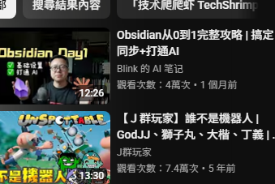

# RTK (Rust Token Killer) 方案分析報告

這份報告分析了 [rtk-ai/rtk](https://github.com/rtk-ai/rtk) 專案。RTK 是一個專為 AI 編碼助手（如 Claude Code, GitHub Copilot, Cursor 等）設計的高性能 CLI 代理工具。

## 什麼是 RTK？

**RTK (Rust Token Killer)** 是一個位於 AI 編碼助手與終端機之間的代理工具。它的主要功能是**過濾並壓縮指令輸出**，在將資料傳回大型語言模型 (LLM) 之前移除冗餘資訊。根據官方數據，RTK 能夠為常見開發任務減少 **60% 到 90%** 的 Token 消耗。

---

## 核心功能

1.  **智慧壓縮策略**：
    *   **過濾 (Filtering)**：移除註解、空白字元及樣板代碼。
    *   **分組 (Grouping)**：將相似項目歸類（例如按目錄歸類檔案，或按類型歸類錯誤）。
    *   **截斷 (Truncation)**：智慧化地切除重複數據，同時保留關鍵上下文。
    *   **去重 (Deduplication)**：合併重複的日誌行（如「10x same error」）。
2.  **透明集成 (Auto-Rewrite Hook)**：
    *   RTK 可以自動攔截 Bash 指令。當 AI 代理執行 `git status` 時，RTK 會自動改為執行 `rtk git status` 並回傳優化後的結果。
3.  **廣泛的生態系統支援**：
    *   支援超過 100 種指令，包括 Git、Cargo、npm、pytest、AWS CLI、Docker、Kubernetes 等。
4.  **Tee 恢復機制**：
    *   若指令執行失敗，RTK 會將原始完整的輸出儲存到本地檔案，供 LLM 在需要時讀取，避免重新執行昂貴的指令。
5.  **節省統計**：
    *   提供 `rtk gain` 指令來追蹤 Token 節省量及預估省下的成本。

---

## 優缺點分析

### 優點 (Pros)

*   **顯著降低成本**：大幅減少 Token 消耗，直接降低使用昂貴模型（如 Claude 3.5 Sonnet）的費用。
*   **提升效能與回應速度**：較小的輸出意味著 LLM 處理速度更快，且能延長對話的上下文窗口 (Context Window)。
*   **極低開銷**：使用 Rust 編寫，指令執行的延遲增加極小（通常小於 10ms）。
*   **易於集成**：初始化後（`rtk init`），在支援的環境下幾乎是透明運作，無需大幅修改現有流程。
*   **隱私保護**：不收集源代碼或祕鑰，僅收集去識別化的遙測數據（且可關閉）。
*   **錯誤復原**：Tee 功能確保了當智慧壓縮過度時，仍有路徑可以獲取完整原始資訊。

### 缺點 (Cons)

*   **作業系統限制**：自動重寫 (Auto-rewrite) 功能主要針對 Unix-like 的 Bash 環境。Windows 原生用戶（CMD/PowerShell）通常需要透過 WSL 使用，或手動在指令前加上 `rtk` 前綴。
*   **攔截限制**：若 AI 工具直接呼叫內建函數（而非透過 Shell 執行指令），RTK 可能無法自動攔截。
*   **過度截斷風險**：雖然有智慧啟發式演算法，但在極少數特殊除錯場景下，可能會意外截斷某些關鍵但被判定為冗餘的細節。
*   **命名衝突**：在 Rust 的生態系統 (crates.io) 中存在同名的專案（Rust Type Kit），安裝時需注意來源。

---

## 總結與建議

對於**重度依賴 AI 輔助開發的團隊或個人**，RTK 是一個高價值、低風險的工具。它能立即轉化為 API 成本的節省並提升 AI 代理的作業效率。

**建議使用對象：**
*   使用 Agentic AI 工具（會自己下指令的工具）的使用者。
*   在意 API 帳單成本的開發者。
*   在 Unix/Linux 或 WSL 環境下工作的工程師。

**不建議或需注意：**
*   僅使用網頁版 AI 介面（如 ChatGPT Web）的使用者（RTK 主要針對 CLI/IDE 代理）。
*   完全不使用 WSL 的純 Windows 開發環境。
