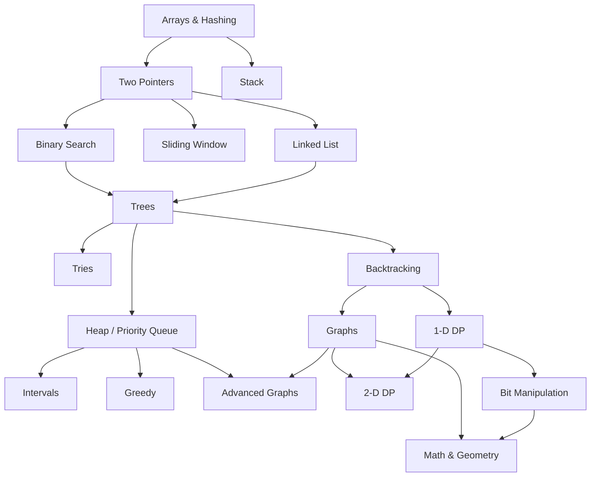

說明 (繁體中文):
本版修正：移除 Stack → (Binary Search / Sliding Window / Linked List) 的箭頭。Stack 保留為獨立補充技巧節點，不直接推進主線。  

---

## Roadmap Diagram (Mermaid)

## Arrays & Hashing
| Problem                      | NeetCode                                                  | LeetCode                                                   | Difficulty | Key Points                     |              筆記               |  Progress  |
| ---------------------------- | --------------------------------------------------------- |:---------------------------------------------------------- |:---------- | ------------------------------ |:-------------------------------:|:----------:|
| Contains Duplicate           | https://neetcode.io/problems/contains-duplicate           | https://leetcode.com/problems/contains-duplicate           | Easy       | HashSet duplicate check        | [Link](/uzqrxdsmT7e9-SSQX00uJw) | 2025.12.18 |
| Valid Anagram                | https://neetcode.io/problems/valid-anagram                | https://leetcode.com/problems/valid-anagram                | Easy       | Frequency count                | [Link](/06y3sCAsRA-2IBKV5p7Q0g) | 2025.12.17 |
| Two Sum                      | https://neetcode.io/problems/two-sum                      | https://leetcode.com/problems/two-sum                      | Easy       | Hash map complement            | [Link](/EM7z-3UcQN29L_7kH41aXA) | 2025.12.18 |
| Group Anagrams               | https://neetcode.io/problems/group-anagrams               | https://leetcode.com/problems/group-anagrams               | Medium     | Sorted key / count signature   | [Link](/qA749NgyTViS0EL_S86bJQ) | 2025.12.24 |
| Top K Frequent Elements      | https://neetcode.io/problems/top-k-frequent-elements      | https://leetcode.com/problems/top-k-frequent-elements      | Medium     | Bucket / heap                  | [link](/rlXfUFCbQT2DJ8FcFfu-ww) | 2026.01.15 |
| Encode and Decode Strings    | https://neetcode.io/problems/encode-and-decode-strings    | https://leetcode.com/problems/encode-and-decode-strings    | Medium     | Custom delimiter length-prefix |                                 |            |
| Product of Array Except Self | https://neetcode.io/problems/product-of-array-except-self | https://leetcode.com/problems/product-of-array-except-self | Medium     | Prefix & suffix pass           | [Link](/k8Ucdk8ZSv6fgxlEY_00Fg) |            |
| Valid Sudoku                 | https://neetcode.io/problems/valid-sudoku                 | https://leetcode.com/problems/valid-sudoku                 | Medium     | Set constraints (row/col/box)  |                                 |            |
| Longest Consecutive Sequence | https://neetcode.io/problems/longest-consecutive-sequence | https://leetcode.com/problems/longest-consecutive-sequence | Medium     | Hash set starts                | [link](/sVHVSWzqRNqAaZ5WtCqwFg) |            |

## Two Pointers
| Problem                            | NeetCode                                               | LeetCode                                                       | Difficulty | Key Points                  |              筆記               |  Progress  |
| ---------------------------------- |:------------------------------------------------------ | -------------------------------------------------------------- | ---------- | --------------------------- |:-------------------------------:|:----------:|
| Valid Palindrome                   | https://neetcode.io/problems/valid-palindrome          | https://leetcode.com/problems/valid-palindrome                 | Easy       | Filter + inward scan        |                                 | 2026.01.16 |
| Two Sum II - Input Array Is Sorted | https://neetcode.io/problems/two-sum-ii                | https://leetcode.com/problems/two-sum-ii-input-array-is-sorted | Medium     | Opposite pointers           |                                 | 2026.01.16 |
| 3Sum                               | https://neetcode.io/problems/3sum                      | https://leetcode.com/problems/3sum                             | Medium     | Sort + skip duplicates      | [Link](/VnEJEwxHShmmg_FhgEfr7g) | 2026.01.19 |
| Container With Most Water          | https://neetcode.io/problems/container-with-most-water | https://leetcode.com/problems/container-with-most-water        | Medium     | Move smaller pointer        |                                 | 2026.01.20 |
| Trapping Rain Water                | https://neetcode.io/problems/trapping-rain-water       | https://leetcode.com/problems/trapping-rain-water              | Hard       | Two pointer / prefix maxima | [link](/AF7BbcRoSDqpvWrz-5tNTA) | 2026.01.22 |

## Sliding Window
| Problem                                        | NeetCode                                                                    | LeetCode                                                                     | Difficulty | Key Points             |              筆記               |  Progress  |
| ---------------------------------------------- | --------------------------------------------------------------------------- | ---------------------------------------------------------------------------- | ---------- | ---------------------- |:-------------------------------:|:----------:|
| Best Time to Buy and Sell Stock                | https://neetcode.io/problems/best-time-to-buy-and-sell-stock                | https://leetcode.com/problems/best-time-to-buy-and-sell-stock                | Easy       | Track min so far       | [link](/SsK1z3_uTaK3J8A1XSnvHA) | 2026.02.23 |
| Longest Substring Without Repeating Characters | https://neetcode.io/problems/longest-substring-without-repeating-characters | https://leetcode.com/problems/longest-substring-without-repeating-characters | Medium     | Window + index map     | [Link](/9d2SSQjATYCYTd2yaGX8Jw) | 2025.10.14 |
| Longest Repeating Character Replacement        | https://neetcode.io/problems/longest-repeating-character-replacement        | https://leetcode.com/problems/longest-repeating-character-replacement        | Medium     | Window + max count     | [Link](/RacaIj_hQ0SevyN0pkp80Q) | 2025.10.14 |
| Minimum Window Substring                       | https://neetcode.io/problems/minimum-window-substring                       | https://leetcode.com/problems/minimum-window-substring                       | Hard       | Expand/contract counts |                                 |            |
| Sliding Window Maximum                         | https://neetcode.io/problems/sliding-window-maximum                         | https://leetcode.com/problems/sliding-window-maximum                         | Hard       | Monotonic deque        |                                 |            |

## Stack
| Problem                          | NeetCode                                                      | LeetCode                                                       | Difficulty | Key Points                     |              筆記               |  Progress  |
| -------------------------------- |:------------------------------------------------------------- |:-------------------------------------------------------------- | ---------- | ------------------------------ |:-------------------------------:|:----------:|
| Valid Parentheses                | https://neetcode.io/problems/valid-parentheses                | https://leetcode.com/problems/valid-parentheses                | Easy       | Stack matching                 | [Link](/aXdVuJOJRtGLosLLXpbaPg) | 2025.10.15 |
| Min Stack                        | https://neetcode.io/problems/min-stack                        | https://leetcode.com/problems/min-stack                        | Medium     | Track min per node             |                                 | 2025.10.15 |
| Evaluate Reverse Polish Notation | https://neetcode.io/problems/evaluate-reverse-polish-notation | https://leetcode.com/problems/evaluate-reverse-polish-notation | Medium     | Stack ops                      |                                 | 2025.10.15 |
| Generate Parentheses             | https://neetcode.io/problems/generate-parentheses             | https://leetcode.com/problems/generate-parentheses             | Medium     | Backtrack counts               |                                 | 2025.10.16 |
| Daily Temperatures               | https://neetcode.io/problems/daily-temperatures               | https://leetcode.com/problems/daily-temperatures               | Medium     | Monotonic stack                |                                 | 2025.10.16 |
| Car Fleet                        | https://neetcode.io/problems/car-fleet                        | https://leetcode.com/problems/car-fleet                        | Medium     | Sort by position / stack times |                                 | 2025.10.17 |
| Largest Rectangle in Histogram   | https://neetcode.io/problems/largest-rectangle-in-histogram   | https://leetcode.com/problems/largest-rectangle-in-histogram   | Hard       | Monotonic stack sentinel       |                                 |            |

## Binary Search
| Problem                              | NeetCode                                                          | LeetCode                                                           | Difficulty | Key Points            |              筆記               |  Progress  |
| ------------------------------------ |:----------------------------------------------------------------- | ------------------------------------------------------------------ | ---------- | --------------------- |:-------------------------------:|:----------:|
| Binary Search                        | https://neetcode.io/problems/binary-search                        | https://leetcode.com/problems/binary-search                        | Easy       | Classic template      |                                 | 2025.10.17 |
| Search a 2D Matrix                   | https://neetcode.io/problems/search-a-2d-matrix                   | https://leetcode.com/problems/search-a-2d-matrix                   | Medium     | Flatten / 2-phase     |                                 | 2025.10.21 |
| Koko Eating Bananas                  | https://neetcode.io/problems/koko-eating-bananas                  | https://leetcode.com/problems/koko-eating-bananas                  | Medium     | Search speed          |                                 | 2025.10.21 |
| Find Minimum in Rotated Sorted Array | https://neetcode.io/problems/find-minimum-in-rotated-sorted-array | https://leetcode.com/problems/find-minimum-in-rotated-sorted-array | Medium     | Compare mid vs right  | [link](/mxFum0HxSKiF1H99WA58cg) | 2025.10.21 |
| Search in Rotated Sorted Array       | https://neetcode.io/problems/search-in-rotated-sorted-array       | https://leetcode.com/problems/search-in-rotated-sorted-array       | Medium     | Determine sorted half | [link](/VBTqKoNoTAm15nawZcRz3g) | 2025.10.22 |
| Time Based Key-Value Store           | https://neetcode.io/problems/time-based-key-value-store           | https://leetcode.com/problems/time-based-key-value-store           | Medium     | Store list + bs       |                                 | 2025.10.23 |
| Median of Two Sorted Arrays          | https://neetcode.io/problems/median-of-two-sorted-arrays          | https://leetcode.com/problems/median-of-two-sorted-arrays          | Hard       | Partition halves      |                                 |            |

## Linked List
| Problem                          | NeetCode                                                      | LeetCode                                                       | Difficulty | Key Points                      |               筆記                |  Progress  |
| -------------------------------- |:------------------------------------------------------------- | -------------------------------------------------------------- | ---------- | ------------------------------- |:---------------------------------:|:----------:|
| Reverse Linked List              | https://neetcode.io/problems/reverse-linked-list              | https://leetcode.com/problems/reverse-linked-list              | Easy       | Iterative pointer flip          |                                   | 2025.10.27 |
| Merge Two Sorted Lists           | https://neetcode.io/problems/merge-two-sorted-lists           | https://leetcode.com/problems/merge-two-sorted-lists           | Easy       | Dummy head merge                |  [link](/4ylzUX9-TySM4aVTLGuh2w)  | 2025.10.28 |
| Reorder List                     | https://neetcode.io/problems/reorder-list                     | https://leetcode.com/problems/reorder-list                     | Medium     | Split + reverse + weave         |                                   | 2025.10.30 |
| Remove Nth Node From End of List | https://neetcode.io/problems/remove-nth-node-from-end-of-list | https://leetcode.com/problems/remove-nth-node-from-end-of-list | Medium     | Two pointers gap                |                                   | 2025.10.31 |
| Copy List with Random Pointer    | https://neetcode.io/problems/copy-list-with-random-pointer    | https://leetcode.com/problems/copy-list-with-random-pointer    | Medium     | Interweave clone nodes          |                                   |            |
| Add Two Numbers                  | https://neetcode.io/problems/add-two-numbers                  | https://leetcode.com/problems/add-two-numbers                  | Medium     | Carry addition                  |  [link](/LBbEvameRaaqBzvhv2HWmQ)  | 2026.02.09 |
| Linked List Cycle                | https://neetcode.io/problems/linked-list-cycle                | https://leetcode.com/problems/linked-list-cycle                | Easy       | Floyd detect                    |  [link](/vF5eYmhcRYGaRBRurPYRzg)  | 2026.03.04 |
| Find the Duplicate Number        | https://neetcode.io/problems/find-the-duplicate-number        | https://leetcode.com/problems/find-the-duplicate-number        | Medium     | Cycle detection / binary search |  [link](/uhJwZKBYRdO18qG2FTn8VQ)  | 2026.03.10 |
| LRU Cache                        | https://neetcode.io/problems/lru-cache                        | https://leetcode.com/problems/lru-cache                        | Medium     | Hash map + DLL                  |                                   |2026.03.12            |
| Merge k Sorted Lists             | https://neetcode.io/problems/merge-k-sorted-lists             | https://leetcode.com/problems/merge-k-sorted-lists             | Hard       | Heap or divide                  | [Link](/6NYszxWMTMGc7Nxsa_IfJw..) |            |
| Reverse Nodes in k-Group         | https://neetcode.io/problems/reverse-nodes-in-k-group         | https://leetcode.com/problems/reverse-nodes-in-k-group         | Hard       | Segment reversal                |                                   |            |

## Trees
| Category | Problem                                                   | NeetCode                                                                               | LeetCode                                                                                | Difficulty |            Key Points             |              筆記               |  Progress  |
| -------- | --------------------------------------------------------- |:-------------------------------------------------------------------------------------- | --------------------------------------------------------------------------------------- | ---------- |:---------------------------------:|:-------------------------------:|:----------:|
| Trees    | Invert Binary Tree                                        | https://neetcode.io/problems/invert-binary-tree                                        | https://leetcode.com/problems/invert-binary-tree                                        | Easy       |           Swap children           | [link](/2uaZIcIvRKWTQ8GZB2-Wxg) | 2026.03.14 |
| Trees    | Maximum Depth of Binary Tree                              | https://neetcode.io/problems/maximum-depth-of-binary-tree                              | https://leetcode.com/problems/maximum-depth-of-binary-tree                              | Easy       |             DFS depth             | [link](/FpVZ1_GqSRexR4Jj8SXjeA) | 2026.03.14 |
| Trees    | Diameter of Binary Tree                                   | https://neetcode.io/problems/diameter-of-binary-tree                                   | https://leetcode.com/problems/diameter-of-binary-tree                                   | Easy       |      Track max path at node       | [linl](/u1cooDF3TgKDZzsBE6N7Wg) | 2026.03.18 |
| Trees    | Balanced Binary Tree                                      | https://neetcode.io/problems/balanced-binary-tree                                      | https://leetcode.com/problems/balanced-binary-tree                                      | Easy       |  Height = -1 signals unbalanced   | [LINK](/RZTXsQAYSYmyVMsbuLMvPg) | 2026.03.18 |
| Trees    | Same Tree                                                 | https://neetcode.io/problems/same-tree                                                 | https://leetcode.com/problems/same-tree                                                 | Easy       |            DFS compare            | [link](/188P4VF5RJ2NTtYAzD8gaw) | 2026.03.19 |
| Trees    | Subtree of Another Tree                                   | https://neetcode.io/problems/subtree-of-another-tree                                   | https://leetcode.com/problems/subtree-of-another-tree                                   | Easy       |    Same tree check at matches     | [Link](/Jorlob55TEaJOu3c-H1K0Q) |            |
| Trees    | Lowest Common Ancestor of a BST                           | https://neetcode.io/problems/lowest-common-ancestor-of-a-bst                           | https://leetcode.com/problems/lowest-common-ancestor-of-a-binary-search-tree            | Medium     |         BST path compare          |                                 |            |
| Trees    | Binary Tree Level Order Traversal                         | https://neetcode.io/problems/binary-tree-level-order-traversal                         | https://leetcode.com/problems/binary-tree-level-order-traversal                         | Medium     |             BFS queue             |                                 |            |
| Trees    | Binary Tree Right Side View                               | https://neetcode.io/problems/binary-tree-right-side-view                               | https://leetcode.com/problems/binary-tree-right-side-view                               | Medium     | BFS last or DFS depth first right |                                 |            |
| Trees    | Count Good Nodes in Binary Tree                           | https://neetcode.io/problems/count-good-nodes-in-binary-tree                           | https://leetcode.com/problems/count-good-nodes-in-binary-tree                           | Medium     |         Carry max so far          |                                 |            |
| Trees    | Validate Binary Search Tree                               | https://neetcode.io/problems/validate-binary-search-tree                               | https://leetcode.com/problems/validate-binary-search-tree                               | Medium     |          Min/max bounds           | [link](/phoWIxKRRzusxrznar5m3w) |            |
| Trees    | Kth Smallest Element in a BST                             | https://neetcode.io/problems/kth-smallest-in-a-bst                                     | https://leetcode.com/problems/kth-smallest-element-in-a-bst                             | Medium     |           Inorder count           | [link](/fOhEYWzTTyCBC0mvPGt2EQ) |            |
| Trees    | Construct Binary Tree from Preorder and Inorder Traversal | https://neetcode.io/problems/construct-binary-tree-from-preorder-and-inorder-traversal | https://leetcode.com/problems/construct-binary-tree-from-preorder-and-inorder-traversal | Medium     |        Recursion splitting        | [link](/QFgla5W8RjOZnDC96Y4Dyg) |            |
| Trees    | Binary Tree Maximum Path Sum                              | https://neetcode.io/problems/binary-tree-maximum-path-sum                              | https://leetcode.com/problems/binary-tree-maximum-path-sum                              | Hard       |      Max gain from children       |                                 |            |
| Trees    | Serialize and Deserialize Binary Tree                     | https://neetcode.io/problems/serialize-and-deserialize-binary-tree                     | https://leetcode.com/problems/serialize-and-deserialize-binary-tree                     | Hard       |         BFS or DFS format         |                                 |            |

## Tries
| Category | Problem                                    | NeetCode                                                                | LeetCode                                                                 | Difficulty | Key Points                   | 筆記 | Progress |
| -------- | ------------------------------------------ |:----------------------------------------------------------------------- | ------------------------------------------------------------------------ | ---------- | ---------------------------- | :---: | -------- |
| Tries    | Implement Trie (Prefix Tree)               | https://neetcode.io/problems/implement-trie                             | https://leetcode.com/problems/implement-trie-prefix-tree                 | Medium     | Node dict children           | [link](/X5AOlpQQRF62co0KeUwxnA) |          |
| Tries    | Design Add and Search Words Data Structure | https://neetcode.io/problems/design-add-and-search-words-data-structure | https://leetcode.com/problems/design-add-and-search-words-data-structure | Medium     | '.' wildcard DFS             |  |          |
| Tries    | Word Search II                             | https://neetcode.io/problems/word-search-ii                             | https://leetcode.com/problems/word-search-ii                             | Hard       | Board backtrack + trie prune |  |          |

## Heap / Priority Queue
| Category | Problem | NeetCode | LeetCode | Difficulty | Key Points | 筆記 | Progress |
|----------|---------|----------|----------|------------|------------| :---: |----------|
| Heap / Priority Queue | Kth Largest Element in a Stream | https://neetcode.io/problems/kth-largest-element-in-a-stream | https://leetcode.com/problems/kth-largest-element-in-a-stream | Easy | Min-heap size k |  |  |
| Heap / Priority Queue | Last Stone Weight | https://neetcode.io/problems/last-stone-weight | https://leetcode.com/problems/last-stone-weight | Easy | Max-heap combine |  |  |
| Heap / Priority Queue | K Closest Points to Origin | https://neetcode.io/problems/k-closest-points-to-origin | https://leetcode.com/problems/k-closest-points-to-origin | Medium | Heap / quickselect |  |  |
| Heap / Priority Queue | Kth Largest Element in an Array | https://neetcode.io/problems/kth-largest-element-in-an-array | https://leetcode.com/problems/kth-largest-element-in-an-array | Medium | Quickselect or heap |  |  |
| Heap / Priority Queue | Task Scheduler | https://neetcode.io/problems/task-scheduler | https://leetcode.com/problems/task-scheduler | Medium | Greedy counts + idle calc |  |  |
| Heap / Priority Queue | Design Twitter | https://neetcode.io/problems/design-twitter | https://leetcode.com/problems/design-twitter | Medium | Min-heap merge streams |  |  |
| Heap / Priority Queue | Find Median from Data Stream | https://neetcode.io/problems/find-median-from-data-stream | https://leetcode.com/problems/find-median-from-data-stream | Hard | Two heaps balance |  |  |

## Backtracking
| Category | Problem | NeetCode | LeetCode | Difficulty | Key Points | 筆記 | Progress |
|----------|---------|----------|----------|------------|------------| :---: |----------|
| Backtracking | Subsets | https://neetcode.io/problems/subsets | https://leetcode.com/problems/subsets | Medium | Decision include/exclude |  |  |
| Backtracking | Combination Sum | https://neetcode.io/problems/combination-sum | https://leetcode.com/problems/combination-sum | Medium | Reuse candidates |  |  |
| Backtracking | Permutations | https://neetcode.io/problems/permutations | https://leetcode.com/problems/permutations | Medium | Swap / used array |  |  |
| Backtracking | Subsets II | https://neetcode.io/problems/subsets-ii | https://leetcode.com/problems/subsets-ii | Medium | Skip duplicates |  |  |
| Backtracking | Combination Sum II | https://neetcode.io/problems/combination-sum-ii | https://leetcode.com/problems/combination-sum-ii | Medium | Single use candidates | [Link](/iAa6kmYLQ_WNwyNvrFLHUQ) |  |
| Backtracking | Word Search | https://neetcode.io/problems/word-search | https://leetcode.com/problems/word-search | Medium | DFS board marking |  |  |
| Backtracking | Palindrome Partitioning | https://neetcode.io/problems/palindrome-partitioning | https://leetcode.com/problems/palindrome-partitioning | Medium | Expand check prefix |  |  |
| Backtracking | Letter Combinations of a Phone Number | https://neetcode.io/problems/letter-combinations-of-a-phone-number | https://leetcode.com/problems/letter-combinations-of-a-phone-number | Medium | Digit mapping recursion |  |  |
| Backtracking | N-Queens | https://neetcode.io/problems/n-queens | https://leetcode.com/problems/n-queens | Hard | Columns/diag sets |  |  |
| Backtracking | Sudoku Solver | https://neetcode.io/problems/sudoku-solver | https://leetcode.com/problems/sudoku-solver | Hard | Constraint sets |  |  |

## Graphs
| Category | Problem | NeetCode | LeetCode | Difficulty | Key Points | 筆記 | Progress |
|----------|---------|----------|----------|------------|------------| :---: |----------|
| Graphs | Number of Islands | https://neetcode.io/problems/number-of-islands | https://leetcode.com/problems/number-of-islands | Medium | DFS/BFS flood | [Link](/m1-Bi_OJTZmaSAoWxbg8Pw) |  |
| Graphs | Clone Graph | https://neetcode.io/problems/clone-graph | https://leetcode.com/problems/clone-graph | Medium | Map old->new | [link](/reFlA7NXSaunCWR9Wj5_Gg) |  |
| Graphs | Max Area of Island | https://neetcode.io/problems/max-area-of-island | https://leetcode.com/problems/max-area-of-island | Medium | DFS counting |  |  |
| Graphs | Pacific Atlantic Water Flow | https://neetcode.io/problems/pacific-atlantic-water-flow | https://leetcode.com/problems/pacific-atlantic-water-flow | Medium | Reverse flow BFS/DFS | [link](/Vxs4szWYTAuZP3ahjj87hw) |  |
| Graphs | Surrounded Regions | https://neetcode.io/problems/surrounded-regions | https://leetcode.com/problems/surrounded-regions | Medium | Border escape mark |  |  |
| Graphs | Rotting Oranges | https://neetcode.io/problems/rotting-oranges | https://leetcode.com/problems/rotting-oranges | Medium | Multi-source BFS |  |  |
| Graphs | Walls and Gates | https://neetcode.io/problems/walls-and-gates | https://leetcode.com/problems/walls-and-gates | Medium | Multi-source BFS distances |  |  |
| Graphs | Course Schedule | https://neetcode.io/problems/course-schedule | https://leetcode.com/problems/course-schedule | Medium | Detect cycle (DFS / indegree) | [link](/qucG6XFmSxupHPAg9ahW9w) |  |
| Graphs | Course Schedule II | https://neetcode.io/problems/course-schedule-ii | https://leetcode.com/problems/course-schedule-ii | Medium | Topological order |  |  |
| Graphs | Graph Valid Tree | https://neetcode.io/problems/graph-valid-tree | https://leetcode.com/problems/graph-valid-tree | Medium | n-1 edges + no cycle |  |  |
| Graphs | Number of Connected Components in an Undirected Graph | https://neetcode.io/problems/number-of-connected-components-in-an-undirected-graph | https://leetcode.com/problems/number-of-connected-components-in-an-undirected-graph | Medium | Union find / DFS |  |  |

## Advanced Graphs
| Category | Problem | NeetCode | LeetCode | Difficulty | Key Points | 筆記 | Progress |
|----------|---------|----------|----------|------------|------------| :---: |----------|
| Advanced Graphs | Reconstruct Itinerary | https://neetcode.io/problems/reconstruct-itinerary | https://leetcode.com/problems/reconstruct-itinerary | Hard | Hierholzer Eulerian path |  |  |
| Advanced Graphs | Min Cost to Connect All Points | https://neetcode.io/problems/min-cost-to-connect-all-points | https://leetcode.com/problems/min-cost-to-connect-all-points | Medium | Prim MST |  |  |
| Advanced Graphs | Network Delay Time | https://neetcode.io/problems/network-delay-time | https://leetcode.com/problems/network-delay-time | Medium | Dijkstra |  |  |
| Advanced Graphs | Swim in Rising Water | https://neetcode.io/problems/swim-in-rising-water | https://leetcode.com/problems/swim-in-rising-water | Hard | Min-heap BFS |  |  |
| Advanced Graphs | Alien Dictionary | https://neetcode.io/problems/alien-dictionary | https://leetcode.com/problems/alien-dictionary | Hard | Topo order from edges |  |  |
| Advanced Graphs | Cheapest Flights Within K Stops | https://neetcode.io/problems/cheapest-flights-within-k-stops | https://leetcode.com/problems/cheapest-flights-within-k-stops | Medium | Bellman-Ford layering |  |  |
| Advanced Graphs | Redundant Connection | https://neetcode.io/problems/redundant-connection | https://leetcode.com/problems/redundant-connection | Medium | Union find detect cycle |  |  |
| Advanced Graphs | Course Schedule III | https://neetcode.io/problems/course-schedule-iii | https://leetcode.com/problems/course-schedule-iii | Hard | Sort by end + max-heap durations |  |  |

## 1-D Dynamic Programming
| Category | Problem                        | NeetCode                                                    | LeetCode                                                     | Difficulty | Key Points              |              筆記               | Progress |
| -------- | ------------------------------ | ----------------------------------------------------------- | ------------------------------------------------------------ | ---------- | ----------------------- |:-------------------------------:| -------- |
| 1-D DP   | Climbing Stairs                | https://neetcode.io/problems/climbing-stairs                | https://leetcode.com/problems/climbing-stairs                | Easy       | Fib style               |                                 |          |
| 1-D DP   | Min Cost Climbing Stairs       | https://neetcode.io/problems/min-cost-climbing-stairs       | https://leetcode.com/problems/min-cost-climbing-stairs       | Easy       | dp[i] cost to reach     |                                 |          |
| 1-D DP   | House Robber                   | https://neetcode.io/problems/house-robber                   | https://leetcode.com/problems/house-robber                   | Medium     | Rolling include/exclude |                                 |          |
| 1-D DP   | House Robber II                | https://neetcode.io/problems/house-robber-ii                | https://leetcode.com/problems/house-robber-ii                | Medium     | Circle split two runs   |                                 |          |
| 1-D DP   | Longest Palindromic Substring  | https://neetcode.io/problems/longest-palindromic-substring  | https://leetcode.com/problems/longest-palindromic-substring  | Medium     | Expand centers          |                                 |          |
| 1-D DP   | Palindromic Substrings         | https://neetcode.io/problems/palindromic-substrings         | https://leetcode.com/problems/palindromic-substrings         | Medium     | Expand centers count    | [link](/jt_vrMdpQKapYZQM7Qh5FA) |          |
| 1-D DP   | Decode Ways                    | https://neetcode.io/problems/decode-ways                    | https://leetcode.com/problems/decode-ways                    | Medium     | dp[i] from last one/two |                                 |          |
| 1-D DP   | Coin Change                    | https://neetcode.io/problems/coin-change                    | https://leetcode.com/problems/coin-change                    | Medium     | Min coins dp            |                                 |          |
| 1-D DP   | Maximum Product Subarray       | https://neetcode.io/problems/maximum-product-subarray       | https://leetcode.com/problems/maximum-product-subarray       | Medium     | Track max & min         | [link](/DN9vCiqCQdyCDuAmRWY3uQ) |          |
| 1-D DP   | Word Break                     | https://neetcode.io/problems/word-break                     | https://leetcode.com/problems/word-break                     | Medium     | dp cut points           |                                 |          |
| 1-D DP   | Longest Increasing Subsequence | https://neetcode.io/problems/longest-increasing-subsequence | https://leetcode.com/problems/longest-increasing-subsequence | Medium     | Patience piles          |                                 |          |
| 1-D DP   | Partition Equal Subset Sum     | https://neetcode.io/problems/partition-equal-subset-sum     | https://leetcode.com/problems/partition-equal-subset-sum     | Medium     | 1-D knap boolean        |                                 |          |
| 1-D DP   | Maximum Subarray               | https://neetcode.io/problems/maximum-subarray               | https://leetcode.com/problems/maximum-subarray               | Easy       | Kadane                  | [link](/suNcBK9-TZ-_s92huCoQAg) |          |
| 1-D DP   | Jump Game                      | https://neetcode.io/problems/jump-game                      | https://leetcode.com/problems/jump-game                      | Medium     | Greedy reachable        |                                 |          |
| 1-D DP   | Jump Game II                   | https://neetcode.io/problems/jump-game-ii                   | https://leetcode.com/problems/jump-game-ii                   | Medium     | Layer greedy jumps      |                                 |          |

## 2-D Dynamic Programming
| Category | Problem | NeetCode | LeetCode | Difficulty | Key Points | 筆記 | Progress |
|----------|---------|----------|----------|------------|------------| :---: |----------|
| 2-D DP | Unique Paths | https://neetcode.io/problems/unique-paths | https://leetcode.com/problems/unique-paths | Medium | Combinatorial / dp grid |  |  |
| 2-D DP | Longest Common Subsequence | https://neetcode.io/problems/longest-common-subsequence | https://leetcode.com/problems/longest-common-subsequence | Medium | 2D dp match/skip |  |  |
| 2-D DP | Best Time to Buy and Sell Stock with Cooldown | https://neetcode.io/problems/best-time-to-buy-and-sell-stock-with-cooldown | https://leetcode.com/problems/best-time-to-buy-and-sell-stock-with-cooldown | Medium | State machine |  |  |
| 2-D DP | Coin Change II | https://neetcode.io/problems/coin-change-ii | https://leetcode.com/problems/coin-change-ii | Medium | Ways accumulation |  |  |
| 2-D DP | Target Sum | https://neetcode.io/problems/target-sum | https://leetcode.com/problems/target-sum | Medium | Offset sum dp |  |  |
| 2-D DP | Interleaving String | https://neetcode.io/problems/interleaving-string | https://leetcode.com/problems/interleaving-string | Medium | dp[i][j] prefix | [Link](/YErpLUqaTSCO6G8gvYpb-g) |  |
| 2-D DP | Longest Increasing Path in a Matrix | https://neetcode.io/problems/longest-increasing-path-in-a-matrix | https://leetcode.com/problems/longest-increasing-path-in-a-matrix | Hard | DFS memo |  |  |
| 2-D DP | Distinct Subsequences | https://neetcode.io/problems/distinct-subsequences | https://leetcode.com/problems/distinct-subsequences | Hard | 2D dp transitions |  |  |
| 2-D DP | Edit Distance | https://neetcode.io/problems/edit-distance | https://leetcode.com/problems/edit-distance | Medium | Insert/delete/replace |  |  |
| 2-D DP | Burst Balloons | https://neetcode.io/problems/burst-balloons | https://leetcode.com/problems/burst-balloons | Hard | Interval DP |  |  |
| 2-D DP | Regular Expression Matching | https://neetcode.io/problems/regular-expression-matching | https://leetcode.com/problems/regular-expression-matching | Hard | dp with '*' '.' |  |  |
| 2-D DP | Maximal Rectangle | https://neetcode.io/problems/maximal-rectangle | https://leetcode.com/problems/maximal-rectangle | Hard | Histogram per row |  |  |

## Greedy
| Category | Problem | NeetCode | LeetCode | Difficulty | Key Points | 筆記 | Progress |
|----------|---------|----------|----------|------------|------------| :---: |----------|
| Greedy | Maximum Subarray | https://neetcode.io/problems/maximum-subarray | https://leetcode.com/problems/maximum-subarray | Easy | Kadane reuse | [link](/suNcBK9-TZ-_s92huCoQAg) |  |
| Greedy | Jump Game | https://neetcode.io/problems/jump-game | https://leetcode.com/problems/jump-game | Medium | Furthest reach |  |  |
| Greedy | Jump Game II | https://neetcode.io/problems/jump-game-ii | https://leetcode.com/problems/jump-game-ii | Medium | BFS layer greedy |  |  |
| Greedy | Gas Station | https://neetcode.io/problems/gas-station | https://leetcode.com/problems/gas-station | Medium | Single pass reset start |  |  |
| Greedy | Hand of Straights | https://neetcode.io/problems/hand-of-straights | https://leetcode.com/problems/hand-of-straights | Medium | Ordered map counts |  |  |
| Greedy | Merge Triplets to Form Target Triplet | https://neetcode.io/problems/merge-triplets-to-form-target-triplet | https://leetcode.com/problems/merge-triplets-to-form-target-triplet | Medium | Track dominated triples |  |  |
| Greedy | Partition Labels | https://neetcode.io/problems/partition-labels | https://leetcode.com/problems/partition-labels | Medium | Last occurrence boundaries |  |  |
| Greedy | Valid Parenthesis String | https://neetcode.io/problems/valid-parenthesis-string | https://leetcode.com/problems/valid-parenthesis-string | Medium | Range of open count |  |  |

## Intervals
| Category | Problem | NeetCode | LeetCode | Difficulty | Key Points | 筆記 | Progress |
|----------|---------|----------|----------|------------|------------| :---: |----------|
| Intervals | Insert Interval | https://neetcode.io/problems/insert-interval | https://leetcode.com/problems/insert-interval | Medium | Merge on insert | [Link](/-OdEhHwcTaOI1XC-MvLh-g) |  |
| Intervals | Merge Intervals | https://neetcode.io/problems/merge-intervals | https://leetcode.com/problems/merge-intervals | Medium | Sort + merge accumulate | [Link](/-OdEhHwcTaOI1XC-MvLh-g) |  |
| Intervals | Non-overlapping Intervals | https://neetcode.io/problems/non-overlapping-intervals | https://leetcode.com/problems/non-overlapping-intervals | Medium | Greedy end keep | [link](/yFDWIOaaSECeQnU5U0Tw0Q) |  |
| Intervals | Meeting Rooms | https://neetcode.io/problems/meeting-rooms | https://leetcode.com/problems/meeting-rooms | Easy | Sort + check overlap | [Link](/KtZ52L_GQYiZlljyd_CCsQ) |  |
| Intervals | Meeting Rooms II | https://neetcode.io/problems/meeting-rooms-ii | https://leetcode.com/problems/meeting-rooms-ii | Medium | Min-heap end times |  |  |
| Intervals | Minimum Interval to Include Each Query | https://neetcode.io/problems/minimum-interval-to-include-each-query | https://leetcode.com/problems/minimum-interval-to-include-each-query | Hard | Sort queries + heap |  |  |
| Intervals | Interval List Intersections | https://neetcode.io/problems/interval-list-intersections | https://leetcode.com/problems/interval-list-intersections | Medium | Two pointers |  |  |

## Math & Geometry
| Category | Problem | NeetCode | LeetCode | Difficulty | Key Points | 筆記 | Progress |
|----------|---------|----------|----------|------------|------------| :---: |----------|
| Math & Geometry | Rotate Image | https://neetcode.io/problems/rotate-image | https://leetcode.com/problems/rotate-image | Medium | Transpose + reverse |  |  |
| Math & Geometry | Spiral Matrix | https://neetcode.io/problems/spiral-matrix | https://leetcode.com/problems/spiral-matrix | Medium | Layer traversal |  |  |
| Math & Geometry | Set Matrix Zeroes | https://neetcode.io/problems/set-matrix-zeroes | https://leetcode.com/problems/set-matrix-zeroes | Medium | First row/col markers |  |  |
| Math & Geometry | Happy Number | https://neetcode.io/problems/happy-number | https://leetcode.com/problems/happy-number | Easy | Cycle detection sum squares |  |  |
| Math & Geometry | Plus One | https://neetcode.io/problems/plus-one | https://leetcode.com/problems/plus-one | Easy | Carry propagate |  |  |
| Math & Geometry | Pow(x, n) | https://neetcode.io/problems/powx-n | https://leetcode.com/problems/powx-n | Medium | Fast exponentiation |  |  |
| Math & Geometry | Multiply Strings | https://neetcode.io/problems/multiply-strings | https://leetcode.com/problems/multiply-strings | Medium | Grade-school multiply |  |  |
| Math & Geometry | Detect Squares (Optional extension) | TBD | https://leetcode.com/problems/detect-squares | Medium | Count points by x |  |  |

## Bit Manipulation
| Category | Problem | NeetCode | LeetCode | Difficulty | Key Points | 筆記 | Progress |
|----------|---------|----------|----------|------------|------------| :---: |----------|
| Bit Manipulation | Single Number | https://neetcode.io/problems/single-number | https://leetcode.com/problems/single-number | Easy | XOR pairs |  |  |
| Bit Manipulation | Number of 1 Bits | https://neetcode.io/problems/number-of-1-bits | https://leetcode.com/problems/number-of-1-bits | Easy | n &= n-1 loop |  |  |
| Bit Manipulation | Counting Bits | https://neetcode.io/problems/counting-bits | https://leetcode.com/problems/counting-bits | Easy | dp i&(i-1) +1 |  |  |
| Bit Manipulation | Reverse Bits | https://neetcode.io/problems/reverse-bits | https://leetcode.com/problems/reverse-bits | Easy | Shift accumulate |  |  |
| Bit Manipulation | Missing Number | https://neetcode.io/problems/missing-number | https://leetcode.com/problems/missing-number | Easy | XOR indices+values |  |  |
| Bit Manipulation | Sum of Two Integers | https://neetcode.io/problems/sum-of-two-integers | https://leetcode.com/problems/sum-of-two-integers | Medium | Bit add w/o + |  |  |
| Bit Manipulation | Bitwise AND of Numbers Range | https://neetcode.io/problems/bitwise-and-of-numbers-range | https://leetcode.com/problems/bitwise-and-of-numbers-range | Medium | Common prefix shift |  |  |

---

## Extended / Additional (If Roadmap Expanded)
| Category (Extended) | Problem | NeetCode (Possibly) | LeetCode | Difficulty | Key Points | 筆記 | Progress |
|---------------------|---------|---------------------|----------|------------|------------| :---: |----------|
| Monotonic / Stack | Next Greater Element I | TBD | https://leetcode.com/problems/next-greater-element-i | Easy | Stack map |  |  |
| Monotonic / Stack | Next Greater Element II | TBD | https://leetcode.com/problems/next-greater-element-ii | Medium | Circular stack |  |  |
| Arrays | 4Sum | https://neetcode.io/problems/4sum | https://leetcode.com/problems/4sum | Medium | k-sum reduction |  |  |
| Heap | Top K Frequent Words | TBD | https://leetcode.com/problems/top-k-frequent-words | Medium | Heap + lexical |  |  |
| Graphs | Dijkstra Variants (Shortest Path to Get All Keys) | TBD | https://leetcode.com/problems/shortest-path-to-get-all-keys | Hard | BFS state bitmask |  |  |
| DP | Word Break II | TBD | https://leetcode.com/problems/word-break-ii | Hard | DFS with memo |  |  |
| DP | Longest Palindromic Subsequence | TBD | https://leetcode.com/problems/longest-palindromic-subsequence | Medium | Reverse LCS or dp[i][j] |  |  |
| Math | Random Pick with Weight | TBD | https://leetcode.com/problems/random-pick-with-weight | Medium | Prefix + binary search |  |  |
| Greedy | Advantage Shuffle | TBD | https://leetcode.com/problems/advantage-shuffle | Medium | Sort & assign |  |  |

---

## Progress Tracking 提示
- 搜尋 `|  |` 批次替換為 `| ✅ |` 表示已完成。  
- 可轉 CSV 後用試算表做進度統計。  

## 後續可選強化
1. 加上 Tags 欄：`two-pointers`, `monotonic-stack`, `union-find`, `prefix-sum` …  
2. 加上 Time / Space Complexity 欄。  
3. 產生多語系版本 (英文/繁中)。  
4. 自動化腳本：用 `grep` / `awk` 統計完成率。

---

如需再補充、精簡或生成子清單（例如只顯示 Hard），告訴我即可。  