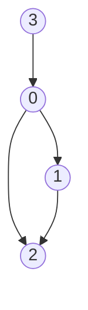

```
Exmaple 1:
Input: numCourse = 4
       prerequisites=[[1,0],[2,1],[2,0],[0,3]]
Output: True
```


# BFS Approach

[參考](https://www.youtube.com/watch/Y2HuGYO9E20)

1. 計算prerequisites -> 得到Edges、In-degree
2. 從In-degree為0的開始traverse
3. traverse完該點後解放指向的點，例如traverse完3後0的In-degree就降為0

| Edges   | In-degree |
|:------- |:---------:|
| 0:[1,2] |    0:1    |
| 1:[2]   |    1:1    |
| 2:[]    |    2:2    |
| 3:[]    |    3:0    |

**traversal** => 3 -> 0 -> 1 -> 2

```python!
class Solution:
    def canFinish(self, numCourses: int, prerequisites: List[List[int]]) -> bool:
        edges = {i:[] for i in range(numCourses)}
        indegree = [0 for i in range(numCourses)]
        Q = deque()
        count = 0

        for i, j in prerequisites:
            edges[j].append(i)
            indegree[i] += 1

        for i in range(numCourses):
            if indegree[i] == 0:
                Q.append(i)

        while Q:
            n = Q.popleft()
            count += 1

            for i in edges[n]:
                indegree[i] -= 1
                if  indegree[i] == 0:
                    Q.append(i)

        return numCourses == count
```

## Tips
1. init
- edges : 準備一個dic放node and out degree
- inDegree : 計算inDegree
- Q : Traversal用
- count : 計算結束node的數量
2. 計算edges & inDegree
3. 將income為0的node加入Q中
4. 進行BFS，每釋放一個node就將其對應的inDegree扣除，若inDegree為0的node依樣加入Q中


# DFS Approach
[參考](https://www.youtube.com/watch/woS4aZ8CudU&t)
1. Setup
    - 計算listPreReq -> 得到 listPreReq
    - takenCourses代表可以訪問的點; visited代表已經訪問過的點
2. 嘗試拜訪每一個點run DFS
3. 


```python!
class Solution:
    def canFinish(self, numCourses, prerequisites):
        listPreReq = [[] for _ in range(numCourses)]
        for course, preReq in prerequisites:
            listPreReq[course].append(preReq)
        self.takenCourses = [False] * numCourses
        self.visited = [False] * numCourses

        for course in range(numCourses):
            if not self.DFS(listPreReq, course):
                return False
        return True

    def DFS(self, listPreReq, course):
        self.visited[course] = True

        if len(listPreReq[course]) == 0 or self.takenCourses[course]:
            self.takenCourses[course] = True
            return True
        
        
        for preReq in listPreReq[course]:
            #如果看過但沒有走通
            if (self.visited[preReq] and not self.takenCourses[preReq]):
                return False
            #拜訪所有鄰居
            if not self.DFS(listPreReq, preReq):
                return False
            else:
                self.takenCourses[preReq] = True
        
        self.takenCourses[course] = True
        return True

```

| list of PreReq |
|:-------------- |
| 0:[3]          |
| 1:[0]          |
| 2:[1,0]        |
| 3:[]           |


|       | takenCourses                 | visited                      |
|:----- |:---------------------------- |:---------------------------- |
| setup | [False, False, False, False] | [False, False, False, False] |
| 0     | [True, False, False, True]   | [True, False, False, True]   |
| 1     | [True, True, False, True]    | [True, True, False, True]    |
| 2     | [True, True, True, True]     | [True, True, True, True]     |
| 3     | [True, True, True, True]     | [True, True, True, True]     |


#### Time complexity : $O( V+E )$
- 點至多拜訪一次，邊也是至多拜訪一次
#### Space complexity: $O( V+E )$
- 包含對應的DFS遞迴深度 + table大小，或者BFS Queue長度 + table大小