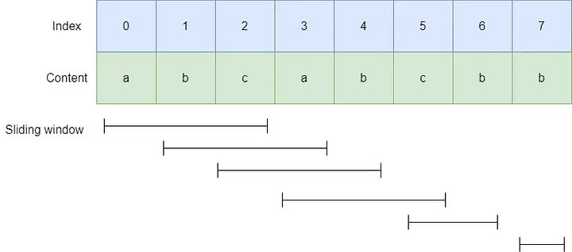

# LeetCode 3. Longest Substring Without Repeating Characters (無重複字元的最長子串)

## 目錄
- [思路總覽 (Overview & Interview Plan)](#思路總覽-overview--interview-plan)
- [演算法詳解](#演算法詳解)
- [程式碼實作](#程式碼實作)
- [正確性說明](#正確性說明)
- [複雜度分析](#複雜度分析)
- [常見誤區](#常見誤區)
- [小結](#小結)

---

## 思路總覽 (Overview & Interview Plan)

### 中文解題計畫
在面試中，這道題的最佳解法是使用「滑動窗口 (Sliding Window)」搭配「雜湊表 (Hash Map)」。
1. **資料結構選擇**：因為我們需要尋找「連續」的子串，滑動窗口是最適合的技巧。同時利用 Hash Map 來記錄每個字元「最近一次出現的索引位置 (Index)」。
2. **核心動態變化**：我們定義一個 `start` 指標作為窗口的左邊界。使用一個迴圈讓右邊界 `i` 不斷向右掃描：
   - 每當右邊界遇到一個「已經存在於 Hash Map 中」的字元時，代表發生重複 (Repeat)。
   - 此時，我們將左邊界 `start` 更新為「該重複字元上一次出現位置的下一個位置」，以排除重複字元。
3. **狀態更新**：每次迭代都要把當前字元的新索引更新到 Hash Map，並計算當前窗口長度 `i - start + 1`，隨時更新最大長度 `out`。

### English Interview Plan
To solve this problem efficiently, I will use a **Sliding Window** approach combined with a **Hash Map** (or Dictionary). 
1. The sliding window is defined by a `start` pointer (left boundary) and an iterator `i` (right boundary).
2. The Hash Map will store the most recent index of each character we have visited.
3. As we expand the window to the right, we check if the current character already exists in our Hash Map. If it does, we perform **Pruning** by immediately shrinking the window: we move the `start` pointer to the right of the previous occurrence of this character.
4. Throughout this process, we continuously update the maximum length of the valid window. This ensures we process each character optimally, maintaining an O(n) time complexity.

---

## 演算法詳解


以字串 `s = "aabccbb"` 為例，我們追蹤字串的狀態變化：

| index     |  0  |  1  |  2  |  3  |  4  |  5  |  6  |
|:--------- |:---:|:---:|:---:|:---:|:---:|:---:|:---:|
| character |  a  |  a  |  b  |  c  |  c  |  b  |  b  |
| out (max) |  1  |  1  |  2  |  3  |  3  |  3  |  3  |

**Hash Map 狀態追蹤 (`h_map`)：**
隨著右指標掃描，字典紀錄的 index 變化如下：

| 步驟 (index) |  a  |  b  |  c  | 動作與說明 |
|:------------ |:---:|:---:|:---:|:---------- |
| 0            |  0  |  -  |  -  | 紀錄 a=0，長度 1 |
| 1            |  1  |  -  |  -  | a 重複！`start` 更新至 index 1，更新 a=1，最大長度維持 1 |
| 2            |  1  |  2  |  -  | 紀錄 b=2，長度更新為 2 ("ab") |
| 3            |  1  |  2  |  3  | 紀錄 c=3，長度更新為 3 ("abc") |
| 4            |  1  |  2  |  4  | c 重複！`start` 更新至 index 4，更新 c=4，最大長度維持 3 |
| 5            |  1  |  5  |  4  | b 重複！`start` 更新至 index 3 (從之前紀錄的b=2加1)，更新 b=5 |
| 6            |  1  |  6  |  4  | b 重複！`start` 更新至 index 6，更新 b=6 |

---

## 程式碼實作

以下是 Python 版本的實作程式碼：
```python
class Solution:
    def lengthOfLongestSubstring(self, s: str) -> int:
        # substring 的開頭 (左指標)
        start = 0 
        h_map = {}
        out = 0

        for i in range(len(s)):
            if s[i] in h_map:
                # 如果字元已存在，更新窗戶的開頭
                # 必須取 max，防止左指標往回跑 (例如遇到早已不在當前窗口內的重複字元)
                start = max(start, h_map[s[i]] + 1)

            # 把右窗戶的字元與其 index 記到 h_map 中
            h_map[s[i]] = i

            # 更新目前為止的最大長度
            out = max(out, i - start + 1)

        return out
```
---

## 正確性說明

- **不重複 (No Duplicates)**：只要在當前視窗內發現重複字元，`start` 指標就會直接跳過該重複字元的歷史位置，確保 `[start, i]` 區間內的所有字元必定唯一。
- **不遺漏 (No Omissions)**：右指標 `i` 嚴格且連續地向右推進，等於是「窮舉了所有以 `s[i]` 為結尾的最長無重複子串」。取這些長度的最大值，必定涵蓋全局最優解。

---

## 複雜度分析

- **Time Complexity: O(n)**
  右指標 `i` 僅會將字串 `s` 遍歷一次。Hash Map 的查詢與更新時間皆為 O(1)，因此整體時間複雜度為線性時間 O(n)，其中 n 是字串的長度。
- **Space Complexity: O(1) 或 O(m)**
  空間複雜度取決於字元集的大小 (Character Set Size, m)。如果字串只包含 ASCII 字元，Hash Map 最多只會存儲 128 或 256 個鍵值對。因此在字元集固定的情況下，空間複雜度可視為 O(1)；若字元集很大，則為 O(min(m, n))。

---

## 常見誤區

面試中最常犯的錯誤在於 **「左指標錯誤回退」**：
如果程式碼寫成 `start = h_map[s[i]] + 1`，當我們遇到一個已經不在當前窗口內（即小於當前 `start`）的重複字元時，會導致 `start` 指標反而往左移動（往回跑），把已經排除的重複字元再次拉回窗口中。
**解法**：務必使用 `start = max(start, h_map[s[i]] + 1)` 確保左指標單調遞增。

---

## 小結
- 滑動窗口 (Sliding Window) 加上 Hash Map 是處理「連續子陣列 / 子串」問題的標準起手式。
- 延伸練習：如果你已經掌握這題，非常推薦繼續挑戰面試常考的 **LeetCode 76. Minimum Window Substring** 或 **LeetCode 424. Longest Repeating Character Replacement**。

[參考YT](https://www.youtube.com/watch?v=tTHtBfakHIw&t=1s&ab_channel=%E4%BB%8A%E5%A4%A9%E6%AF%94%E6%98%A8%E5%A4%A9%E5%8E%B2%E5%AE%B3)

