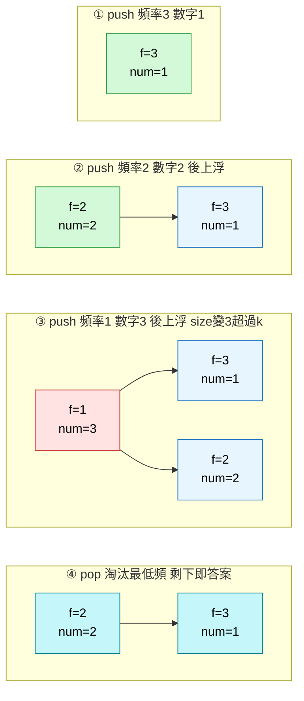
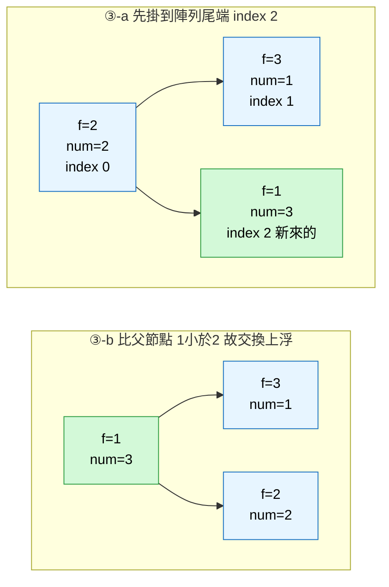
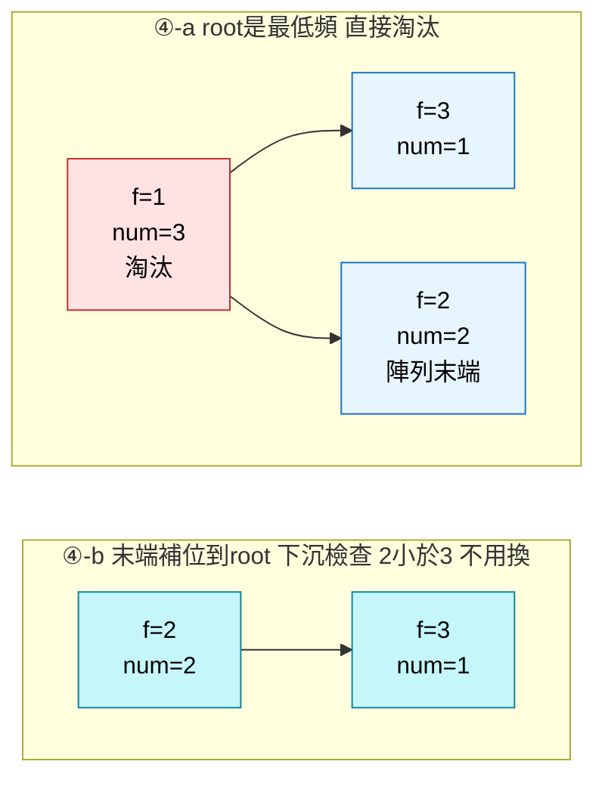

# LeetCode 347. Top K Frequent Elements
(前 K 個高頻元素)

## 目錄
- [題目描述 (中文摘要)](#題目描述-中文摘要)
- [思路總覽 (Overview & Interview Plan)](#思路總覽-overview--interview-plan)
- [演算法詳解](#演算法詳解)
- [程式碼實作](#程式碼實作)
  - [方法一：Bucket Sort](#方法一bucket-sort)
  - [方法二：Min-Heap](#方法二min-heap)
  - [方法三：手寫計數版](#方法三手寫計數版)
- [正確性說明](#正確性說明)
- [複雜度分析](#複雜度分析)
- [常見誤區](#常見誤區)
- [延伸思考](#延伸思考)
- [小結](#小結)

---

## 題目描述 (中文摘要)

給定整數陣列 `nums` 與整數 `k`，回傳出現頻率最高的前 `k` 個元素，**順序不拘**。

- `1 <= nums.length <= 10^5`，`-10^4 <= nums[i] <= 10^4`
- `k` 保證落在 `[1, 相異元素數量]`，且答案唯一
- **Follow-up**：時間複雜度必須優於 $O(N \log N)$ ← 這句話就是本題的真正考點

範例：
```
輸入：nums = [1, 1, 1, 2, 2, 3], k = 2
輸出：[1, 2]
```

---

## 思路總覽 (Overview & Interview Plan)

### 中文解題計畫

核心觀察：**Top-K 不需要完全排序**，而且頻率的值域被 $N$ 上界住，所以可以用非比較排序壓到線性。

1. **演算法選擇**：主推 **桶排序 (Bucket Sort)**，備援 **最小堆 (Min-Heap)**。
2. **具體步驟**：
   - **計數**：掃一次 `nums`，用 Hash Map 統計每個數字的出現次數。
   - **策略 A — Bucket Sort**：以「頻率」為索引建桶陣列，從高頻往低頻掃描收集，湊滿 `k` 個即回傳。
   - **策略 B — Min-Heap**：維護大小為 `k` 的最小堆，超過就 pop 掉堆頂（當前最低頻），**活下來的就是答案**。
   - **關鍵處理**：桶陣列長度要開 `len(nums) + 1`，因為最大可能頻率就是 `len(nums)`。

### English Interview Plan

Return the `k` elements with the highest frequency, in any order, faster than $O(N \log N)$.

1. **Strategy**: Frequencies are bounded by `N`, so they can be used as array indices. Bucket sort avoids comparison-based sorting entirely and reaches $O(N)$.
2. **Execution**:
   - **Count**: Build a frequency map in one pass.
   - **Bucket step**: `buckets[freq]` holds all values with that frequency; scan from `N` down to `1`.
   - **Key Insight**: Top-K never requires a total order. A min-heap of size `k` gives $O(N \log k)$; bucketing by a bounded key gives $O(N)$.

---

## 演算法詳解

暴力解是「計數後對 frequency map 依頻率排序，取前 `k` 個」，$O(N \log N)$ ——這正是 follow-up 明文禁止的量級。浪費在於：我們排序了全部 $U$ 個相異元素，卻只需要前 `k` 名。

以下以 `nums = [1, 1, 1, 2, 2, 3]`、`k = 2` 走一遍。計數結果為 `count = {1: 3, 2: 2, 3: 1}`（Python `dict` 保留插入順序）。

### 狀態變化 A：Bucket Sort

以頻率為索引分桶：

```
索引:    0    1    2    3    4    5    6
桶內:   []  [3]  [2]  [1]  []   []   []
```

從 `i = 6` 往回掃：`i=3` 取到數字 `1`，`i=2` 取到數字 `2`，`result` 長度達到 `k = 2`，立即回傳 `[1, 2]`。

**注意**：只有 3 個相異元素，所以 `buckets` 裡總共只躺著 3 個值。外層迴圈雖然要走過 `N + 1` 個桶，內層 body 的總執行次數被 $U$ 上界住——這是雙層迴圈卻仍是線性的原因（見[常見誤區](#常見誤區)第 5 條）。

### 狀態變化 B：Min-Heap 建構過程

推進堆的 tuple 是 `(freq, num)`，比較時先看 `freq`。迴圈跑的是 `count.items()`，所以**只有 3 次 push**：



**步驟三的上浮 (sift-up)**：新元素一律先接在陣列尾端，再往上跟父節點比較。



**步驟四的淘汰 (sift-down)**：堆大小變成 3 超過 `k = 2`，觸發 `heappop`。



### 陣列視角

`heapq` 沒有真的建樹，它就是操作一個 `list`，二元樹只是心智模型。索引關係固定：**parent = `(i-1)//2`，children = `2i+1` 與 `2i+2`**。

| 步驟 | 動作 | 陣列狀態 | size |
|---|---|---|---|
| ① | `push (3, 1)` | `[(3,1)]` | 1 |
| ② | `push (2, 2)` | `[(2,2), (3,1)]` | 2 |
| ③ | `push (1, 3)` | `[(1,3), (3,1), (2,2)]` | 3 ← 超過 k |
| ④ | `pop` 掉 `(1,3)` | `[(2,2), (3,1)]` | 2 |

最後 `[num for _, num in heap]` 得到 `[2, 1]`。

---

## 程式碼實作

### 方法一：Bucket Sort

線性時間，面試主推版本。

```python
from collections import Counter
from typing import List


class Solution:
    def topKFrequent(self, nums: List[int], k: int) -> List[int]:
        count = Counter(nums)

        # 以「頻率」為索引；最大頻率是 len(nums)，故需 len(nums)+1 格
        buckets = [[] for _ in range(len(nums) + 1)]
        for num, freq in count.items():
            buckets[freq].append(num)

        # 從高頻往低頻掃，湊滿 k 個立刻回傳，不必掃完
        result = []
        for freq in range(len(nums), 0, -1):
            for num in buckets[freq]:
                result.append(num)
                if len(result) == k:
                    return result
        return result
```

### 方法二：Min-Heap

額外空間只有 $O(k)$，且支援增量更新，適合串流場景。

```python
import heapq
from collections import Counter
from typing import List


class Solution:
    def topKFrequent(self, nums: List[int], k: int) -> List[int]:
        count = Counter(nums)
        heap = []  # 存 (freq, num)，min-heap，只保留 k 個

        for num, freq in count.items():
            heapq.heappush(heap, (freq, num))
            # 淘汰制：超過 k 就擠掉當前頻率最低的，活下來的才是答案
            if len(heap) > k:
                heapq.heappop(heap)

        return [num for _, num in heap]
```

### 方法三：手寫計數版

面試官若要求不使用 `Counter`，只需替換計數段落，其餘邏輯不動。

```python
from typing import List


class Solution:
    def topKFrequent(self, nums: List[int], k: int) -> List[int]:
        count = {}
        for num in nums:
            count[num] = count.get(num, 0) + 1

        buckets = [[] for _ in range(len(nums) + 1)]
        for num, freq in count.items():
            buckets[freq].append(num)

        result = []
        for freq in range(len(nums), 0, -1):
            for num in buckets[freq]:
                result.append(num)
                if len(result) == k:
                    return result
        return result
```

---

## 正確性說明

1. **不重複 (No Redundancy)**：Hash Map 的 key 唯一，每個相異元素只會被放進**一個**桶（它的頻率只有一個值），因此結果不會出現重複元素。
2. **不遺漏 (Completeness)**：計數階段覆蓋所有元素；桶陣列從最大可能頻率 `len(nums)` 開始往下掃，任何頻率的元素都在掃描範圍內。既然是由高往低走，先被收進 `result` 的必定頻率不低於後面的，前 `k` 個即為所求。
3. **邊界條件**：
   - `len(nums) == 1`：`buckets[1] = [nums[0]]`，正確回傳。
   - `k == 相異元素數`：掃到頻率 1 才湊滿，迴圈自然走完。
   - `k <= 0`（題目不會出現，但面試可主動提）：`len(result) == k` 永遠不成立，會收完全部才回傳；需補 `if k <= 0: return []`。

---

## 複雜度分析

符號定義：$N$ = `len(nums)`，$U$ = 相異元素數量，且 $U \le N$。

| 方法 | 時間 | 空間 |
|---|---|---|
| **Bucket Sort** | $O(N)$ | $O(N)$ |
| **Min-Heap（大小 k）** | $O(N + U \log k)$，慣寫 $O(N \log k)$ | $O(N)$ |
| **Max-Heap（heapify 後 pop k 次）** | $O(N + U + k \log U)$ | $O(N)$ |
| **`Counter.most_common(k)`** | $O(N + U \log k)$ | $O(N)$ |
| **`Counter.most_common()` / `sorted`** | $O(N + U \log U)$ | $O(N)$ |

- **Bucket Sort**：計數 $O(N)$ + 建桶 $O(U)$ + 掃描 $O(N)$。最好情況（最高頻元素恰好湊滿 `k`）掃幾格就 early return，最壞情況掃完 $N$ 個桶，兩者都是 $O(N)$。
- **Min-Heap**：迴圈跑的是 `count.items()` 共 $U$ 次，不是 $N$ 次；堆大小被 `if len(heap) > k` 卡在 $k$ 以內，故單次操作 $O(\log k)$。當 $U \ll N$（例如陣列全是同一個數字）時，選擇階段的成本趨近於零，只剩計數的 $O(N)$。
- **`most_common(k)`**：CPython 在有傳 `k` 時走 `heapq.nlargest`，等同手寫 Min-Heap；**只有不傳 `k` 才會整個排序**成 $O(U \log U)$。
- **空間**：三者都由 frequency map 主導，皆為 $O(N)$。Min-Heap 的堆本身只佔 $O(k)$，這是它在串流場景的優勢。

---

## 常見誤區

1. **搞反 Min-Heap 的方向，把 pop 出來的當答案**：本題是 min-heap 找 top-k **最大**，走的是淘汰制——root 永遠是堆內*最低頻*者，pop 是把最弱的踢掉。掃完後**活下來的 `k` 個**才是答案。範例中 pop 出的 `(1, 3)` 是被淘汰的數字 3，不是解。
2. **tuple 欄位順序寫錯**：`heapq` 依 tuple 第一欄排序，必須是 `(freq, num)`。寫成 `(num, freq)` 會變成按「數值大小」淘汰，答案全錯。
3. **桶陣列長度開成 `len(nums)`**：最高頻率可以等於 `len(nums)`（全陣列同一個數字），少開一格會 `IndexError`。必須是 `len(nums) + 1`。
4. **以為 `Counter.most_common(k)` 是 $O(N \log N)$**：它內部是 `nlargest`，實際為 $O(U \log k)$，與手寫 Min-Heap 同級。真正是 $O(U \log U)$ 的是**不帶參數**的 `most_common()`。
5. **看到雙層 `for` 就判定 $O(N^2)$**：Bucket Sort 的內層迴圈總執行次數是 $\sum_i \text{len(buckets}[i]) = U \le N$，不隨外層次數放大。這叫**聚合分析 (aggregate analysis)**——同樣的推理也適用於 sliding window、DFS 走訪鄰接表、KMP 的 failure function。
6. **誤把 $O(N \log k)$ 當成本題下界**：不是。Bucket Sort 的 $O(N)$ 就推翻了這個說法。$O(N \log k)$ 只是**比較式 (comparison-based)** 選擇的代價；因為頻率的值域被 $N$ 上界住，改用非比較排序就能達到線性。

---

## 延伸思考

### 面試口述腳本

扣分通常不在 code 寫錯，而在講不出推進過程。建議順序：

1. **澄清**：回傳順序有要求嗎？`k` 保證合法嗎？
2. **給 baseline**：「計數後依頻率排序取前 `k`，$O(N \log N)$。」先給出能動的解，不要沉默。
3. **點出浪費**：「我不需要完整排序，只要前 `k` 名。大小 `k` 的 min-heap 可降到 $O(N \log k)$。」
4. **推到線性**：「頻率值域最大就是 $N$，可以拿頻率當陣列索引，用桶排取代比較排序，$O(N)$。」← **本題得分點**
5. **寫 code**，邊寫邊說明桶為何要 `len(nums) + 1` 格。
6. **驗算**：拿 `[1,1,1,2,2,3], k=2` 走一遍桶的狀態。
7. **補複雜度**：主動說明「雙層迴圈但內層總次數被 $U$ 上界住，所以是線性」——面試官通常正準備問這個。

### 使用哪個套件算作弊

界線很清楚：**用資料結構可以，用「一行就是答案」的 API 不行**。

- `dict` / `Counter` / `heapq` 都是 primitive，沒有面試官期待你手刻 hash table 或 sift-down；你只需能解釋它們的行為與複雜度。
- `Counter(nums).most_common(k)` 則是把「Top-K 不需完全排序」這個考點整個吃掉，面試官看不到任何訊號。它是驗算工具，不是答案。

### 變體題

| 變體 | 處理方式 |
|---|---|
| 串流資料持續進來 | 用 Min-Heap，額外空間 $O(k)$ 且可增量更新；桶陣列需重建，不適合 |
| 改求頻率**最低**的 k 個 | Min-Heap 改存 `(-freq, num)`，或桶陣列改由低往高掃 |
| 同頻率需按數值排序 | tuple 改為 `(freq, -num, num)`，或在結果上再排序 |
| `k` 可能為 0 或負數 | 開頭加 `if k <= 0: return []` |

---

## 小結

本題屬於 **Top-K 選擇** 題型，核心是「部分有序即足夠」。

**核心觀念：**
- Top-K 不需要完全排序：Heap 只維護 `k` 個，Bucket 只掃到湊滿即止。
- 當排序鍵的**值域有界**（此處頻率上限為 $N$），就能用非比較排序突破 $O(N \log N)$。
- 選型取決於 `k` 與 $U$ 的關係：`k` 遠小於 $U$ 或資料為串流 → Min-Heap；追求最優時間且記憶體充足 → Bucket Sort。

**推薦延伸練習：**
- LeetCode 215. Kth Largest Element in an Array
- LeetCode 692. Top K Frequent Words
- LeetCode 451. Sort Characters By Frequency
- LeetCode 973. K Closest Points to Origin
