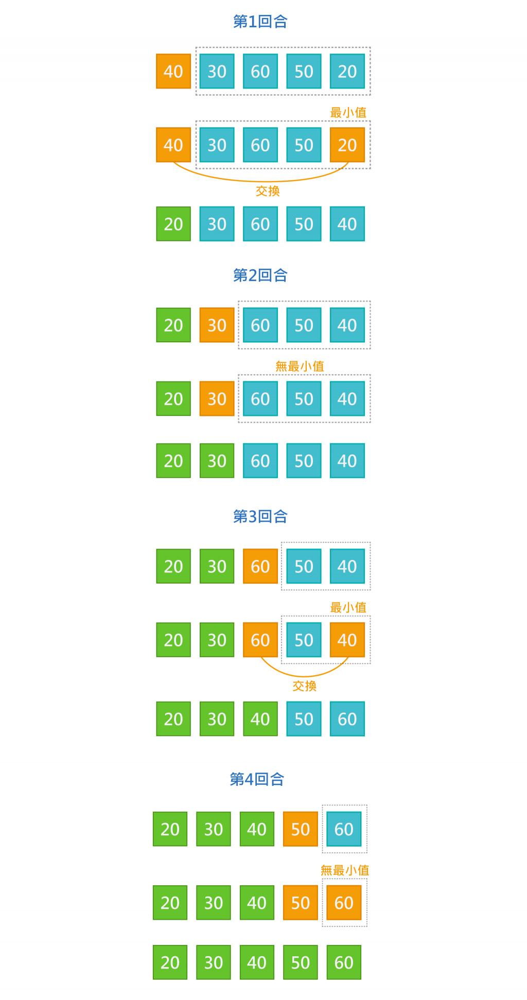
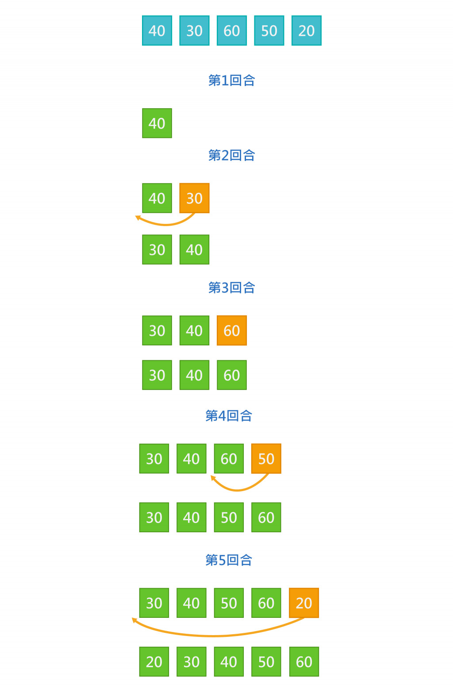
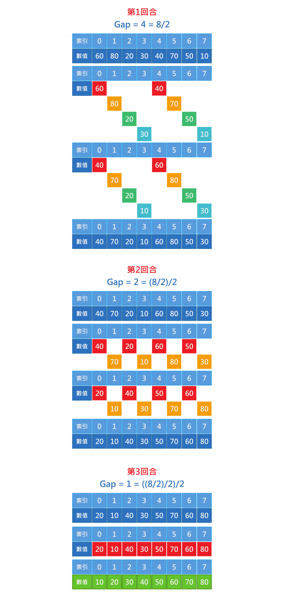
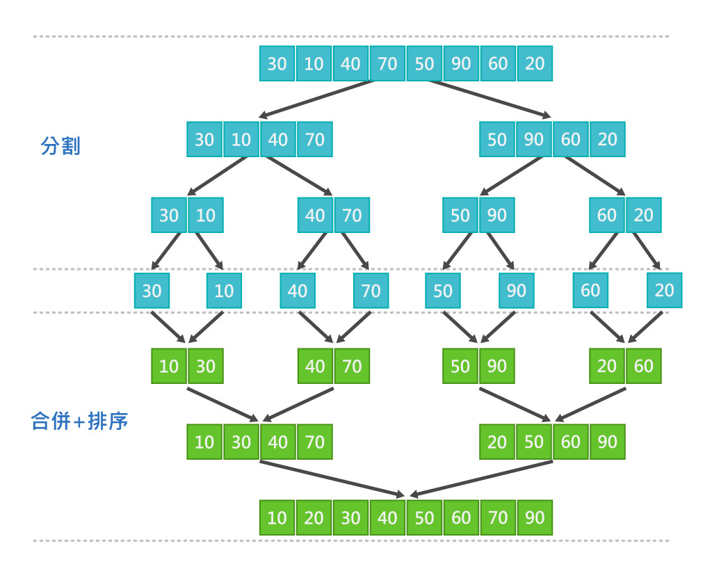
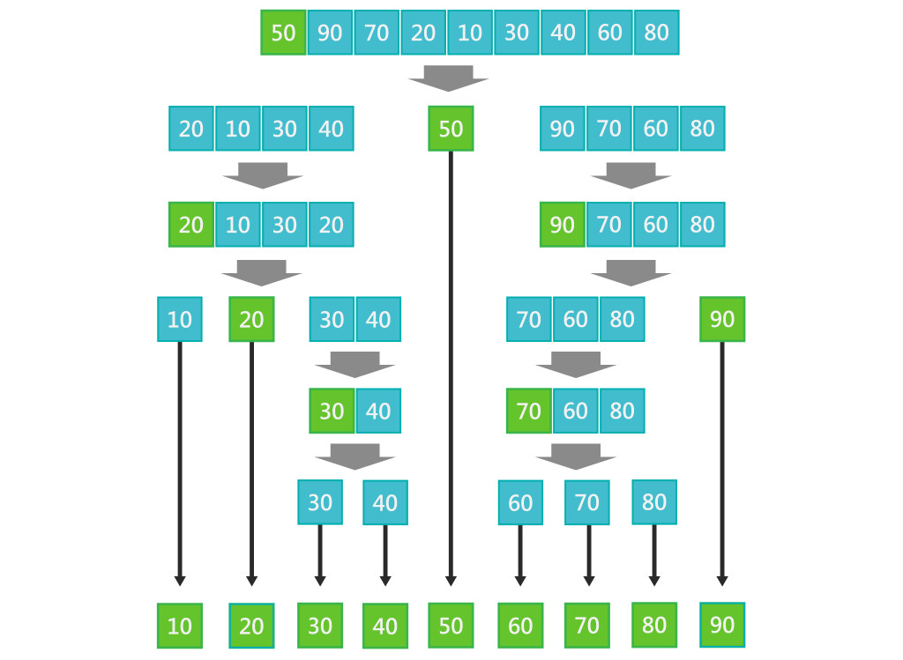
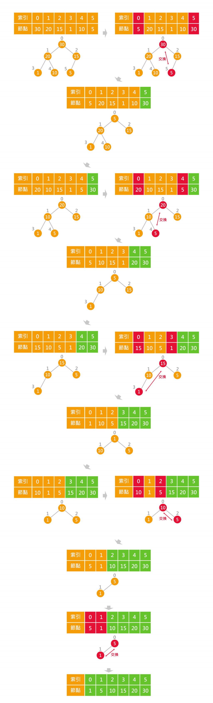
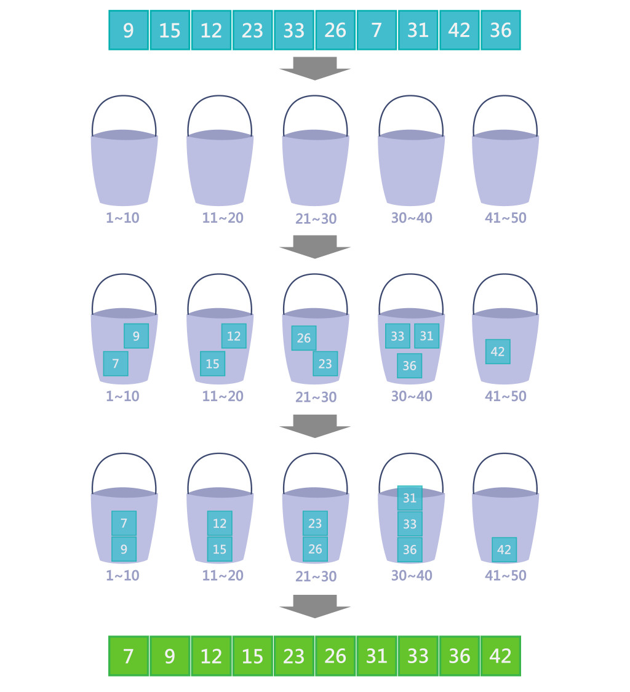
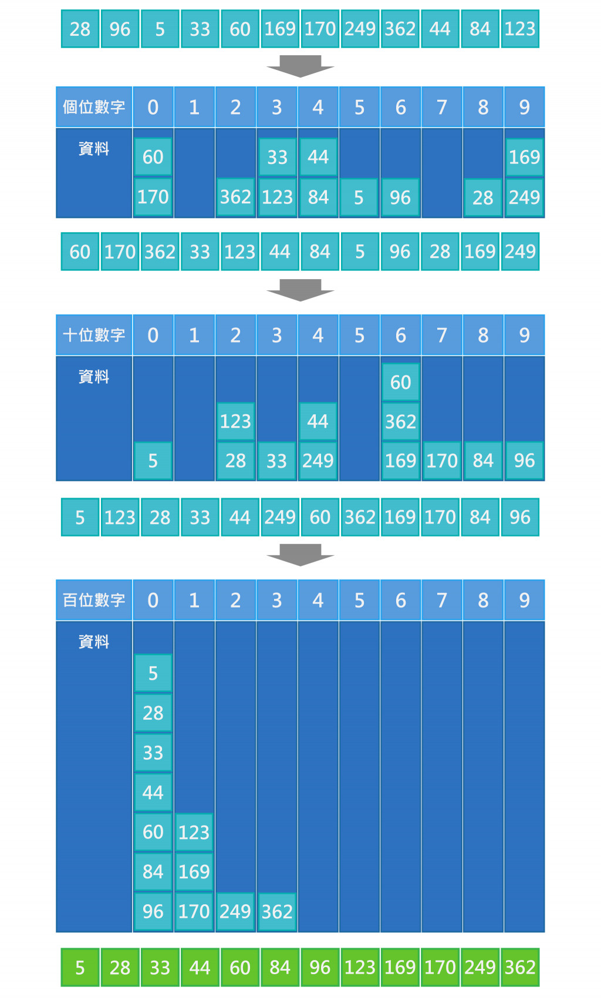
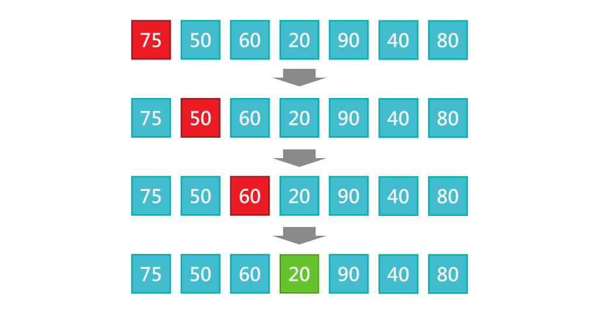

# Day21 排序Sort & 氣泡排序法Bubble Sort

## 氣泡排序法Bubble Sort
從第一筆資料開始，逐一比較相鄰兩筆資料，如果兩筆大小順序有誤則做交換，反之則不動，接者再進行下一筆資料比較，所有資料比較完第1回合後，可以確保最後一筆資料是正確的位置。

---
n=5
第1回合比較了4次，n-1次
第2回合比較了3次，n-2次
第3回合比較了2次，n-3次
第4回合比較了1次，n-4次
總共比較了4回合，n-1回合
(n-1) + (n-2) + .... + 1 = n(n-1) / 2
==平均時間複雜度為: O(n²)==

#### JavaScript
```JavaScript!
let data = [8,6,1,10,5,3,9,2,7,4]
function BubbleSort(array){
    let len = array.length
    while (len > 1) {
        len--
        for (let i = 0; i < len; i++) {
            // 如果前面的元素比後面的元素要大，則交換元素位置
            if (array[i] > array[i + 1]) {
                [array[i], array[i + 1]] = [array[i + 1], array[i]];
            }
        }
    }
    return array
}
console.log(BubbleSort(data))//[1, 2, 3, 4, 5, 6, 7, 8, 9, 10]
```

#### Python
```python!
#Bubble Sort
data = [89, 34, 23, 78, 67, 100, 66, 29, 79, 55, 78, 88, 92, 96, 96, 23]
def BubbleSort(data):
    n = len(data)
    while n > 1:
        n-=1
        for i in range(n):
            if data[i] > data[i+1]:
                data[i], data[i+1] = data[i+1], data[i]
    return data

print(BubbleSort(data))
#[23, 23, 29, 34, 55, 66, 67, 78, 78, 79, 88, 89, 92, 96, 96, 100]
```

# Day22 選擇排序法Selection Sort
原理是反覆從未排序數列中找出最小值，將它與左邊的數做交換。可以有兩種方式排序，一為由大到小排序時，將最小值放到末端;若由小到大排序時，則將最小值放到前端。
例如:未排序的數列中找到最小值的資料，和第1筆資料交換位置，再從剩下未排序的資料列中找到最小值的資料，和第2筆資料交換位置，以此類推。



n=5
第1回合在4個數中找最小值，找4次，n-1次
第2回合在3個數中找最小值，找3次，n-2次
第3回合在2個數中找最小值，找2次，n-3次
第4回合在1個數中找最小值，找1次，n-4次
總共找了4回合，n-1回合
(n-1) + (n-2) + .... + 1 = n(n-1) / 2
**平均時間複雜度為: O(n²)**

#### javascript
```javascript!
let data = [8,6,1,10,5,3,9,2,7,5]
function SelectionSort(array) {
    let n = array.length;
    for(let i = 0; i < n; i++) {
        let min = i;
        for(let j = i+1; j < n; j++){
            if(array[j] < array[min]) {
                //記憶最小值的位置
                min=j;
            }
        }
        if (min != i) {
            [array[i], array[min]] = [array[min], array[i]];
        }
    }
    return array;
}
console.log(SelectionSort(data))//[1, 2, 3, 5, 5, 6, 7, 8, 9, 10]
```

#### Python
```python!
#Selection Sort
data = [89, 34, 23, 78, 67, 100, 66, 29, 79, 55, 78, 88, 92, 96, 96, 23]
def SelectionSort(data):
    n = len(data)
    for i in range(n):
        min_idx = i
        for j in range(i+1, n):
            if data[j] < data[min_idx]:
                min_idx = j
        if min_idx != i:
            data[i], data[min_idx] = data[min_idx], data[i]
    return data

print(SelectionSort(data))
#[23, 23, 29, 34, 55, 66, 67, 78, 78, 79, 88, 89, 92, 96, 96, 100]
```

# Day23 插入排序法Insertion Sort
插入排序法(Insertion Sort)，原理是逐一將原始資料加入已排序好資料中，並逐一與已排序好的資料作比較，找到對的位置插入。例如:已有2筆排序好資料，將第3筆資料與前面已排序好的2筆資料作比較，找到對的位置插入，再將第4筆資料與前面已排序好的3筆資料作比較，找到對的位置插入，以此類推。



n=5
第2回合與1個數比較，比1次，n-4次
第3回合在2個數比較，比2次，n-3次
第3回合在2個數比較，比3次，n-2次
第4回合在1個數比較，比4次，n-1次
(n-1) + (n-2) + .... + 1 = n(n-1) / 2
**平均時間複雜度為: O(n²)**

#### javascript
```javascript!
let data = [8,6,10,5,3,9,2,7,4,1]
function InsertSort(array) {
  for (let i = 1; i < array.length; i++) {
    let target = i;
    for (let j = i - 1; j >= 0; j--) {
      if (array[target] < array[j]) {
        [array[target], array[j]] = [array[j], array[target]]
        target = j;
      }
    }
  }
  return array;
}
console.log(InsertSort(data))//[1, 2, 3, 4, 5, 6, 7, 8, 9, 10]
```

#### python
```python!
#Insertion Sort
data = [89, 34, 23, 78, 67, 100, 66, 29, 79, 55, 78, 88, 92, 96, 96, 23]
def InsertionSort(data):
    n = len(data)
    for i in range(n-1):
        key = data[i+1]
        j = i
        while j >=0 and key < data[j] :
                data[j+1] = data[j]
                j -= 1
        data[j+1] = key
    return data

# i think this is beter
def insertion_sort(data):
    n = len(data)
    for i in range(1, n):
        key = data[i]
        j = i - 1
        while j >= 0 and key < data[j]:
            data[j + 1] = data[j]
            j -= 1
        data[j + 1] = key
    return data

print(InsertionSort(data))
#[23, 23, 29, 34, 55, 66, 67, 78, 78, 79, 88, 89, 92, 96, 96, 100]
```

# Day24 希爾排序法Shell Sort
希爾排序法(Shell Sort)是插入排序(Insertion Sort)的改良版。可減少插入排序的資料搬移次數，加入了間距(Gap)的概念將資料分成多個小區塊，再將不同區塊資料進行插入排序，每一回合Gap會漸漸減少，最後一回Gap會是1。

操作流程:
* 由大到小制定數個間距(Gap)，最後一次的Gap一定要是1
* 將資料依制定的間距(Gap)分組
* 每組進行插入排序
* 重複上述步驟，不斷減少Gap，直到最後一次Gap是1完成為止。



時間複雜度會因選用的GAP有所不同，但因為是插入排序改良版，幾乎所有狀況都能比$O(n²)$來得快。

##### JavaScript
```JavaScript!
let data = [8, 6, 10, 5, 3, 9, 2, 7, 4, 1]
function ShellSort(data) {
  let i, j, tmp;
  let gap = parseInt(data.length / 2);
  for (gap; gap > 0; gap = parseInt(gap / 2)) {
    //開始插入排序法
    for (i = gap; i < data.length; i++) {
      tmp = data[i];
      for (j = i; j >= gap && tmp < data[j - gap]; j -= gap) {
        data[j] = data[j - gap];
      }
      data[j] = tmp;
    }
  }
  return data
}
console.log(ShellSort(data))//[1, 2, 3, 4, 5, 6, 7, 8, 9, 10]
```

#### Python
```python!
#Shell Sort
data = [89, 34, 23, 78, 67, 100, 66, 29, 79, 55, 78, 88, 92, 96, 96, 23]
def ShellSort(data):
    n = len(data)
    gap = n // 2
    while gap > 0:
        for i in range(gap,n):
            temp = data[i]
            j = i
            while j >= gap and data[j-gap] > temp:
                data[j] = data[j-gap]
                j = j - gap
            data[j] = temp
        gap = gap // 2
    return data

print(ShellSort(data))
#[23, 23, 29, 34, 55, 66, 67, 78, 78, 79, 88, 89, 92, 96, 96, 100]
```

# Day25 合併排序法Merge Sort
合併排序法(Merge Sort)原理是會先將原始資料分割成兩個資料列，接著再將兩個資料繼續分割成兩個資料列，依此類推，直到無法再分割，也就是==每組都只剩下一筆資料時==，再兩兩合併各組資料，合併時也會進行該組排序，==每次排序都是比較最左邊的資料，將較小的資料加到新的資料列中==，依此類推，直到最後合併成一個排序好的資料列為止。



時間複雜度 = 分割步驟數 + 合併步驟數
分割：分割含有 n 個資料需要 n-1 次，$O(n)$。
合併：合併的兩邊共用 n 個元素，每次都是比較最左邊的資料，將較小的加到新陣列中，因此每次排序與合併必須經過 n 次，每回合log n次，$O(log n)$。
平均時間複雜度為: $O(n log n)$

#### JavaScript
```JavaScript!
let data = [8,6,1,10,5,3,9,2,7,4]
function merge(left, right){
    let result = [];
    while (left.length&&right.length){
        //左右兩陣列第一個元素進行比較，較小的推入result
        if (left[0] < right[0]){
            result.push(left.shift());
        }else{
            result.push(right.shift());
        }
    }
    //while迴圈跳出時，表示左右陣列其中一個為空，因此左右判斷concat哪邊
    result = left.length ? result.concat(left) : result.concat(right)
    return result;
}

function mergeSort(array){
    if(array.length < 2){
        return array;
    }
    let mid = Math.floor(array.length/2);
    let leftArray = array.slice(0, mid);
    let rightArray = array.slice(mid, array.length);
    //用遞迴一直切到最後一個元素再合併
    return merge(mergeSort(leftArray), mergeSort(rightArray))
}
console.log(mergeSort(data))//[1, 2, 3, 4, 5, 6, 7, 8, 9, 10]
```

#### python
```python!
data = [89, 34, 23, 78, 67, 100, 66, 29, 79, 55, 78, 88, 92, 96, 96, 23]
def merge(left, right):
    result = []
    while len(left) and len(right):
        if (left[0] < right[0]):
            result.append(left.pop(0))
        else:
            result.append(right.pop(0))
    result = result+left if len(left) else result+right
    return result

def mergeSort(array):
    if len(array) < 2:
        return array
    mid = len(array)//2
    leftArray = array[:mid]
    rightArray = array[mid:]
    return merge(mergeSort(leftArray),mergeSort(rightArray))

print(mergeSort(data))
#[23, 23, 29, 34, 55, 66, 67, 78, 78, 79, 88, 89, 92, 96, 96, 100]
```

# Day26 快速排序法Quick Sort
快速排序法(Quick Sort)又稱分割交換排序法，是目前公認效率極佳的演算法，使用了分治法(Divide and Conquer)的概念。原理是先從原始資料列中找一個基準值(Pivot)，接著逐一將資料與基準值比較，小於基準值的資料放在左邊，大於基準值的資料放在右邊，再將兩邊區塊分別再找出基準值，重複前面的步驟，直到排序完為止。

### 常用的基準值(Pivot)選擇方式:
* 選擇第1筆或最後1筆的資料
* 隨機亂數
* 三數中位數(Median-of-three)，第一、中間、最後筆資料，排序之後取中間的值(Musser, 1997)。
例如: 1,5,9,6,3，取出1,9,3，排序後1,3,9，取3為基準點。
Average time complexity: $O(n log n)$

由於快速排序法有多種實作版本，下面介紹常見的3種實作版本。

### 遞迴版本
此版本雖然容易理解，但會影響到空間複雜度，每次都需要申請兩個子數列的記憶體空間，==遞迴的深度越多，需要記憶體空間就越大==。

操作流程:
1. 資料列中找出一個基準值(Pivot)
2. 將小於Pivot的資料放在左邊，大於Pivot的資料放在右邊
3. 左右兩邊資料分別重複1~2步驟，直到剩下1筆資料
4. 合併



#### JavaScript
```javascript!
let data = [50,90,70,20,10,30,40,60,80]
function quickSort(arr) {
  if (arr.length <= 1) {
    return arr;
  }
  let left = [];
  let right = [];
  let pivot = arr[0];
  for (let i = 1; i < arr.length; i++) {
    let num = arr[i];
    if (num < pivot) {
      left.push(num);
    } else {
      right.push(num);
    }
  }
  return [...quickSort(left), pivot, ...quickSort(right)];
}
console.log(quickSort(data))//[10, 20, 30, 40, 50, 60, 70, 80, 90]
```

#### python
```python=
def QuickSort(arr):
    n = len(arr)
    if n <= 1:
        return arr
    left = []
    right = []
    pivot = arr[0]
    for i in range(1,n):
        if arr[i] < pivot:
            left.append(arr[i])
        else:
            right.append(arr[i])
    return QuickSort(left) + [pivot] + QuickSort(right)

data = [50,90,70,20,10,30,40,60,80]
print(QuickSort(data))#[10, 20, 30, 40, 50, 60, 70, 80, 90]
```

# [Day 27 堆積排序法 Heap Sort](https://ithelp.ithome.com.tw/articles/10279239)
堆積排序法(Heap Sort)原理是利用「堆積」的資料結構為基礎來完成排序。

#### 操作流程(最大堆積為例):
1. 將陣列轉換最大堆積(Max Heap)
2. 將Root與最後一個節點交換
3. 將最後一個節點移除
4. 將剩餘為排序完的節點重複1~3步驟，直到所有節點被移除，即完成排序。



==時間複雜度 = 建立堆積 + 移除堆積==
建立堆積: $Ο(n)$
移除堆積: $n-1$ 次，$(n-1) * Ο(log n) = Ο(n log n)$
$Ο(n) + Ο(n log n) = Ο(n log n)$
==平均時間複雜度為: $O(n log n)$==

#### JavaScript
```javascript=
let data = [30,20,15,1,10,5];
function maxHeapify(arr, n, i){
    let largest = i;
    let l = 2 * i + 1;
    let r = 2 * i + 2;

    // 若左子樹大於根結點時
    if (l < n && arr[l] > arr[largest]) {
        largest = l;
    }

    // 若右子樹大於根結點時
    if (r < n && arr[r] > arr[largest]) {
        largest = r;
    }

    // 根節點不是最大值時
    if (largest != i) {
        [arr[i],arr[largest]] = [arr[largest],arr[i]]
        // 子樹堆積化遞迴
        maxHeapify(arr, n, largest);
    }
}

function heapSort(arr) {
    let n = arr.length
    // 建立最大堆積化
    for (let i = parseInt(n / 2 - 1); i >= 0; i--) {
        maxHeapify(arr, n, i);
    }

    //逐一從最後節點拿出
    for (let i = n - 1; i >= 0; i--) {
        // 根節點與最後節點交換位置
        [arr[0],arr[i]] = [arr[i],arr[0]]
        maxHeapify(arr, i, 0);
    }
}
heapSort(data);
console.log(data);//[1, 5, 10, 15, 20, 30]
```

#### Python (top down)
```python=
def maxHeapify(arr, n, i):
    # Function to maintain the max-heap property
    largest = i
    l = 2 * i + 1 # left child index
    r = 2 * i + 2 # right child index

    # Compare with left child
    if l < n and arr[i] < arr[l]:
        largest = l

    # Compare with right child
    if r < n and arr[largest] < arr[r]:
        largest = r

    # If the largest element is not the root, swap and heapify the affected subtree
    if largest != i:
        arr[i],arr[largest] = arr[largest],arr[i]
        maxHeapify(arr, n, largest)

def heapSort(arr):
    n = len(arr)
    # Build max heap
    for i in range(n // 2 - 1, -1, -1):
        maxHeapify(arr, n, i)

    # Extract elements from heap one by one
    for i in range(n-1, 0, -1):
        # Swap the root (maximum element) with the last element
        arr[i], arr[0] = arr[0], arr[i]
        # Call maxHeapify on the reduced heap
        maxHeapify(arr, i, 0)

data = [30,20,15,1,10,5]
heapSort(data)
print(data)
```

# Day28 桶排序法Bucket Sort
桶排序法(Bucket Sort)，與前面幾篇的排序法不一樣，前面都是經==由兩兩互相比較而成的排序==，稱為==比較排序法==，而==桶排序是非比較排序==，==屬於「分配性」的排序==。原理是先準備幾個桶子，每個桶子都是有限的固定區間，再將待排序的資料分配到對應區間的桶子中，接著每個桶再個別排序（可以使用別的排序演算法），最後再依序收集排序好的資料。

如果記憶體更大的話, 可以使用增加桶子的數量來降低區間，這樣將可以減少排序的次數，所以桶排序是一種可以==用空間來換時間的排序法==。

操作流程:
1. 設定定量的空桶子
2. 走訪原始資料並分配到對應桶子中
3. 對每個不是空的桶子進行排序
4. 依序從不是空的桶子中，把排序好資料收集回來



k = 桶子的數量
n = 資料數量
==平均時間複雜度為: $O(n+k)$==

#### JavaScript
```javascript
function bucketSort(arr){
  let min = Math.min(...arr);
  let max = Math.max(...arr);
  let size = 5
  //產生空桶子
  let buckets = Array.from(
    { length: Math.floor((max - min) / size) + 1 },() => []);
  //依規則分類到各桶子
  arr.forEach(function(val){
    buckets[Math.floor((val - min) / size)].push(val);
  });
  result=[];
  //各桶子裡資料排序
  for (i = 0; i < buckets.length; i++) {
    buckets[i].sort()//偷懶使用sort()，可以自行使用其他排序法
    //拉出合併
    for (var j = 0; j < buckets[i].length; j++) {
      result.push(buckets[i][j]);
    }
  }
  return result
};
let arr = [9, 15, 12, 23, 33, 26, 7, 31, 42, 36]
console.log(bucketSort(arr)) //[7, 9, 12, 15, 23, 26, 31, 33, 36, 42]
```

#### Python
```python
#Bucket Sort
import math
def bucketSort(array):
    maxx = max(array)
    minn = min(array)
    size = 5
    buckets = [[] for i in range(math.floor((maxx-minn)/size+1))] #math.floor(x) 必須返回int
    for i in range(len(array)):
        val = int(array[i])
        buckets[math.floor((val-minn)/size)].append(val)
    result = []
    for i in range(len(buckets)):
        buckets[i] = sorted(buckets[i])
        for j in range(len(buckets[i])):
            result.append(buckets[i][j])
    return result

data = [9, 15, 12, 23, 33, 26, 7, 31, 42, 36]
print(bucketSort(data))
#[7, 9, 12, 15, 23, 26, 31, 33, 36, 42]
```

# Day29 基數排序法Radix Sort
基數排序法(Radix Sort)，與前篇的桶排序都是非比較排序，也屬於「分配性」的排序方式，原理依據鍵值排序的方向又分為兩種:
* **LSD(Least Significant Digit First)： 從最右邊的位數開始排序**
* **MSD(Most Significant Digit First)： 從最左邊的位數開始排序**

排序流程(LSD為例):
1. 取得每個資料位數(最小開始)的值
2. 依該位數大小排序資料
3. 取得下一個位數進行比較，重複1~2步驟，直到所有位數都排序完為止

下面利用28 96 5 33 60 169 170 249 362 44 84 123由小到大排序(使用LSD為例)
從最右邊位數開始排序: 個位數 > 十位數 > 百位數
而若都是十進位的數，可以產生0~9的空陣列來進行分配排序



#### JavaScript
```javascript
function radixSort(arr){
  //找出最大位數
  let maxDigits = 0
  for (let num of arr) {
    maxDigits = (maxDigits < num.toString().length) ? num.toString().length : maxDigits
  }
  for (let i = 0; i < maxDigits; i++) {
    //產生空桶子
    let buckets = Array.from({length:10}, () => [])
    //依據位數大小分類
    for (let j = 0; j < arr.length; j++) {
      let radix = Math.floor(arr[j] / Math.pow(10,i)) % 10
      buckets[radix].push(arr[j])
    }
    //合併桶子的資料
    arr = [].concat(...buckets)
  }
  return arr
}
let arr = [28, 96, 5, 33, 60, 169, 170, 249, 362, 44, 84, 123]
console.log(radixSort(arr))
//[5, 28, 33, 44, 60, 84, 96, 123, 169, 170, 249, 362]
```

#### python
```python
#Radix Sort
def radixSort(arr):
    maxNum = max(arr)
    digits = 1
    while maxNum >= 10**digits:
        digits += 1
    for i in range(digits):
        #產生空桶子
        buckets = [[] for _ in range(10)]
        #依據位數大小分類
        for j in arr:
            radix = int(j/(10**i) % 10)
            buckets[radix].append(j)
        #合併桶子的資料
        x = 0
        for y in range(10):
            for num in buckets[y]:
                arr[x] = num
                x += 1
    return arr

data = [28, 96, 5, 33, 60, 169, 170, 249, 362, 44, 84, 123]
print(radixSort(data))
#[5, 28, 33, 44, 60, 84, 96, 123, 169, 170, 249, 362]
```

# [Day30 線性搜尋法Linear Search](https://ithelp.ithome.com.tw/articles/10280298)

### 搜尋（Search）
就是從一群資料中找出符合某些條件的資料，當資料量非常龐大時，如何在短時間內有效率地找到所要的資料，因此，搜尋演算法就變得相當重要。

### 線性搜尋法(Linear Search)
又稱循序搜尋法，是最簡單的搜尋法。原理是在資料列中從頭開始逐一的搜尋，一筆一筆的資料值與搜尋目標值做比對，直到找到為止。此種搜尋優點是搜尋前不需要將資料做任何排序，因為都是從頭開始搜尋。缺點是若目標資料剛好排在最後一筆，則需要作n次的比對，因此不適合資料量過大的搜尋。



#### javascript
```javascript
let data=[75,50,60,20,90,40,80];
let target=20;
function linearSearch(arr,target){
    for(let i=0;i<arr.length;i++){
        if(arr[i]===target){
            return "有搜尋結果: 在第" + (i+1) + "項";
        }
    }
    return "無搜尋結果";
}
console.log(linearSearch(data,target))
//有搜尋結果: 在第4項
```

#### Python
```python=
#Linear Search
data=[75,50,60,20,90,40,80]
target=20
def linearSearch(arr, target):
    for i in range(len(arr)):
        if arr[i] == target:
            return "有搜尋結果: 在第" + str(i + 1) + "項"
    return "無搜尋結果"

print(linearSearch(data,target))
#有搜尋結果: 在第4項
```
