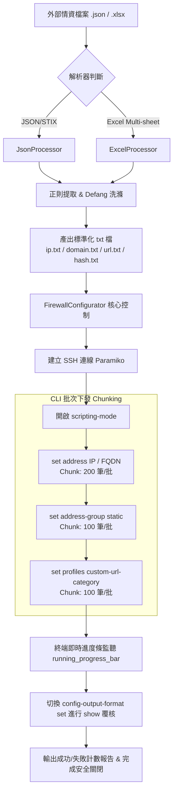

# PA440 防火牆情資自動化配置工具 — 威脅情資 (CTI) 自動化注入與組態稽核實戰

> **寫在前面**：本筆記針對資安維運（SecOps）實務中，如何透過 Python 與 SSH 自動化將外部威脅情資（Cyber Threat Intelligence, CTI — 如 FISAC 產出之 JSON/Excel 威脅指標）自動注入 Palo Alto Networks PA-440 防火牆的系統設計與技術細節進行完整紀錄與分享。

---

## 💡 痛點與設計目標

在企業與資安防護體系中，威脅情資（IoC, Indicators of Compromise）的頻繁更新是阻斷惡意攻擊的關鍵防線。然而在日常營運中，維運團隊常面臨以下挑戰：

1. **手動設定費時易錯**：一份情資報告動輒包含數百筆 IP、FQDN 網域、惡意 URL 與 File Hash，若手動透過 Palo Alto Web UI 點擊新增，耗時費力且極易發生漏輸入或格式填錯。
2. **格式多樣與避險標記（Defang）**：情資檔案常以 STIX/JSON 或 Excel (多 Sheet) 呈現，且文字中常包含安全避險處理（如 `hxxp://`、`example[.]com`），手動清洗極為繁瑣。
3. **設備批次限制與 CLI 阻塞**：直接對網路設備大量下發 SSH 命令若無適當 Chunking（分批）與狀態監聽，易造成 Paramiko Buffer 溢位、SSH 逾時或 CLI 響應分頁卡死。

### 核心解法
開發 **Palo Alto Firewall Data Configurator** (`PaloAltoFirewallConfigurator`)，實現：
- 支援 **Excel (.xlsx)** 與 **JSON (.json)** 雙格式情資自動解析與正則提取。
- **Defang 避險標記自動還原**（如 `hxxp` $\rightarrow$ `http`、`[.]` $\rightarrow$ `.`）與多重指標互斥去重。
- 透過 `Paramiko` 建立 SSH 自動化管道，開啟 `scripting-mode` 進行大批次 CLI 注入。
- **動態進度條監聽**與**自動化組態稽核比對（Error Checking）**。
- 打包為單一綠色免安裝可執行檔 (`.exe`)，降低 SecOps 人員操作門檻。

---

## 🏗️ 系統架構與資料處理解析

系統運作流程劃分為三大階段：**「情資清洗與洗滌」** $\rightarrow$ **「SSH 批次指令生成與注入」** $\rightarrow$ **「即時進度監聽與覆核稽核」**。



---

## 🔍 核心模組與技術亮點剖析

### 1. 多格式情資清洗與自動 Defang (JsonProcessor & ExcelProcessor)

#### A. 編碼與防呆處理 (`chardet`)
JSON 情資檔常由不同平台匯出，編碼格式（UTF-8, UTF-8-BOM, Big5, GBK）不一。`JsonProcessor` 透過 `chardet` 動態檢測檔案編碼後讀取，避免解碼崩潰。

#### B. 避險標記還原與正則匹配 (Regex Pattern Match)
威脅情資為了防止被誤點擊或遭郵件網關阻擋，常採用避險標記（Defang）。解析器在提煉時進行清洗：
```python
# ExcelProcessor.py 中的清洗與去重
self.urls = [url.replace('hxxp', 'http').replace('[.]', '.') for url in self.urls]
self.urls = list(sorted(set(self.urls), key=self.urls.index))
```

正則表達式設計上，特別處理了**優先順序與互斥條件**，防止整條 URL 被重複誤抓為單一 IP 或 Domain：
```python
# 避免匹配到 http/hxxp 前綴的純 IP 匹配正則
ipv4_pattern = re.compile(r'(?<![hH]xxp://|http://)(?<!hxxp |http )\b(?:[0-9]{1,3}\.){3}[0-9]{1,3}\b')
```

---

### 2. Palo Alto CLI 自動化與批次策略 (FirewallConfigurator)

#### A. 啟用 Scripting Mode
在連線成功後發送 `set cli scripting-mode on`，這是 Palo Alto SSH 自動化最關鍵的技巧：
- **停用 Paging**：避免輸出超過一頁時 CLI 停在 `--more--` 觸發阻塞。
- **移除控制碼**：關閉 ANSI escape code 顏色與格式字元，方便位元流精準比對。

#### B. 動態前導零補齊 (Zero-Padding Indexing)
為了讓在 Palo Alto 界面上呈現的 Address Object 名稱保持一致排序與視覺整潔，系統根據總數量動態計算前導零補齊長度：
```python
set_address_len = len(ipList) + len(domainList)
self.fill_in = len(str(set_address_len)) # 如總數 150 筆 -> fill_in = 3 (001~150)

# 指令生成範例
tmpInstruction = f"set address {self.address_group_name}-{str(self.serialNumber).zfill(self.fill_in)} ip-netmask {ip}\n"
```

#### C. 大批次 (Chunking) 下發策略
避免一次性寫入數千條 CLI 指令導致 SSH socket buffer 溢位，`FirewallConfigurator` 設計了 Chunking 批次發送機制：
- **Address 物件 (`set address`)**：每 **200** 條累積發送一次。
- **Address Group 群組 (`set address-group`)**：每 **100** 條累積發送一次。
- **Custom URL Category (`set profiles custom-url-category`)**：每 **100** 條累積發送一次。

---

### 3. 非阻塞位元流監聽與實時進度條 (`running_progress_bar`)

由於 `paramiko` 的 `invoke_shell()` 為持續性互動 Channel，程式透過 `recv_ready()` 非阻塞輪詢，將接收到的位元串流與預期命令進行正則比對，動態計算目前完成比例：

```python
def running_progress_bar(self):
    url_pattern = r'(https?://\S+)'
    progressBar = 0
    received_data = b""
    while True:           
        if self.shell.recv_ready():
            received_data += self.shell.recv(1024)
            # 正則匹配 returned data 與指令集中 matched command 索引
            for i, command in enumerate(self.all_config_commends):
                if command.encode() in received_data:
                    progressBar = max(i, progressBar)
            if 'done'.encode() in received_data:
                break
        self.progress_bar(progressBar, len(self.all_config_commends), prefix='Progress:', suffix='Complete', length=50)
        time.sleep(3)
```

---

### 4. 組態自動化檢驗與復核機制 (`checking_error`)

指令發送結束後，不能假設設備完全無誤地套用了所有設定。程式提供二次複核機制：
1. 切換 CLI 輸出格式：`set cli config-output-format set`
2. 下發 `show address-group <name>` 撈取防火牆內部實際產生的 Config。
3. 比對產出的清單位元流：
   - 檢查是否所有 `Address Group` 流水號皆包含於內部。
   - 檢查 `Custom URL Category` 中的 URL 長度是否超過 Palo Alto 防火牆之 255 字元上限。
4. 最終計算出 `successfully` 與 `error` 數據並向維運人員回報。

---

## 🛠️ 專案模組架構表

專案內包含 4 個主要 Python 檔案及發布組件：

| 檔案名稱 | 角色 / 職責說明 |
|---|---|
| [PaloAltoFirewallConfigurator.py](file:///D:/PA440-FW-data-configurator/PaloAltoFirewallConfigurator.py) | **程式進入點**：實例化 `FirewallConfigurator` 並發動 `configure_firewall()` |
| [FirewallConfigurator.py](file:///D:/PA440-FW-data-configurator/FirewallConfigurator.py) | **核心控制引擎**：處理互動輸入、Paramiko SSH 連線、CLI 指令 Chunking 生成、進度監聽與組態覆核 |
| [JsonProcessor.py](file:///D:/PA440-FW-data-configurator/JsonProcessor.py) | **JSON 情資處理器**：自動檢測編碼、Regex 提煉 STIX/JSON 中的 IP, Domain, URL, Hash 並導出 txt |
| [ExcelProcessor.py](file:///D:/PA440-FW-data-configurator/ExcelProcessor.py) | **Excel 情資處理器**：解析多 Sheet Excel、正則優先順序濾重、Defang 洗滌與檔案導出 |
| `PaloAltoFirewallConfigurator-v6.6.exe` | **單一免安裝執行檔**：由 PyInstaller 打包，包含 Python 3.8 執行環境與相關套件 |

---

## 🚀 操作與交付流程

### 1. 執行檔配置目錄結構
將編譯完成的 `.exe` 與待寫入的情資檔案置於同一個資料夾：

```bash
Your Folder
├── Example.json                         # 欲匯入之 JSON 情資檔
├── Example.xlsx                         # 欲匯入之 Excel 情資檔
└── PaloAltoFirewallConfigurator-v6.6.exe # 主可執行程式
```

### 2. 互動式執行參數輸入
執行後輸入防火牆存取資訊與群組命名（確保名稱不重複）：
- 防火牆 IP / Username / Password
- 情資檔檔名 (`Example.json` 或 `Example.xlsx`)
- Address Group Name (如 `FISAC-202401-IP`)
- Custom URL Category Name (如 `FISAC-202401-URL`)

### 3. 自動導出中間檔與下發
程式將於 `./output/` 目錄導出標準清洗文字檔：
- `<filename>_ip.txt`
- `<filename>_domain.txt`
- `<filename>_url.txt`
- `<filename>_hash.txt`

並自動發起 SSH 寫入 Palo Alto 防火牆：
- IP / Domain $\rightarrow$ 建立 `Address` 物件與 `Address Group`
- URL $\rightarrow$ 寫入 `Custom URL Category` (`URL List`)

---

## 💎 經驗與心得 (Key Takeaways)

1. **網路設備自動化不能只寫不看**：大量下發配置時，位元串流監聽 (`recv_ready()`) 與二次 `show` 讀取比對是確保防禦策略 100% 生效的靈魂所在。
2. **Defang 字元清洗的細節**：安全情資經常充斥格式變體，嚴謹的正則表達式設計與字元清洗（如 `hxxp` 與 `[.]`）能大幅減少無效防護項目的產生。
3. **SecOps 友善交付**：提供免安裝獨立 EXE 工具包，大幅減輕第一線值班資安工程師設置 Python 環境與套件版本相衝的負擔。
