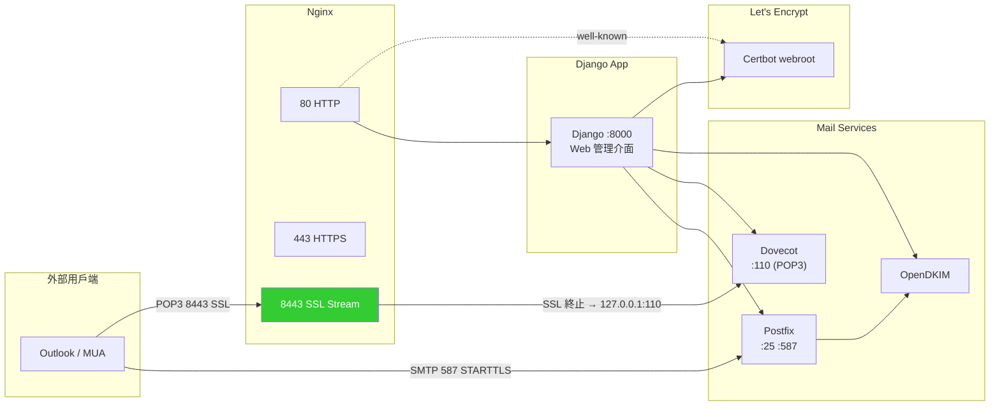
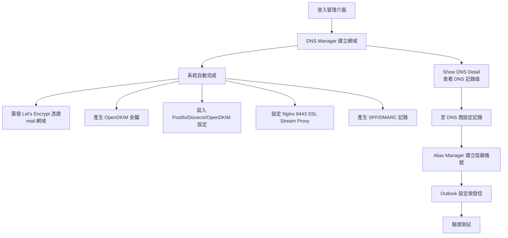

---
tags:
  - mail-server
  - postfix
  - dovecot
  - opendkim
  - django
  - linux
  - self-hosted
created: '2026-06-22'
project: Postfix Manager
tech_stack:
  - Django
  - Postfix
  - Dovecot
  - OpenDKIM
  - Nginx
  - Certbot
source: 'D:\mail-server'
---
# Postfix Manager 郵件伺服器管理系統


> 基於 Django 的郵件伺服器管理系統，通過 Web 介面管理 Postfix、Dovecot、OpenDKIM 配置。支援多網域、TLS 憑證自動簽發、DKIM 金鑰自動產生，並透過 Nginx SSL Stream Proxy 統一對外的加密郵件接入點。

## Table of Contents
- [專案概述](#專案概述)
- [主要功能](#主要功能)
- [系統需求](#系統需求)
- [專案結構](#專案結構)
- [架構與資料流](#架構與資料流)
- [部署方式](#部署方式)
- [使用流程](#使用流程)
- [Cloudflare DNS 設定](#cloudflare-dns-設定)
- [Outlook 郵件客戶端設定](#outlook-郵件客戶端設定)
- [連接埠對照](#連接埠對照)
- [驗證與測試](#驗證與測試)
- [常見問題排除](#常見問題排除)
- [相關文件](#相關文件)

---

## 專案概述

Postfix Manager 是一個自架郵件伺服器的管理介面，封裝了 Postfix（SMTP）、Dovecot（IMAP/POP3）、OpenDKIM（DKIM 簽章）、Certbot（Let's Encrypt 憑證）、Nginx（反向代理 + SSL Stream Proxy）等元件的配置工作。

**核心設計理念：**
- 把繁瑣的郵件伺服器配置（Postfix/Dovecot/OpenDKIM）封裝成 Web UI 操作
- 透過 **Nginx 8443 SSL Stream Proxy** 統一對外的加密 POP3 接入點（環境無關設計，見下方說明）
- 自動整合 Let's Encrypt 憑證簽發流程（webroot 驗證）
- 信箱帳號直接對應 Linux 系統使用者（底層為系統帳號）

**預設登入資訊：**
- 帳號：`admin`
- 密碼：`Aa123456`
- ⚠️ 登入後請立即修改密碼

---

## 主要功能

| 模組 | 功能說明 |
|------|----------|
| **DNS / 網域管理** | 新增、切換、查看網域；自動產生 TLS 憑證、OpenDKIM 金鑰、SPF/DMARC 記錄 |
| **別名（信箱帳號）管理** | 建立、刪除、鎖定/解鎖、修改密碼（底層為 Linux 系統使用者） |
| **TLS 憑證整合** | 透過 Certbot + Nginx webroot 自動簽發 Let's Encrypt 憑證 |
| **OpenDKIM 配置** | 自動產生 DKIM 金鑰並寫入 KeyTable / SigningTable / TrustedHosts |
| **Nginx SSL Stream Proxy** | 將 POP3 (110) 透過 8443 SSL 對外提供，統一加密接入點 |
| **一鍵部署腳本** | `deploy.sh` 自動完成所有安裝與設定 |

---

## 系統需求

- **OS**：Ubuntu 20.04+ / Debian 11+
- **Python**：3.10+
- **權限**：Root
- **需對外開放的連接埠**：80、443、25、587、8443

**系統套件：** Postfix、Dovecot (IMAP/POP3)、OpenDKIM、Certbot、Nginx

---

## 專案結構

```
mail-server/
├── Server/                    # Django 專案設定
│   ├── settings.py            # 應用程式設定（SQLite、靜態檔案、時區 Asia/Taipei）
│   ├── urls.py                # URL 路由 + 靜態檔案服務
│   ├── wsgi.py / asgi.py
├── server_app/                # 主要應用程式
│   ├── views.py               # 視圖函數（DNS Manager、Alias Manager、Login 等）
│   ├── models.py              # 資料模型（DNSModel、AliasModel）
│   ├── admin.py               # Django Admin 設定
│   └── migrations/
├── extModule/                 # 外部模組
│   └── Util.py                # 核心工具庫（Util、PathGetter、UserManager）
├── src_obj/                   # 設定檔模板
│   ├── obj_main               # Postfix main.cf 模板
│   ├── obj_auth               # Dovecot 10-auth.conf 模板
│   ├── obj_ssl                # Dovecot 10-ssl.conf 模板
│   ├── fixed_obj/             # 固定設定檔模板（master.cf、dovecot.conf 等）
│   └── acc_obj/               # 累加型設定檔模板（KeyTable、SigningTable、TrustedHosts）
├── static/                    # 靜態檔案（CSS、JS、圖片）
├── templates/                 # HTML 模板
│   ├── base.html              # 基礎模板
│   ├── index.html             # 首頁
│   ├── login.html             # 登入頁
│   ├── dns_manager.html       # 網域管理介面
│   ├── alias_manager.html     # 帳號管理介面
│   ├── show_dns_detail.html   # 網域詳細資料（含 SPF/DMARC/DKIM）
│   ├── change_password.html   # 修改密碼介面
│   └── confirm_delete.html    # 刪除確認介面
├── manage.py                  # Django 管理命令
├── run_linux.py               # Linux 環境啟動腳本
├── run_app_final.py           # 打包用啟動腳本
├── run_app_fixed.py           # 打包用啟動腳本（修正版）
├── requirements.txt           # Python 依賴
├── db.sqlite3                 # SQLite 資料庫
├── deploy.sh                  # 一鍵部署腳本（推薦）
├── docker_build.sh            # Docker 跨平台打包腳本
├── linux_package.sh           # Linux 環境打包腳本
├── setup_linux_env.sh         # Linux 環境設定腳本
└── rebuild_package.bat        # Windows 環境打包腳本
```

### 關鍵模板分類

- **`src_obj/obj_*`**：變動型模板，會依網域參數填入（main.cf、10-auth.conf、10-ssl.conf）
- **`src_obj/fixed_obj/`**：固定設定檔（master.cf、dovecot.conf 等），不隨網域改變
- **`src_obj/acc_obj/`**：累加型設定檔（KeyTable、SigningTable、TrustedHosts），每新增一個網域就附加一筆

---

## 架構與資料流



### 8443 SSL Stream Proxy 設計理念

本系統對外 POP3 走 **8443 (SSL)** 而非傳統 995，SMTP 走 **587 (STARTTLS)** 而非 465。這是個**與環境無關的架構選擇**，不預設任何 port 遭封鎖，優勢包括：

| 設計目標 | 說明 |
|----------|------|
| **統一外部接入點** | 不論底層 Dovecot 跑在哪個 port、是否啟用 SSL，對外都走 8443 SSL，用戶端設定一致 |
| **SSL 終止集中於 Nginx** | 憑證管理統一在 Nginx 層，Dovecot 內部 110 保持純文字，設定單純 |
| **跨環境可攜** | 無論主機商是否允許 993/995/465 直接 TLS、是否在 NAT/防火牆後，8443 都能穩定運作 |
| **避開常見限制** | 部分主機商/ISP 確實會限制 993/995/465，8443 + 587 是大多數環境都放行的 port |
| **內部服務解耦** | Dovecot 內部監聽 127.0.0.1:110 即可，SSL 交給 Nginx 處理 |

```
用戶端 (SSL) ──:8443──> Nginx (SSL 終止) ──> 127.0.0.1:110 (Dovecot POP3)
```

> 💡 若你的環境允許 993/995/465，也可自行調整 Nginx/Dovecot 設定改走標準 port；本系統預設以 8443 + 587 作為最通用、相容性最高的組合。

---

## 部署方式

### 方法一：一鍵部署（推薦）

```bash
sudo bash deploy.sh
```

部署完成後：
- 管理介面：`http://伺服器IP`
- 預設帳號：`admin` / `Aa123456`（登入後請立即修改）

### 方法二：手動安裝

#### 1. 安裝系統套件
```bash
sudo apt update
sudo apt install -y postfix dovecot-core dovecot-imapd dovecot-pop3d \
    opendkim opendkim-tools certbot python3-certbot-nginx \
    nginx python3-pip python3-venv
```

#### 2. 建立 Certbot webroot
```bash
mkdir -p /var/www/certbot/.well-known/acme-challenge
```

#### 3. 複製專案檔案到 /opt/postfix-manager
```bash
mkdir -p /opt/postfix-manager
cp -r Server server_app extModule src_obj static templates \
      manage.py run_linux.py requirements.txt db.sqlite3 \
      /opt/postfix-manager/
```

#### 4. 安裝 Python 依賴
```bash
cd /opt/postfix-manager
pip3 install -r requirements.txt
```

#### 5. 設定 Nginx 反向代理
```nginx
# /etc/nginx/sites-enabled/default
server {
    listen 80 default_server;
    server_name _;

    location /.well-known/acme-challenge/ {
        root /var/www/certbot;
    }

    location / {
        proxy_pass http://127.0.0.1:8000;
        proxy_set_header Host $host;
        proxy_set_header X-Real-IP $remote_addr;
        proxy_set_header X-Forwarded-For $proxy_add_x_forwarded_for;
        proxy_set_header X-Forwarded-Proto $scheme;
    }

    location /static/ {
        alias /opt/postfix-manager/static/;
    }
}
```

#### 6. 建立 systemd 服務
```bash
cat > /etc/systemd/system/postfixmanager.service << 'EOF'
[Unit]
Description=PostfixManager Mail Server
After=network.target postfix.service dovecot.service

[Service]
Type=simple
User=root
WorkingDirectory=/opt/postfix-manager
ExecStart=/usr/bin/python3 /opt/postfix-manager/run_linux.py
Restart=on-failure
RestartSec=5
StandardOutput=append:/opt/postfix-manager/postfix_manager.log
StandardError=append:/opt/postfix-manager/postfix_manager.log

[Install]
WantedBy=multi-user.target
EOF

systemctl daemon-reload
systemctl enable --now postfixmanager
```

### 打包方式

| 環境 | 指令 |
|------|------|
| Windows | `rebuild_package.bat` |
| Linux | `chmod +x linux_package.sh && sudo ./linux_package.sh` |
| Docker（確保 GLIBC 相容性） | `chmod +x docker_build.sh && ./docker_build.sh` |

> 打包相關問題請參考 `OLDER_LINUX_COMPATIBILITY.md`

---

## 使用流程

### 流程總覽



### 1. 網域設定
1. 登入後進入 **DNS Manager**
2. 輸入新網域名稱，點選 **Create & Use**
3. 系統自動完成：
   - 簽發 Let's Encrypt TLS 憑證（`mail.{網域}`）
   - 產生 OpenDKIM 金鑰
   - 寫入 Postfix / Dovecot / OpenDKIM 設定檔
   - 設定 Nginx 8443 SSL Stream Proxy
   - 產生 SPF、DMARC 記錄
4. 點選 **Show DNS Detail** 查看需要在 DNS 設定的記錄值

### 2. 信箱帳號管理
1. 進入 **Alias Manager**
2. 使用 **Create New Alias** 建立新帳號
3. 可執行操作：修改密碼、鎖定/解鎖、刪除帳號

> ⚠️ `postmaster` 為系統保留帳號，會自動視為已存在，無法建立。

---

## Cloudflare DNS 設定

### 前置條件
- 已在 Postfix Manager 的 DNS Manager 中建立網域
- 已在 **Show DNS Detail** 頁面取得 SPF、DMARC、DKIM 記錄值
- 網域已託管於 Cloudflare

### Step 1 — A 記錄（mail 子網域）

| 欄位 | 值 |
|------|-----|
| Type | `A` |
| Name | `mail` |
| IPv4 address | `你的伺服器 IP` |
| Proxy status | **DNS only（灰雲圖示）** ⚠️ |
| TTL | Auto |

> **🚨 重要：Proxy status 必須設為 DNS only（灰雲）！**
> Cloudflare 的 Proxy（橘雲）只支援 HTTP/HTTPS 流量，郵件流量（SMTP、POP3、IMAP）無法通過 Cloudflare Proxy。若設為 Proxied，所有郵件連線都會失敗。

### Step 2 — MX 記錄

| 欄位 | 值 |
|------|-----|
| Type | `MX` |
| Name | `@`（或你的網域名稱） |
| Mail server | `mail.你的網域` |
| Priority | `10` |
| TTL | Auto |

### Step 3 — SPF 記錄（TXT）

格式：`v=spf1 ip4:你的伺服器IP -all`

| 欄位 | 值 |
|------|-----|
| Type | `TXT` |
| Name | `@`（或你的網域名稱） |
| Content | `v=spf1 ip4:你的伺服器IP -all` |
| TTL | Auto |

> ⚠️ DNS 標準規定一個網域**只能有一條 SPF 記錄**。若已有其他 SPF 記錄，需合併為一條，例如：
> ```
> v=spf1 ip4:伺服器IP include:_spf.google.com -all
> ```

### Step 4 — DMARC 記錄（TXT）

格式：
```
v=DMARC1; p=reject; rua=mailto:postmaster@你的網域; ruf=mailto:postmaster@你的網域; fo=1
```

| 欄位 | 值 |
|------|-----|
| Type | `TXT` |
| Name | `_dmarc` |
| Content | `v=DMARC1; p=reject; rua=mailto:postmaster@...; ruf=mailto:postmaster@...; fo=1` |
| TTL | Auto |

> 💡 建議測試階段先設 `p=none`，確認無誤後改為 `p=reject`。

### Step 5 — DKIM 記錄（TXT）

在 Show DNS Detail 頁面取得 OpenDKIM 公鑰：
```
mail._domainkey IN TXT "v=DKIM1; k=rsa; " "p=MIIBIjANBgkqhkiG9w0BAQEFAAOCAQ8AMIIBCgKCAQEA..."
```

| 欄位 | 值 |
|------|-----|
| Type | `TXT` |
| Name | `mail._domainkey` |
| Content | `v=DKIM1; k=rsa; p=完整公鑰內容` |
| TTL | Auto |

> **DKIM 公鑰處理注意事項：**
> 1. 從 Show DNS Detail 頁面取得的內容可能包含引號和括號，需整理為單一行
> 2. 將 `v=DKIM1; k=rsa;` 和 `p=...` 合併為一行
> 3. 移除所有內部引號 `"`，只保留 Content 欄位本身的值
> 4. 完整格式：`v=DKIM1; k=rsa; p=MIIBIjANBgkqhkiG...（很長的一串）`

### DNS 記錄總覽

| Type | Name | Content | Proxy |
|------|------|---------|-------|
| A | `mail` | `伺服器IP` | DNS only (灰雲) |
| MX | `@` | `mail.你的網域` (priority 10) | — |
| TXT | `@` | `v=spf1 ip4:伺服器IP -all` | — |
| TXT | `_dmarc` | `v=DMARC1; p=reject; rua=mailto:...` | — |
| TXT | `mail._domainkey` | `v=DKIM1; k=rsa; p=...` | — |

### ⚠️ Cloudflare Email Routing 衝突

如果 Cloudflare 帳號有啟用 **Email Routing**：
- Email Routing 與自架郵件伺服器**不可同時使用**同一網域
- 請在 Cloudflare → **Email** → **Email Routing** 中停用此功能
- 否則 Cloudflare 會自動新增衝突的 MX 記錄，導致收信異常
- 停用後需刪除 Cloudflare 自動新增的 MX 記錄，只保留手動新增的 `mail.你的網域`

---

## Outlook 郵件客戶端設定

### 前置條件
- DNS 記錄已設定完成
- 已在 Alias Manager 中建立信箱帳號
- 伺服器 Port 8443 和 587 已對外開放

### 設定步驟

1. **開啟 Outlook** → 檔案 → 新增帳戶 (Add Account)
2. **選擇手動設定** → 手動設定或其他伺服器類型
3. **選擇 POP 或 IMAP**
4. **填入帳號資訊**：

| 欄位 | 值 |
|------|-----|
| 您的名稱 | 你的顯示名稱 |
| 電子郵件地址 | `你的帳號@你的網域` |
| 內送郵件伺服器類型 | `POP3` |
| 內送郵件伺服器 | `mail.你的網域` |
| 外寄郵件伺服器 (SMTP) | `mail.你的網域` |
| 使用者名稱 | `你的帳號`（⚠️ 不含 @網域） |
| 密碼 | 在 Alias Manager 中設定的密碼 |

5. **其他設定**：
   - **外寄伺服器** 分頁：勾選「我的外寄伺服器 (SMTP) 需要驗證」
   - 選擇「使用與內送郵件伺服器相同的設定」
   - **進階** 分頁：

| 設定項目 | 值 |
|----------|-----|
| 內送伺服器 (POP3) | `8443` |
| 此加密連線類型 | `SSL/TLS` |
| 外寄伺服器 (SMTP) | `587` |
| 此加密連線類型 | `STARTTLS` |
| 伺服器超時 | `1 分鐘`（預設） |

6. 點選 **下一步** 進行測試，兩項測試（登入網路伺服器、傳送測試電子郵件訊息）皆顯示綠色勾勾即成功

### 連接埠對照

| | 內送 (POP3) | 外寄 (SMTP) |
|---|---|---|
| 伺服器 | `mail.你的網域` | `mail.你的網域` |
| Port | **8443** | **587** |
| 加密 | SSL/TLS | STARTTLS |
| 需要驗證 | 是 | 是（使用與內送相同的設定） |

---

## 連接埠對照

| Port | 用途 | 說明 |
|------|------|------|
| 80 | HTTP | Nginx 反向代理 → Django (8000)，Certbot webroot |
| 443 | HTTPS | （需另行設定） |
| 25 | SMTP | Postfix 收信 |
| 587 | SMTP STARTTLS | Postfix 寄信（Outlook 外寄用） |
| 110 | POP3 | Dovecot 內部（僅 127.0.0.1） |
| 8443 | POP3 SSL | Nginx Stream Proxy → 127.0.0.1:110（對外加密接入點） |
| 8000 | Django | 應用程式（僅 127.0.0.1） |

> 💡 本系統預設對外郵件 port 為 **8443 (POP3 SSL)** 與 **587 (SMTP STARTTLS)**，這是在各種主機環境下相容性最高的組合。若你的環境允許標準 993/995/465，也可自行調整 Nginx/Dovecot 設定改走標準 port。

---

## 驗證與測試

### DNS 記錄驗證

```bash
# 驗證 A 記錄
dig mail.你的網域 A +short

# 驗證 MX 記錄
dig 你的網域 MX +short

# 驗證 SPF
dig 你的網域 TXT +short | grep spf

# 驗證 DMARC
dig _dmarc.你的網域 TXT +short

# 驗證 DKIM
dig mail._domainkey.你的網域 TXT +short
```

### 郵件驗證工具

| 工具 | 用途 | 網址 |
|------|------|------|
| Mail-Tester | 寄測試信查看評分（目標 10/10） | https://mail-tester.com/ |
| Google Postmaster Tools | 查看 Gmail 的送信評估 | https://postmaster.google.com/ |

### 連線測試

```bash
# 測試 SMTP (587 STARTTLS)
openssl s_client -connect mail.你的網域:587 -starttls smtp

# 測試 POP3 (8443 SSL)
openssl s_client -connect mail.你的網域:8443

# 測試 SMTP 發送認證
swaks --to test@example.com --from you@你的網域 \
      --server mail.你的網域:587 --tls \
      --auth LOGIN --auth-user 你的帳號
```

### 服務狀態檢查

```bash
systemctl status postfix
systemctl status dovecot
systemctl status nginx
systemctl status postfixmanager
nginx -t
tail -f /var/log/mail.log
```

---

## 常見問題排除

### Domain 建立失敗 "[ TLS generation fail ]"
- 確認 Port 80 未被佔用
- 確認 `/.well-known/acme-challenge/` 路徑可被外部存取
- 確認 DNS 已指向伺服器 IP

### "Invalid HTTP_HOST header"
在 `Server/settings.py` 的 `ALLOWED_HOSTS` 中加入伺服器 IP：
```python
ALLOWED_HOSTS = ["*"]  # 生產環境應設為特定 IP 或網域
```

### POP3 無法連線
- 使用 Port **8443 (SSL)**（本系統預設對外 port）
- 確認主機商防火牆/安全群組允許 8443 對外
- 確認 Nginx stream proxy 運行：`nginx -t && systemctl status nginx`
- 確認 Dovecot 運行：`systemctl status dovecot`
- 確認 Cloudflare A 記錄已設為 **DNS only**

### SMTP 無法連線
- 使用 Port **587 + STARTTLS**（本系統預設外寄 port）
- 確認「我的伺服器需要驗證」已勾選
- 確認 Postfix 運行：`systemctl status postfix`
- 確認主機商防火牆/安全群組允許 587 對外

### 寄到 Gmail 被退信 / 進垃圾信
- 確認 SPF、DKIM、DMARC 記錄均已正確設定
- 在 DNS Manager → Show DNS Detail 可查看所需記錄值
- 使用 https://mail-tester.com/ 檢測評分
- 確認伺服器 IP 未被列入黑名單
- DMARC 政策建議先設為 `p=none` 測試，確認無誤後改為 `p=reject`

### 收不到信
- 檢查 `/etc/aliases` 中 `postmaster: root` 是否已註解
- 執行 `newaliases` 更新別名資料庫

### Outlook 一直要求輸入密碼
1. 確認密碼正確（可在 Alias Manager 中重新設定）
2. 確認帳號未被鎖定
3. 確認使用者名稱格式（不含 @網域）
4. 檢查 Dovecot 認證設定：`disable_plaintext_auth = no` 已加入 `/etc/dovecot/conf.d/10-auth.conf`

### Cloudflare A 記錄設為 Proxied（橘雲）
郵件連線（SMTP/POP3/IMAP）全部失敗。Cloudflare Proxy 只處理 HTTP/HTTPS。請改為 **DNS only（灰雲）**。

---

## 相關文件（位於專案 `D:\mail-server`）

- `README.md` — 專案說明
- `SETUP_GUIDE.md` — Outlook 與 Cloudflare 設定指南
- `LINUX_INSTALLATION.md` — Linux 完整安裝指南
- `OLDER_LINUX_COMPATIBILITY.md` — 舊版 Linux 相容性說明

## 授權

© 2025 Postfix Manager 系統 · MIT License
