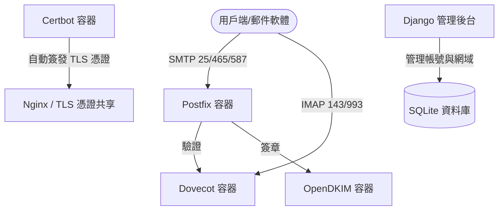

# Postfix Manager 郵件伺服器架構與維護指南

本專案是一個基於 **Django + Docker** 容器化技術構建的郵件伺服器管理系統，旨在管理 Postfix (SMTP)、Dovecot (IMAP/POP3) 與 OpenDKIM 等基礎郵件服務，並集成了自動憑證簽發、反向代理、高安全性防禦等機制。

---

## 📌 系統架構簡介

郵件伺服器採用模組化容器架構，由以下幾個核心容器協同運作：



* **Postfix (SMTP)**：處理郵件傳送與接收。
* **Dovecot (IMAP/POP3)**：提供郵件存取服務，並充當 Postfix 的 SASL 驗證後端。
* **OpenDKIM**：自動為外寄郵件進行 DKIM 數位簽章，提升郵件信譽並防止被列為垃圾郵件。
* **Certbot**：透過 Let's Encrypt 自動簽發並更新 SSL/TLS 憑證。
* **Django 管理系統**：提供 Web 介面管理網域與別名帳號，支援密碼備份還原。

---

## 🛡️ 安全防禦機制與異常監控

由於伺服器暴露於公網，容易遭受惡意 Botnet 的暴力破解與掃描。專案內部署了 **Fail2ban** 防禦系統。

### 1. 宿主機與容器日誌整合
因為郵件伺服器運行於 Docker 容器中，宿主機的 Fail2ban 無法直接讀取容器內部日誌。我們將容器的 json 日誌軟連結至宿主機的 `/var/log` 目錄下：
* Postfix 日誌路徑：`/var/log/postfix-docker.log`
* Dovecot 日誌路徑：`/var/log/dovecot-docker.log`

### 2. 指數增長封鎖機制 (Ban Time Increment)
為了防止惡意 IP 持續、緩慢地嘗試密碼，我們啟用了 **指數增長封鎖規則**：
* **基本規則**：10 分鐘內嘗試登入失敗達 5 次即予以封鎖。
* **初始封鎖時間**：1 天 (86,400 秒)。
* **指數遞增公式**：
  $$\text{Ban Time} = \text{base\_bantime} \times 2^{\text{ban\_count}}$$
  * 第一次封鎖：1 天
  * 第二次封鎖：2 天
  * 第三次封鎖：4 天
  * 最大封鎖時間上限：約 5 週 ($3,000,000$ 秒)，避免誤判導致無限期封鎖。

---

## 🛠️ 常見維護指令

### 1. 檢查郵件佇列 (Mail Queue)
進入 Postfix 容器查看是否有積壓的郵件（若積壓過多可能是遭到垃圾郵件利用）：
```bash
docker exec -it postfix mailq
```

### 2. 查看 Fail2ban 防護狀態與封鎖清單
查看 SSH、Postfix 與 Dovecot 的封鎖狀況：
```bash
# 查看所有作用中的 Jail 列表
fail2ban-client status

# 查看特定 Jail 阻擋的 IP 清單（以 Postfix 為例）
fail2ban-client status postfix-docker
```

### 3. 手動解封 IP (Unban)
若內部人員不慎遭到誤鎖，可在宿主機使用以下指令解鎖：
```bash
fail2ban-client set <Jail名稱> unbanip <被鎖IP>
# 例如：fail2ban-client set postfix-docker unbanip 1.2.3.4
```
