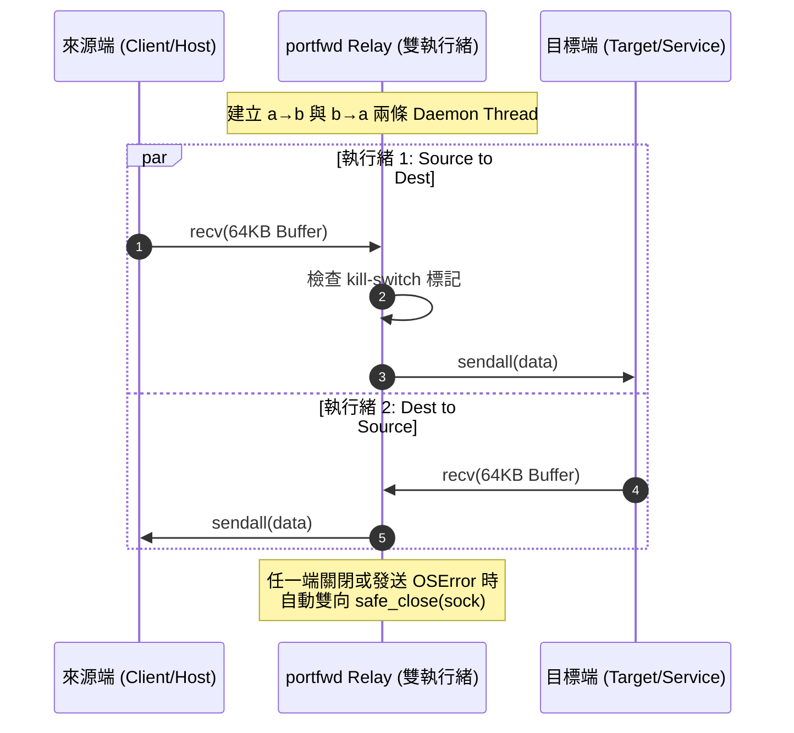
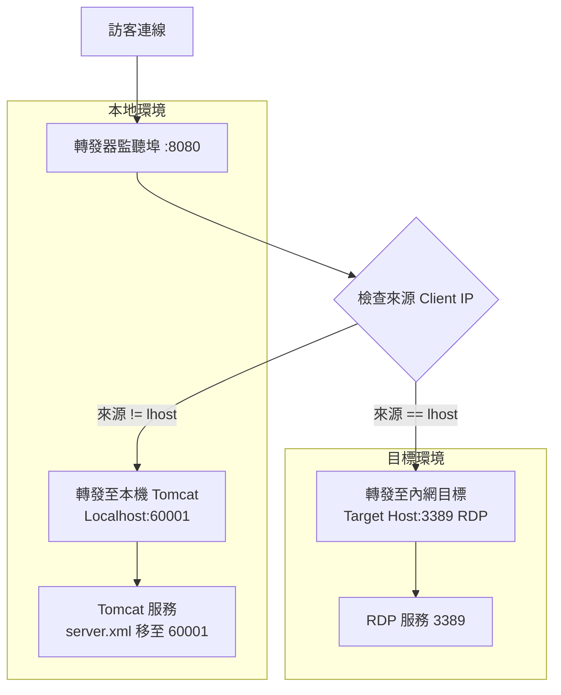

# 從零到一：TCP Port Forwarding 工具重構與網路轉發架構實戰分享

> **寫在前面**：本筆記針對網路安全與維運實務中常見的 4 種 TCP 連接埠轉發（Port Forwarding）情境進行深度剖析。記錄如何將分散於實驗室環境、缺乏規範且綁定平台的 4 組 Python 獨立腳本，成功整併為單一、模組化、跨平台且具備單元測試的 Python 工具庫 `portfwd`。

---

## 💡 痛點與重構動機

在網路穿透、滲透測試或內部服務存取測試中，TCP 轉發器（Port Forwarder）是不可或缺的中繼工具。然而在未重構前的原始程式碼庫中，存在以下軟體工程與營運問題：

1. **代碼高度冗餘（Code Duplication）**：
   - 核心的雙向 Socket 資料轉送邏輯 `forward_data` 在不同腳本中被重複實作了 **6 次**，且細節處理（如讀取大小、例外拋出、連線關閉時機）互不一致。
2. **硬編碼（Hardcoded Configs）**：
   - 大量寫死實驗室 VM IP（如 `192.168.159.131`、`192.168.226.129`）與固定 Port，彈性極低且容易發生誤連。
3. **平台強依賴與破壞性行為**：
   - 直接呼叫 Windows 專屬 API（如 `ctypes.windll.shell32`、`e.winerror`），導致在 Linux/macOS 環境下直接崩潰。
   - 收到魔術字串（如 `b'close'`）時直接呼叫 `os._exit(1)` 強制殺掉整個 Python 核心進程，缺乏防禦與安全退出的語意。
4. **連線語意與多工問題**：
   - 在反向連線（Reverse Connection）中繼端，對單一 TCP 控制連線進行多次重複 `accept()`，無法支援正確的多工轉發。

---

## 🎯 四大轉發情境與技術演進

本專案收錄並重構了由簡入繁、逐步演進的四種 TCP 轉發手法，後面兩種更結合了防護與隱蔽性邏輯：

```
[Standard Forwarding] -> [Reverse Connection] -> [Shutdown Service] -> [Forwarding Shunt]
   (直連轉送)               (反向穿透 NAT)            (停服借埠)             (IP 動態分流)
```

### 1. 標準轉發 (Standard Forwarding)
- **情境**：跳板機可直接連通目標主機與請求端。
- **機制**：在本地端 `bind` 監聽 Port，接受連線後主動建立對目標主機（如 RDP 3389）的連線並做雙向轉送。
- **改進點**：提供可選的 `--kill-switch` 標記，收到 `b'close'` 時僅優雅中斷該條連線 socket，而不殺死整個程序。

### 2. 反向連線穿透 (Reverse Connection)
- **情境**：目標主機位於 Strict NAT 或防火牆內部，外部無法主動連入，但目標主機能**對外連線**。
- **機制**：
  - **內網 Client**：主動向公網中繼站（Server）建立控制連線。
  - **公網 Server**：對外開啟服務 Port（如 1234），當外部 RDP 連入時，透過既有的控制連線通知 Client，Client 再主動連向本機 RDP，實現反向打洞。

### 3. 關閉服務借埠型 (Shutdown Service Forwarding)
- **情境**：目標 Port 已被目標主機上的合法服務（例如 Tomcat HTTP 8080）佔用。
- **機制**：
  - 透過 `TomcatController` 暫時停止 Tomcat 服務。
  - 轉發器搶佔綁定該 Port 開始轉送資料。
  - 設定計時器（如 60 秒），時間到後關閉轉發器並恢復啟動 Tomcat 服務。

### 4. 來源 IP 動態分流型 (Forwarding Shunt)
- **情境**：希望在借用合法 Port 的同時，對一般正常使用者「無感」，減少服務中斷時間與被察覺風險。
- **機制**：
  1. 先搜尋空閒 Port（如 60000~65000），將 Tomcat 設定檔 `server.xml` 的 Connector Port 改改至該空閒 Port 並重啟 Tomcat。
  2. 轉發器接管原本的 Tomcat 監聽 Port。
  3. **動態分流**：根據連線的 `Client IP` 判斷：
     - 若來自指定測試者/攻擊者 IP (`lhost`) $\rightarrow$ 轉發至目標 RDP 服務 (3389)。
     - 若來自其他一般使用者 IP $\rightarrow$ 轉發至被搬家的本機 Tomcat 新 Port。

---

## 🏗️ 系統架構與資料處理解析

### 雙向 Socket 轉發原語 (`relay.py`)

為了消除重複代碼，重構核心在於抽離出唯一正規的 `forward_data` 與 `bidirectional_relay`。



### 來源 IP 動態分流架構 (`shunt.py`)



---

## 🛠️ 核心模組與重構亮點

### 1. 統一的轉發原語 (`portfwd/relay.py`)

把 Buffer 從原本的 1024 bytes 放大至 **64KB (65536)** 提升傳輸吞吐量，並實作跨平台 Socket 斷線過濾機制：

```python
_EXPECTED_WINERRORS = frozenset({10053, 10054})  # WSAECONNABORTED, WSAECONNRESET

def _is_expected_disconnect(exc: BaseException) -> bool:
    """判斷例外是否為「對端正常斷線」，跨平台處理。"""
    if isinstance(exc, (ConnectionResetError, ConnectionAbortedError, BrokenPipeError)):
        return True
    winerror = getattr(exc, "winerror", None)
    if winerror in _EXPECTED_WINERRORS:
        return True
    return False
```

### 2. 跨平台 Tomcat 控制器 (`portfwd/tomcat.py`)

封裝 `TomcatController`，支援 `startup.bat`/`shutdown.bat` (Windows) 以及 `startup.sh`/`shutdown.sh` (Linux/macOS)，並透過 Python 的 `xml.etree.ElementTree` 安全處理 `server.xml`：

```python
def is_admin() -> bool:
    """跨平台的管理員 / root 權限判斷。"""
    if os.name == "nt":
        try:
            from ctypes import windll
            return bool(windll.shell32.IsUserAnAdmin())
        except Exception:
            return False
    try:
        return os.geteuid() == 0
    except AttributeError:
        return False
```

### 3. 規範化 CLI 介面 (`portfwd/cli.py`)

將原本散落在各檔案角落或硬編碼的參數，統一整合為 `argparse` 子指令（Subcommands）：

```bash
# 1. 標準轉發
portfwd standard <listen_port> <target_host> <target_port> [--listen-host 0.0.0.0] [--kill-switch]

# 2. 反向連線 (Server & Client)
portfwd reverse-server [--control-port 5678] [--rdp-port 1234]
portfwd reverse-client <control_host> <control_port> <target_host> <target_port>

# 3. 停服借埠型
portfwd service <listen_port> <target_host> <target_port> <tomcat_bin> [--duration 60]

# 4. 分流型
portfwd shunt <lhost> <listen_port> <target_host> <target_port> <tomcat_bin> [--duration 60]
```

---

## 🧪 測試驗證與品質保證

為避免重構過程破壞原始轉發行為，專案建立了一套基於 `pytest` 的完整 Loopback 端到端測試（28 項測試全數通過）：

1. **Socket 雙向迴圈測試 (Loopback E2E Test)**：
   - 透過 `netutil.find_free_port()` 自動尋找測試空閒埠。
   - 模擬真實 Client 與 Target 進行二進位數據雙向收發驗證。
2. **Tomcat Controller 副作用隔離 (Mocking)**：
   - 注入假控制器 (`DummyTomcatController`) 隔離實際系統服務的停啟動作，讓測試能在任何 CI/CD 環境下無害且快速地執行。

```bash
$ python -m pytest -q
............................
28 passed in 0.45s
```

---

## 📝 總結與效益

透過本次對 TCP Port Forwarding 工具箱的重構，達成了以下成果：

- **維護性提升**：消除 80% 以上重複的 Socket 轉發與 Tomcat 操作程式碼。
- **安全性與防禦性**：將強行殺進程的危險操作改為連線級關閉，並補充跨平台權限檢查機制。
- **跨平台支援**：完整相容 Linux / macOS / Windows，避免平台特有 API 導致程式崩潰。
- **可測試性**：建立現代 Python 套件架構 (`pyproject.toml`)，引進 Automated Tests 為後續擴充保駕護航。
