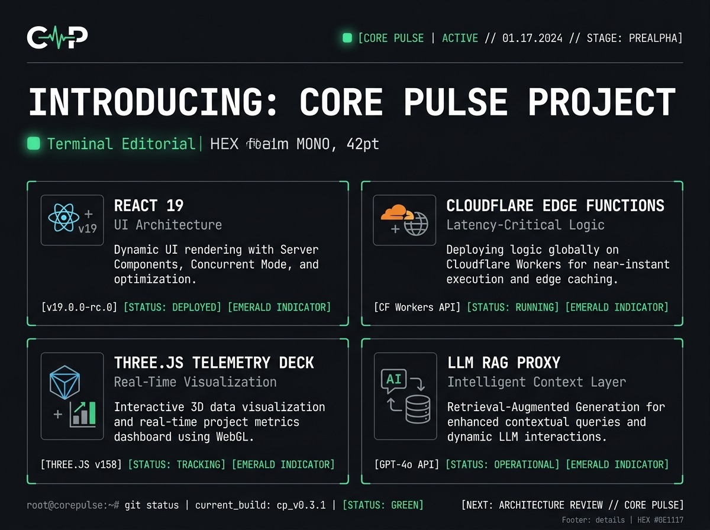
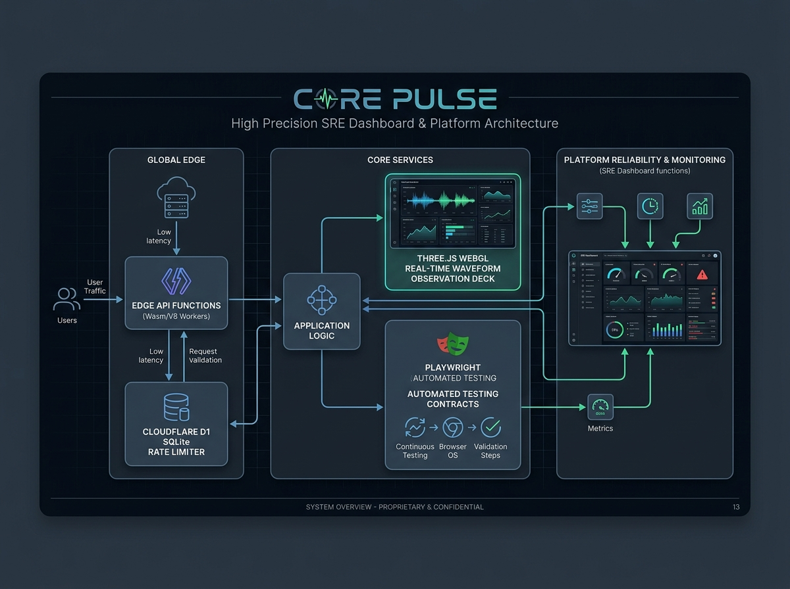
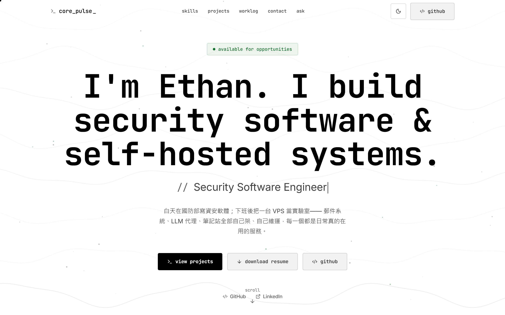
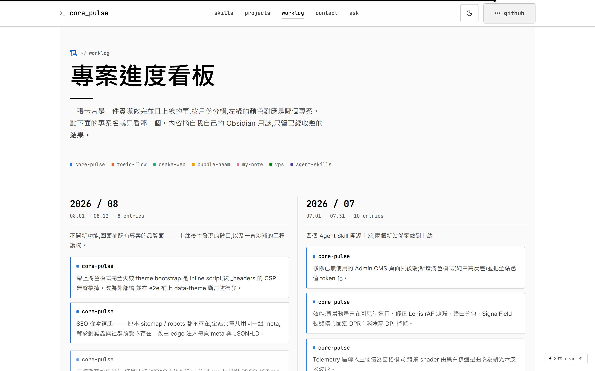
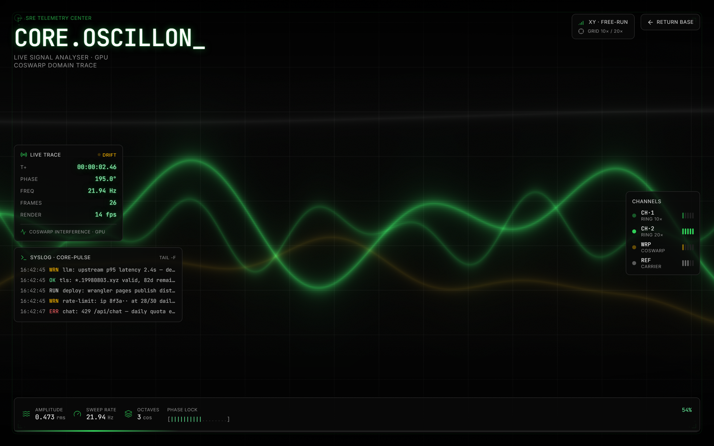
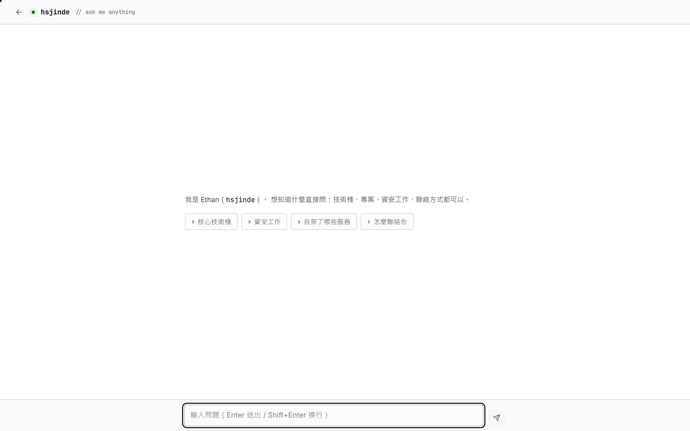

# CORE PULSE — SRE / AI 系統個人品牌與技術展示平台

> 線上站點：[19980803.xyz](https://19980803.xyz)（備援 `core-pulse.pages.dev`）
>
> 個人品牌網站，但我把它當專案在做：架構、測試紀律與設計取捨全都攤在生產環境上，任何人都可以打開 DevTools 驗證。

---

## 求職摘要

* **求職目標**：Senior SRE Engineer / AI Infrastructure Developer / Staff Platform Engineer / Full-Stack System Architect
* **技術棧**：React 19、TypeScript、Vite 5、React Router v7、Three.js、Cloudflare Pages Functions、Cloudflare D1、Vitest、Playwright
* **關鍵數字**（2026-08-25 實跑 `vitest run` 與 `npm run build` 確認）
  * 16 個 Vitest 測試檔、**80 個測試全過**，另有 6 支 Playwright E2E
  * 首頁 bundle `459KB`（gzip `149KB`）；`/telemetry`（含 Three.js）`550KB`（gzip `142KB`）、`/ask` `342KB`（gzip `105KB`）都切在 lazy route，進首頁不會下載到
  * `/api/chat` 限流只存 `IP + Salt` 的 SHA-256 雜湊，**不記錄訪客真實 IP**
* **主要亮點**
  1. **Terminal Editorial 設計系統**：不用漸層與玻璃擬態模板，「終端機 × 印刷雜誌」黑灰畫布，色彩只當狀態訊號。
  2. **雙運行時架構**：前端 React 19 + Vite 5 SPA 走 CDN，動態部分限縮在 Pages Functions + D1。
  3. **`/telemetry` WebGL 訊號分析器**：Three.js GPU shader 加示波器 HUD——是視覺與前端效能工程，不是真的監控後端，詳見下方第 3 點。
  4. **`/ask` AI 知識庫問答**：SSE 流式輸出、建置期預編譯的 Markdown Wiki、邊緣端雜湊限流。
  5. **測試即契約**：無障礙焦點環、SEO sitemap 同步、CSP 主題載入全部寫成 CI 會擋的測試。

---

## 為什麼做這個

我想往 SRE 走，但 side project 有個尷尬：講「我懂可觀測性、我在意工程紀律」，跟證明它是兩回事。履歷上寫十行，不如讓人直接打開網站看。

所以這個站的定位不是作品集頁面，是作品本身。三個自己給自己的約束：

1. **不用罐頭模板**——現在的個人網站十個有九個是紫色漸層加玻璃模糊，看久了會疲乏，也看不出誰做的。
2. **不堆展示性套件**——每加一個依賴就要能講出為什麼，講不出來就不加。
3. **規範要能被機器擋下來**——寫在 README 裡的「我們很重視無障礙」沒有任何效力，寫成 CI 測試才有。

---

## 專案簡報圖





---

## 線上畫面

以下都是生產環境 `https://19980803.xyz` 的實際畫面（Retina 雙倍解析度擷取）。

### 1. 首頁 Hero



髮絲線框配 JetBrains Mono，全站灰階深色畫布。會用到顏色的只有 Live 狀態燈跟 Telemetry 讀數——規則是「色彩即訊號」，不做裝飾。行長壓在 `≤72ch`，字階比例 `≥1.25`。

### 2. 滾動專案看板



近三個月的工作紀錄，從 Vault 日誌手動精選並脫敏過，更舊的月份自動收進下方摺疊區。每個專案有固定的 CSS Custom Property 色標，可以單選過濾，對比度都通過 WCAG 3:1。

### 3. `/telemetry` 訊號分析器



這頁要先講清楚它「不是」什麼，說明在下方〈工程決策〉第 3 點。

### 4. `/ask` AI 職涯知識庫



Edge Function 串 OpenAI 相容端點，SSE 打字機輸出。知識來源是站內 `src/content/wiki/*.md`，建置時就打包進邊緣端，非 public 標籤會被過濾掉。

### 5. 首頁全頁


---

## 系統架構

「雙運行時、單一儲存庫」：前端編譯成靜態資產走 CDN，動態部分限縮在 Pages Functions。

```mermaid
flowchart TD
    subgraph Client ["Client Runtime (Browser / React 19 SPA)"]
        UI["React 19 + Vite 5 App"]
        Router["React Router v7"]
        Home["Home Page (Static Bundle)"]
        Telemetry["Telemetry Page (Lazy Chunk + Three.js)"]
        AskUI["Ask LLM Page (Lazy Chunk + Markdown)"]
    end

    subgraph Edge ["Serverless Edge (Cloudflare Pages Functions)"]
        CF["functions/api/"]
        ChatEP["/api/chat (SSE Stream Endpoint)"]
        WikiGen["functions/api/_wiki-gen.ts (Auto-generated Wiki)"]
        Sanitizer["chat-sanitizer.ts (Input Protection)"]
        RateLimit["chat-rate-limit.ts (IP Hash Rate Limiter)"]
    end

    subgraph External ["External Infrastructure & Storage"]
        D1[("Cloudflare D1 (SQLite) Rate Limit Table")]
        LLM["OpenAI-Compatible LLM API"]
        WikiFiles["src/content/wiki/*.md"]
    end

    UI --> Router
    Router --> Home
    Router --> Telemetry
    Router --> AskUI

    AskUI -- "POST /api/chat (SSE)" --> ChatEP
    ChatEP --> Sanitizer
    ChatEP --> RateLimit
    RateLimit -- "Read/Write Hits" --> D1
    ChatEP --> WikiGen
    WikiGen <--- "Build Time (gen-wiki.cjs)" --- WikiFiles
    ChatEP -- "Stream Tokens" --> LLM
    LLM -- "SSE Delta Frames" --> AskUI
```

---

## 六個工程決策

### 1. 建置期預編譯 Wiki（`scripts/gen-wiki.cjs`）

Pages Functions 用的 Wrangler（esbuild）不吃 Vite 的 `?raw` 文字匯入，Edge 端根本讀不到 Markdown。踩到之後的解法是寫一支 Node 預編譯腳本，把 `src/content/wiki/*.md` 轉成 `functions/api/_wiki-gen.ts` 的字串常量。好處是 Edge 端載入知識庫的運行時開銷是零——不用讀檔、不用打網路。

### 2. 不記 IP 的限流

`/api/chat` 要防濫用，但我不需要知道誰是誰。

作法是 `IP + RATE_LIMIT_SALT` 取 SHA-256，只把雜湊值寫進 D1 做每日計數，另外配 CORS 來源白名單。同一個人今天問第幾次算得出來，但資料庫裡沒有任何一個真實 IP。這是自己給自己定的規矩：能不收的資料就不要收。

### 3. `/telemetry` 是訊號分析器，不是監控儀表板

這點我寧可講得很白，因為它最容易被誤讀，而誤讀的版本我不想寫在履歷上。

**它不是**接了監控後端的 SRE 儀表板。沒有 Prometheus、沒有真實服務指標、沒有延遲分佈。

**它是**一頁 WebGL 訊號分析器介面：底層是 Three.js 跑的 GPU shader 干涉場，上面疊示波器 HUD。HUD 的讀數裡，FPS 是瀏覽器真實的 rAF 幀率（`useSignalClock` 做指數平滑），相位與頻率是同一支時鐘算出來的合成訊號，左下 syslog 那欄是照本站真實基礎設施寫的模擬事件流——原始碼註解裡就是這樣寫的。

那它證明什麼？前端效能與資源管理：

* **Code-splitting**：整包 WebGL 封在 `/telemetry` 的 lazy route，build 出來 `Telemetry` chunk `550KB`（gzip `142KB`），首頁 `index` chunk `459KB`（gzip `149KB`）——進首頁完全不會下載到那 550KB。
* **資源生命週期**：組件卸載時主動釋放 Geometry、Material 與 WebGLRenderer，不留 memory leak。
* **降級**：`prefers-reduced-motion` 會停掉高頻幀渲染。
* **深色孤島**：這頁用 `data-theme="dark"` 釘死深色，因為磷光綠 `#30d158` 在白底只有 1.9:1 對比，示波器的隱喻會整個垮掉。真的儀器本來就是黑面板。

順帶一提，`Telemetry` chunk 目前超過 Vite 500KB 的警告線，build 每次都會提醒我。這是知情的取捨：它是 lazy route，首頁不受影響，而且拆得更細也只是把同一包 Three.js 分成兩次請求。真的要改，該做的是換更輕的 WebGL 封裝，不是再切一刀。

真正在跑的可觀測性在別的地方：Footer 的健康燈打 `/api/health`，LCP 用 `PerformanceObserver` 即時量測後印出來，Build Time 由 Vite `define` 在打包當下注入。那些是真的。

### 4. 無障礙焦點環契約（`e2e/a11y-contract.spec.ts`）

Playwright 搭 `@axe-core/playwright` 掃過全站可聚焦元素，驗證焦點環存在。全站統一 `2px solid :focus-visible` outline，停用元素強制跳過，鍵盤使用者不會失去焦點位置。

重點是這是 CI 會擋的契約，不是文件上的承諾——寫在文件裡的東西三個月後就會失真。

### 5. SEO sitemap 同步守護（`e2e/seo.spec.ts`）

SPA 很常見的問題：前端加了新路由，但 sitemap 跟 Open Graph 忘了更新，然後過半年才發現某頁根本沒被索引。

所以寫成測試——`src/App.tsx` 裡每一個 `<Route>` 都必須在 `public/sitemap.xml` 找到對應的 `<url>`，對不上就直接 build fail。忘記這件事的成本從「半年後才發現」變成「這次 push 就過不了」。

### 6. CI/CD

`tsc --noEmit` ➔ `npm run lint` ➔ `vitest run` ➔ `vite build` ➔ `playwright test`（Wrangler 本地模擬）➔ Cloudflare Pages 部署。

---

## 測試與品質

2026-08-25 實跑：

```
 Test Files  16 passed (16)
      Tests  80 passed (80)
   Duration  4.53s
```

* **Vitest（16 檔 / 80 測試）**：`/api/chat` 的限流、輸入清洗、prompt 組裝與 wiki 載入，聊天狀態機 `useMascotChat`，工作紀錄看板的解析與渲染，捲動讀數的無障礙行為。
* **Playwright E2E（6 支）**：`a11y-contract`、`a11y`、`seo`、`theme`、`ask`、`telemetry`。

測試名稱刻意用中文寫成完整句子（例如「捲到頁首時退出 tab 序列與無障礙樹，不留下看不見卻聚焦得到的按鈕」），因為半年後回來看，測試名稱就是唯一還沒過期的文件。

---

## 面試問答

### Q1：為什麼是 React 19 + Vite 5 + Pages Functions，而不是 Next.js？

> 「Next.js 適合大型 SSR/SSG 應用，但這個站的優先順序是首屏速度跟維護成本，SPA + Serverless Edge 更輕、掌控度更高。
> 我把動態 API 限縮在 `functions/api/`，前端編譯成純靜態資產丟到 Cloudflare CDN。換來的是毫秒級全球首屏，以及低很多的維護複雜度。
> 反過來說，如果這站需要真正的 SSR 或大量動態 SEO 頁，這個選擇就不成立了，那時候該換 Next.js。」

### Q2：`/telemetry` 那頁的數據是真的嗎？

> 「一部分是，但我不會說它是監控儀表板。
> FPS 是瀏覽器真實的 rAF 幀率，syslog 是照我自己基礎設施寫的模擬事件流，相位跟頻率是合成訊號。它證明的是前端效能工程，不是可觀測性後端。
> 我把 Three.js 那 550KB 切在 lazy route，首頁 chunk 是 459KB，進首頁完全不會載到；元件卸載時手動釋放 WebGL 資源；`prefers-reduced-motion` 會降級。
> 站上真的在量的可觀測性是 Footer 那三個：`/api/health` 心跳、`PerformanceObserver` 量的 LCP、build 時注入的版本時間。
> 我特別把這件事講清楚，是因為把一頁裝飾動畫寫成 live production metrics，開 DevTools 就穿幫了——那不值得。」

### Q3：「Terminal Editorial」的設計原則是什麼？

> 「三個詞：冷靜、精準、儀器感。
> 現在很多 UI 模板濫用紫色漸層、大圓角跟玻璃模糊，看久了會疲乏。我用近黑灰階畫布配 JetBrains Mono 等寬字體做終端機感，並定下『色彩即訊號』——只有實時數據、狀態燈或錯誤回饋才用得上顏色。
> 這其實就是 SRE 看儀表板的習慣：畫面上突然出現顏色，代表有事發生，而不是設計師覺得這裡該亮一點。」

---

## 履歷描述範本

### 繁體中文

* **設計與建置 Edge-Native 個人品牌平台 (CORE PULSE)**：以 React 19、TypeScript、Vite 5 與 Cloudflare Pages Functions 打造雙運行時架構，前端編譯為靜態資產走 CDN，動態 API 限縮於 Serverless Edge，正式上線於 `https://19980803.xyz`。
* **以 route-based code-splitting 控制首屏成本**：將 Three.js WebGL 訊號分析頁 (`550KB`) 與 LLM 問答頁 (`342KB`) 隔離於 lazy route，首頁 bundle 維持 `459KB`（gzip `149KB`）；並實作 WebGL 資源生命週期釋放與 `prefers-reduced-motion` 降級。
* **建置具隱私保護之 RAG 問答系統 (`/ask`)**：整合 SSE 流式輸出與建置期預編譯的 Markdown Wiki 知識庫，並以 `IP + Salt` SHA-256 雜湊寫入 Cloudflare D1 進行限流——達成防濫用的同時不記錄訪客真實 IP。
* **將工程規範寫成 CI 契約**：以 16 個 Vitest 測試檔（80 項測試）搭配 6 支 Playwright E2E，守護無障礙焦點環、SEO sitemap 與路由同步、CSP 主題載入；任一路由未同步至 `sitemap.xml` 即中斷建置。

### English

* **Architected an Edge-Native Personal Brand Platform (CORE PULSE)**: Built a dual-runtime system with React 19, TypeScript, Vite 5 and Cloudflare Pages Functions—static assets served from CDN, dynamic APIs confined to the serverless edge—deployed at https://19980803.xyz.
* **Controlled First-Paint Cost via Route-Based Code-Splitting**: Isolated a Three.js WebGL signal-analyser page (`550KB`) and an LLM chat page (`342KB`) behind lazy routes, keeping the landing bundle at `459KB` (`149KB` gzipped); implemented explicit WebGL resource disposal and `prefers-reduced-motion` degradation.
* **Developed a Privacy-Preserving RAG-Grounded LLM Assistant (`/ask`)**: Combined SSE streaming with a build-time precompiled markdown wiki knowledge base, and rate-limited requests via salted SHA-256 IP hashes stored in Cloudflare D1—preventing abuse without ever recording visitor IPs.
* **Encoded Engineering Standards as CI Contracts**: Enforced accessibility focus-ring behaviour, SEO sitemap/route parity and CSP theme loading through 16 Vitest suites (80 tests) and 6 Playwright E2E specs; any route missing from `sitemap.xml` fails the build outright.

---
*線上網址：<https://19980803.xyz> ｜ 索引：[[作品集總覽]] ｜ 技術細節：[[工作專案/CORE-PULSE|CORE PULSE 技術分享]]*
