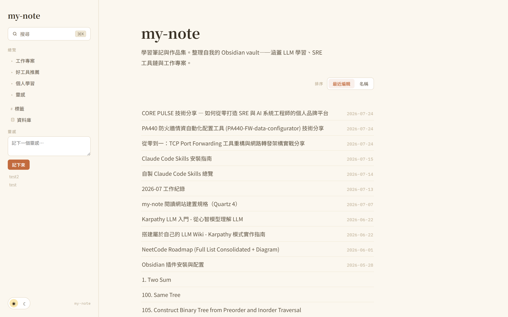
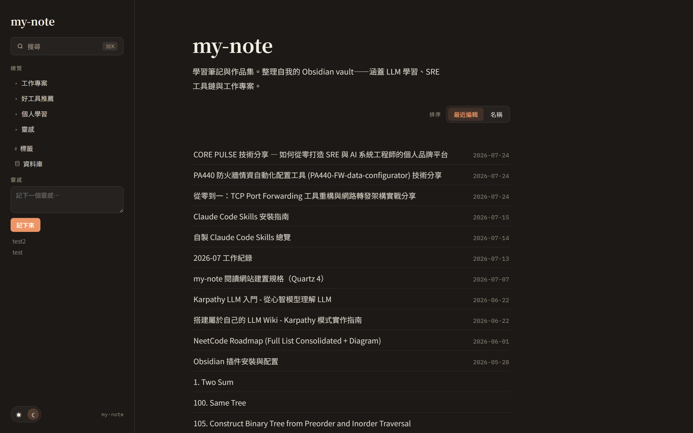
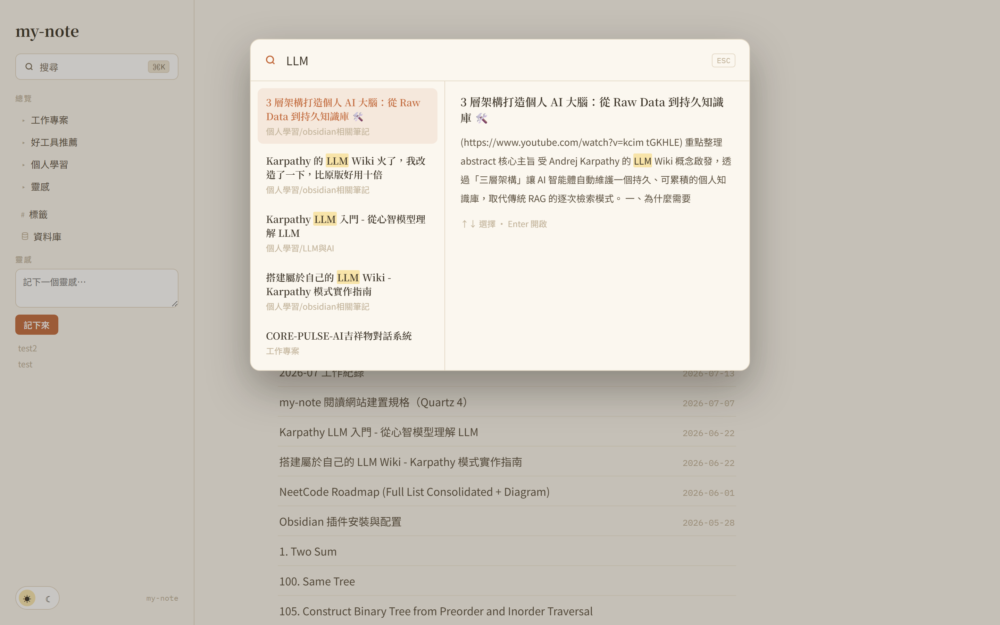
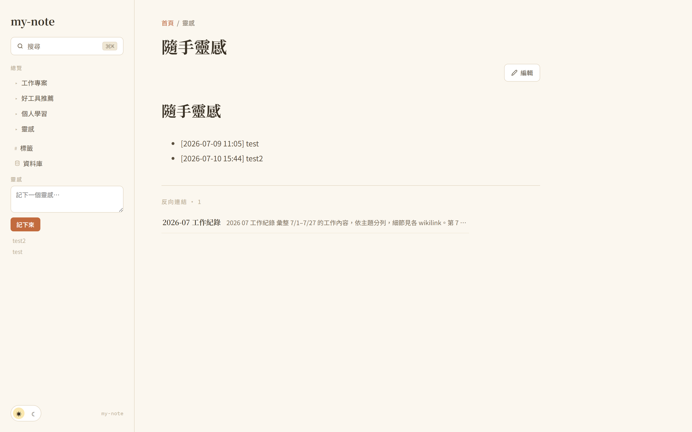
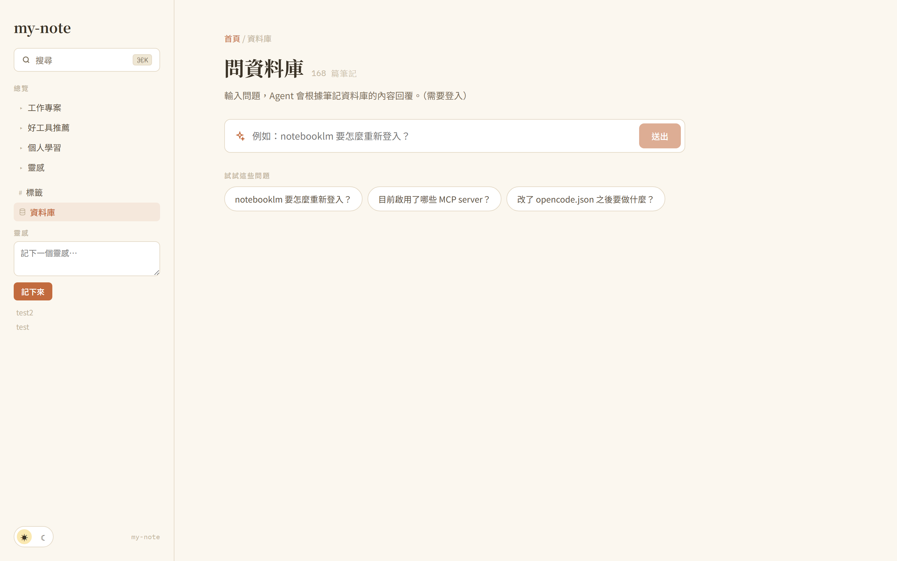
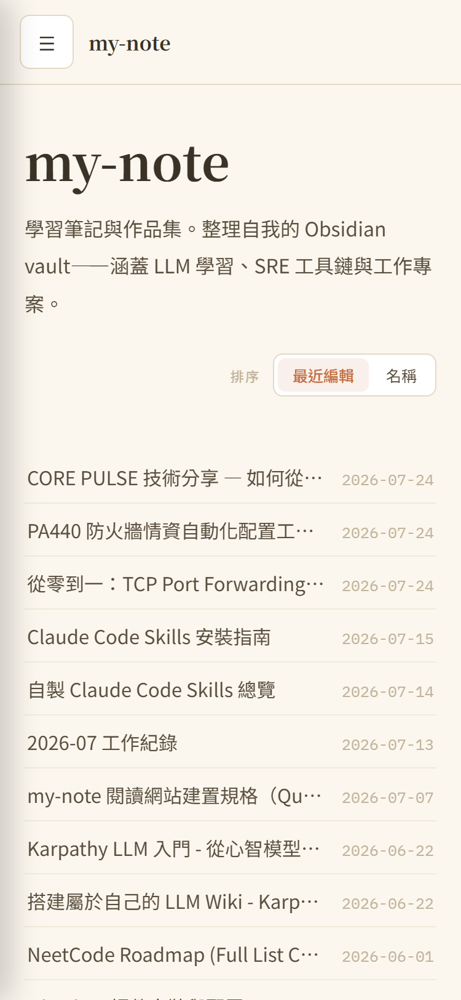
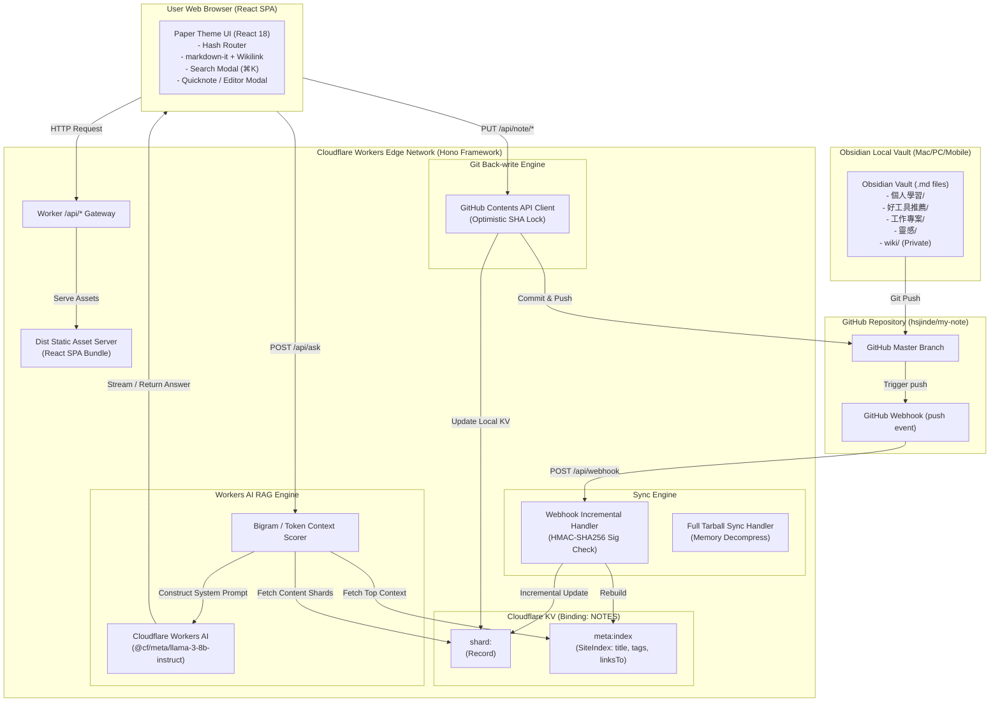

# my-note-web — Obsidian 雲端知識庫與 Git 雙向同步 Edge 閱讀平台

> 把本地 Obsidian Vault 接上公開網頁：Cloudflare Workers + Hono + Sharded KV 提供閱讀與檢索，Webhook 做增量同步，網頁編輯經 GitHub Contents API 樂觀鎖回寫。

---

## 求職摘要

* **求職目標**：Senior Full-Stack Engineer / Cloudflare & Edge Systems Architect / Frontend Architect / AI Application Engineer
* **線上網站**：[note.19980803.xyz](https://note.19980803.xyz) ｜ **原始碼**：[hsjinde/my-note-web](https://github.com/hsjinde/my-note-web)
* **技術棧**
  * 邊緣與 Serverless：Cloudflare Workers、Hono、Cloudflare KV（分片）、Workers AI (`@cf/meta/llama-3-8b-instruct`)
  * 前端：React 18、Vite、TypeScript、Vanilla CSS（自建設計系統「書房紙頁」）、自寫 Hash Router、markdown-it + 自訂 Wikilink plugin、KaTeX
  * 資料管線：GitHub Webhook 增量同步、GitHub Contents API 樂觀鎖回寫、Gzip Tarball 串流同步
  * 品質：Vitest（15 個測試檔、83 個測試全過）、TypeScript strict mode
* **關鍵數字**
  * `<50ms` 邊緣 API 響應，無冷啟動
  * `<3 秒` Webhook 增量同步：本地 push 後幾秒內反映到線上
  * `168+` 篇筆記可全文檢索、標籤過濾與雙向連結
  * `0 元` RAG 成本：不養 Vector DB，答案附來源筆記路徑可回頭驗證
  * 公開白名單與私有 `wiki/` 硬隔離，私有內容不出現在任何公開 API

---

## 線上畫面

以下皆為正式線上環境 [note.19980803.xyz](https://note.19980803.xyz) 的實際畫面。

### 1. 「書房紙頁」亮色主題



不用現成 SaaS 樣板，視覺目標是「溫暖、安靜、書卷氣」的紙頁質感（底色 `#fbf9f4`）。字型分三種角色：標題 `Noto Serif TC`、內文 `Noto Sans TC`、後設資訊與程式碼 `IBM Plex Mono`。

### 2. 深色模式



亮暗兩版共用同一組 CSS 變數（`--bg` / `--tx` / `--ac`），切換不載入額外 CSS、也不閃爍。焦點色「書籤橘」的覆蓋面積控制在 10% 以下。

### 3. ⌘K 即時搜尋



`⌘K` / `Ctrl+K` 開啟，`Esc` 關閉、方向鍵選擇。左欄是匹配結果、右欄即時預覽該段落並高亮關鍵字——不必點進去就能判斷是不是要找的那篇。

### 4. 雙向連結與筆記內頁



自訂 `markdown-it` plugin 把 Obsidian 的 `[[筆記名稱]]` 解析成 hash 路由；建索引時順便算出全站引用圖譜，於頁尾列出反向連結與摘錄。頁面上的「編輯」按鈕會開啟線上 Markdown 編輯器，需通過認證，存檔即 commit 回 GitHub。

### 5. 問資料庫



用自然語言問整個 Vault，例如「notebooklm 要怎麼重新登入？」「目前啟用了哪些 MCP server？」。檢索與生成都在邊緣節點完成，機制見下方〈不養 Vector DB 的 RAG〉。

### 6. 行動端 375px



側邊欄收合為 Drawer，在 375px 下閱讀、搜尋與靈感速記（Quicknote）都不會橫向溢出。

---

## 系統架構

「單一 Worker 雙重服務、雙向 Git 同步、Sharded KV 儲存、Zero-Embedding RAG」：



---

## 六個工程決策

### 1. KV 儲存模型：分片 + 中樞索引

Cloudflare KV 邊緣讀取很快，但按讀寫次數計費。若每篇筆記各存一個 key，光是畫出目錄樹或建搜尋索引就要一次 `KV.list()` 加數百次 `KV.get()`——延遲與帳單都不能接受。

解法是把 KV 當成兩層來用（[src/worker/sync.ts](src/worker/sync.ts)、[src/worker/content.ts](src/worker/content.ts)）：

* **分片 `shard:<頂層資料夾>`**：同一個頂層目錄（`個人學習`、`工作專案`…）的所有筆記內容合併成一個 JSON 物件 `Record<path, { content, sha }>`，存成單一 key。
* **中樞索引 `meta:index`**：由各 shard 重建，只放 header meta（標題、標籤、摘要、大小、修改時間、Wikilinks 引用關係）。

```typescript
export interface SiteIndex {
  notes: Record<string, NoteMeta>;
  tags: Record<string, number>;
  updatedAt: string;
}
```

效果：首頁與目錄樹只需 **1 次 KV 讀取**就拿到全站 168+ 篇的導航結構與標籤統計，latency `<30ms`；讀單篇筆記也只需取對應那一個 shard。

### 2. 雙向同步：Webhook 增量 + Tarball 全量復原

本地 `git push` 後線上要立刻更新。輪詢浪費 API，每次全量又會撞 GitHub Rate Limit，所以拆成兩條管線：

**增量（`incrementalSync`，[src/worker/webhook.ts](src/worker/webhook.ts)）**——驗證 `X-Hub-Signature-256` HMAC-SHA256 簽章擋掉偽造請求，從 push payload 取出 `added` / `modified` / `removed`，只抓變動檔案更新對應 shard，最後 `rebuildIndexFromKV` 重建索引。從 push 到線上反映 3 秒內。

**全量（`fullSync`，[src/worker/tarball.ts](src/worker/tarball.ts)）**——首次部署或 KV 索引遺失時用。不打上千次 File API，而是抓 repo 的 gzip tarball，在 Worker 記憶體裡串流解壓、過濾白名單 Markdown 後批次寫入 KV。

### 3. 網頁編輯回寫與樂觀鎖

這站不只是唯讀閱讀器，可以在網頁上直接編輯筆記、寫「隨手靈感」。但網頁寫入的同時，本地 Obsidian 也可能剛 push 了新 commit——競爭條件會造成覆蓋。

用 GitHub Contents API 內建的 SHA 樂觀鎖處理（[src/worker/github.ts](src/worker/github.ts)）：讀取筆記時一併帶回該檔案的 blob SHA，提交編輯時必須附上它。SHA 對不上 GitHub 直接回 `409`，前端提示衝突而不是硬蓋。寫入成功後 Worker 立刻更新本地 shard 與索引，不必等下一次 Webhook。

```typescript
// src/worker/github.ts 樂觀鎖實作範例
export async function putFile(
  env: Env,
  path: string,
  content: string,
  message: string,
  sha?: string
): Promise<{ sha: string }> {
  const res = await githubFetch(env, `/contents/${encodePath(path)}`, {
    method: 'PUT',
    body: JSON.stringify({
      message,
      content: stringToBase64Utf8(content),
      sha, // 傳入當前客戶端持有之 SHA 進行鎖定比對
      branch: env.GITHUB_BRANCH || 'main',
    }),
  });
  if (res.status === 409) {
    throw new Error('Conflict: File has been modified on GitHub');
  }
  // ...
}
```

### 4. 不養 Vector DB 的 RAG

標準做法是呼叫 Embedding API、維護向量資料庫（Vectorize、Pinecone），再承受查詢延遲。但這裡的語料只有數百篇筆記——為此養一套向量基礎設施，維護成本與帳單都不划算。

所以在 [src/worker/ask.ts](src/worker/ask.ts) 寫了一套不需 Embedding 的全記憶體計分檢索：中文以 Bigram 雙字切分、英數以 token 切分，接著兩階段排序——

* **Stage 1**：掃 `meta:index` 的標題（權重 ×3）、標籤（×2）與摘要，選出 Top 10 候選。
* **Stage 2**：從 shard 取這 10 篇全文，計算提問詞的出現頻率與鄰近度，選出 Top 4。

最後把 Top 4 全文連同來源路徑組成 context 注入 system prompt，交給 Workers AI 生成。

```
[使用者提問] ──> Bigram / Token 分詞
                    │
                    ▼
            Stage 1: 掃描 meta:index (Title / Tag 3x/2x 加權) ──> 取出 Top 10
                    │
                    ▼
            Stage 2: 載入 Shard 筆記全文計分 ───────────────> 選出 Top 4 筆記
                    │
                    ▼
            組裝 System Prompt ──> Cloudflare Workers AI ──> 帶出處的回答
```

這個做法的失效條件也很明確：語料再大一個數量級，關鍵字計分就贏不了語意檢索，那時才該換 Vector DB。

### 5. 公開與私有的硬邊界

Vault 裡混著兩種東西：想公開的技術文章（`個人學習/`、`好工具推薦/`、`工作專案/`），以及含個資、內部架構與草稿的 `wiki/`。邊界寫成程式碼層級的不變量（[src/shared/folders.ts](src/shared/folders.ts)、[src/worker/content.ts](src/worker/content.ts)）：

* `PUBLIC_FOLDERS` 白名單內的頂層目錄才會出現在 `publicIndex()`。
* `wiki/` 照樣同步進 KV 但標記 `NoteMeta.private = true`，在 `publicIndex()` 被硬性過濾，不會出現在 `/api/index`、`/api/note/*` 或任何前端頁面。
* 只有通過 HMAC session 驗證（`requireAuth`）的登入使用者呼叫 `/api/ask` 時，RAG 才允許檢索包含 `wiki/` 的全文。

### 6. 零依賴 SPA 與「書房紙頁」設計系統

前端刻意不裝 React Router、Tailwind 或 Redux——這個規模用不到，裝了只是 bundle 變大、視覺變得跟別人一樣。

* **Hash Router**：[src/app/router.ts](src/app/router.ts) 用 30 行實作型別安全的路由解析（`#/note/<path>`、`#/tag/<tag>`、`#/db`），零外部依賴。
* **Vanilla CSS 變數**：`theme.css` 定義雙色主題（Paper Light / Paper Dark）、紙頁質感邊框 `var(--ln)` 與微互動，不用 Tailwind。
* **markdown-it 延伸**：搭配 `markdown-it-anchor` 與自訂 Wikilink 解析器，做到單頁跳轉與錨點滾動。

---

## 測試

15 個測試檔、83 個單元與整合測試，涵蓋 Webhook 簽章與增量同步、認證與 session cookie、Markdown 雙向連結與目錄樹建構、網頁編輯與衝突處理、公開/私有 API 路由。

```
 RUN  v3.2.7 D:/my-note-web

 ✓ tests/webhook.test.ts (2 tests)
 ✓ tests/auth.test.ts (5 tests)
 ✓ tests/quicknote.test.ts (9 tests)
 ✓ tests/tarball.test.ts (5 tests)
 ✓ tests/github.test.ts (6 tests)
 ✓ tests/markdown.test.ts (7 tests)
 ✓ tests/routes-public.test.ts (5 tests)
 ✓ tests/ask.test.ts (4 tests)
 ✓ tests/sync.test.ts (5 tests)
 ✓ tests/create-note.test.ts (7 tests)
 ✓ tests/routes-auth.test.ts (12 tests)
 ✓ tests/router.test.ts (1 test)
 ✓ tests/content.test.ts (8 tests)
 ✓ tests/folderTree.test.ts (3 tests)
 ✓ tests/index-build.test.ts (4 tests)

 Test Files  15 passed (15)
      Tests  83 passed (83)
   Duration  1.33s
```

`tests/helpers.ts` 的 `mockKV()` 模擬 Cloudflare KV，測試不依賴真實網路或 Wrangler 模擬器，1.3 秒跑完全套。

---

## 面試時可以談的四件事

1. **Cloudflare Edge 架構取捨**
   重點不是用了哪些服務，而是為什麼把整站索引壓成一次 KV 讀取（`meta:index`），以及這個決定換到了 `<50ms` 的邊緣響應。
2. **雙向 Git 同步與資料一致性**
   多數個人筆記網站只做單向 SSG。這裡有 Webhook 增量同步與 Contents API 樂觀鎖回寫，可以談 SHA 衝突偵測與 `409` 的處理方式。
3. **RAG 的規模判斷**
   數百篇筆記不值得養 Vector DB，所以自寫全記憶體 Bigram / Token 計分檢索。可以談兩階段權重設計，以及什麼時候該換掉它。
4. **前端零依賴取向**
   30 行 Hash Router、Vanilla CSS 變數主題。可以談為什麼在這個專案刻意不用 Tailwind 與 React Router。

---

## 履歷描述範本

### 繁體中文

* **打造 Obsidian 雙向同步之邊緣知識平台 (my-note-web)**：以 Cloudflare Workers、Hono 與 Workers AI 建構 168+ 篇筆記的雲端閱讀與檢索平台，設計 Sharded KV 儲存模型將全站導覽壓縮為單次 KV 讀取，邊緣 API 響應 `<50ms` 且無冷啟動。
* **實作雙向 Git 同步與寫入衝突防護**：建置 Webhook 增量同步管線（HMAC-SHA256 簽章驗證）達成 push 後 3 秒內上線，另設計 Gzip Tarball 串流全量同步作為災難復原；網頁編輯經 GitHub Contents API SHA 樂觀鎖回寫，以 `409` 攔截並行覆寫。
* **開發零 Embedding 之邊緣 RAG 檢索引擎**：自研全記憶體 Bigram / Token 兩階段計分演算法（Meta Index 加權篩選 Top 10 → 全文計分選出 Top 4），無須維運向量資料庫即完成語意問答，且答案皆附來源筆記路徑可供驗證。
* **建立公開／私有內容硬隔離與測試防護網**：以白名單機制與 `NoteMeta.private` 不變量確保私有知識庫不外流至任何公開 API，並以 15 個測試檔、83 個 Vitest 單元與整合測試覆蓋同步、認證、編輯衝突與路由邏輯。

### English

* **Built an Edge-Native Knowledge Platform with Bidirectional Obsidian Sync (my-note-web)**: Architected a Cloudflare Workers + Hono reading and search platform serving 168+ notes, using a sharded KV storage model that collapses full-site navigation into a single KV read, achieving `<50ms` edge API responses with zero cold start.
* **Engineered Bidirectional Git Sync with Write-Conflict Protection**: Implemented an HMAC-SHA256-verified webhook pipeline delivering sub-3-second propagation from local push to production, plus a streaming gzip tarball full-sync path for disaster recovery; web edits are committed through the GitHub Contents API with SHA-based optimistic locking that surfaces `409` conflicts instead of overwriting.
* **Developed a Zero-Embedding Edge RAG Engine**: Designed an in-memory two-stage bigram/token scoring algorithm (weighted meta-index ranking to top 10, then full-text scoring to top 4), delivering grounded Q&A with cited source paths and no vector database to operate.
* **Enforced a Hard Public/Private Content Boundary Backed by Tests**: Guaranteed private vault content never reaches any public API via folder whitelisting and a `NoteMeta.private` invariant, covered by 83 Vitest unit and integration tests across 15 suites spanning sync, auth, edit-conflict and routing logic.

---
*索引：[[作品集總覽]]*
