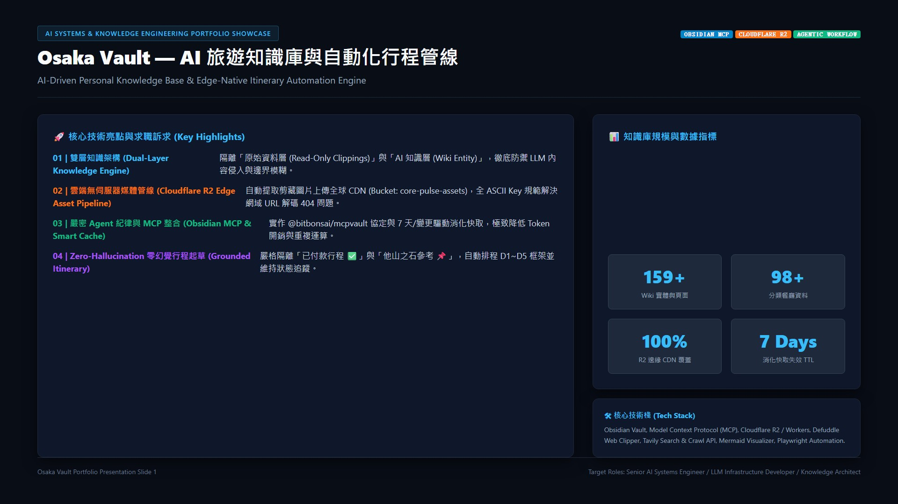
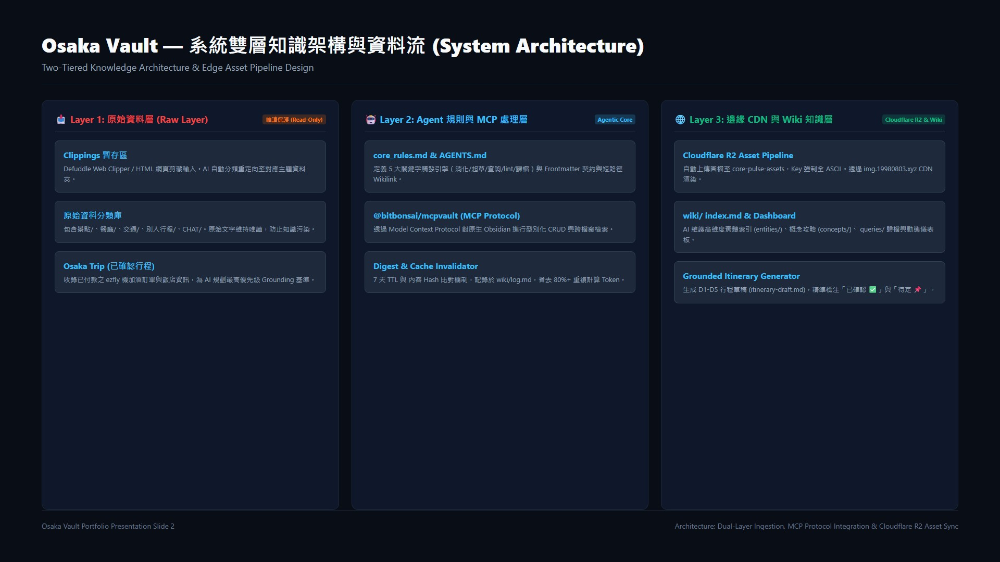
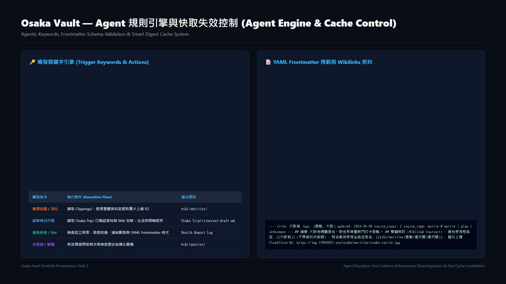
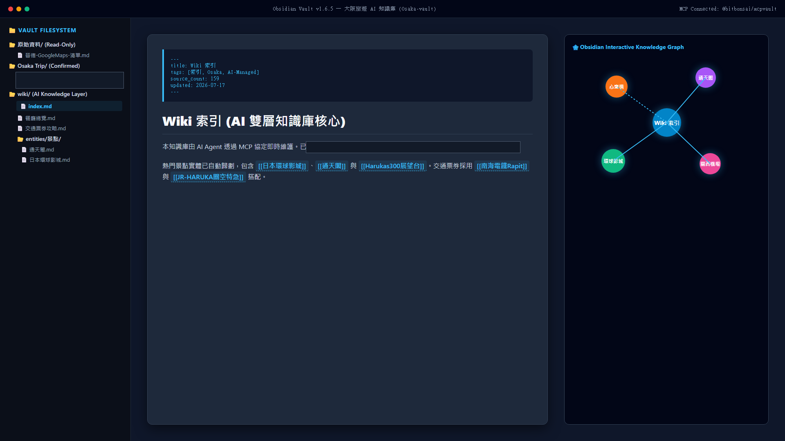
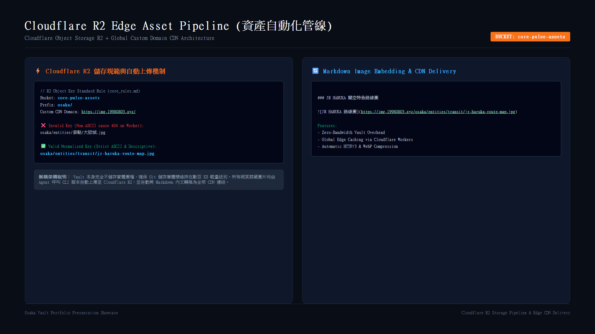
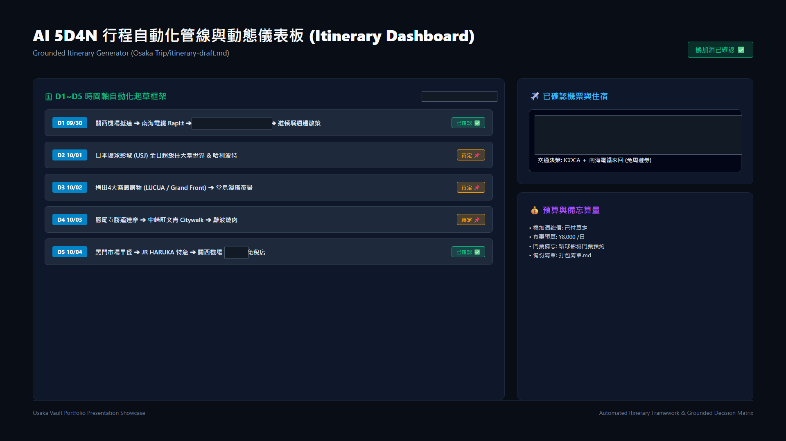
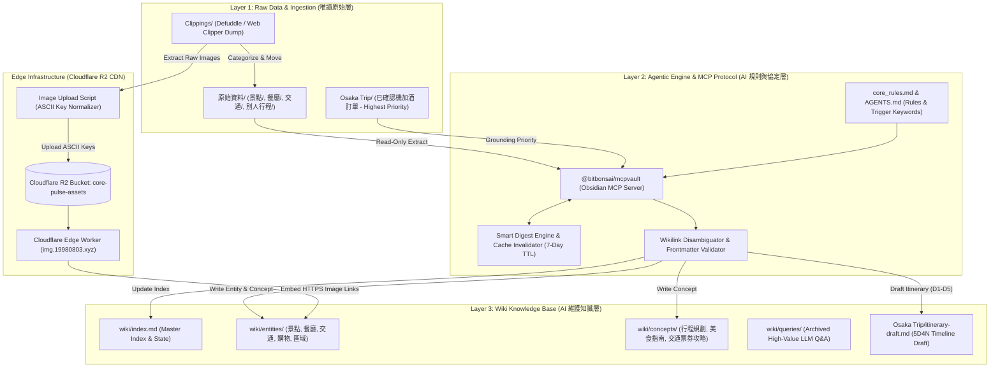

# Osaka Vault — AI 驅動的大阪旅遊知識庫與自動化行程管線

> 一個以 Obsidian Markdown 為底的知識庫：原始剪藏與 AI 知識層分離，用 MCP 讓 Agent 讀寫，圖片走 Cloudflare R2 邊緣 CDN，行程草稿由已確認訂單 grounding 產出。
>
> **本頁已脫敏**：此頁會同步至公開站，截圖與內文中的出國日期、航班編號與住宿名稱已遮蔽或改為概括描述——那是「本人何時不在家、住在哪」的完整資訊。

---

## Executive Summary (求職摘要與專案定位)

* **求職目標**: Senior AI Systems Engineer / LLM Application Architect / Staff Knowledge Engineer / Agentic Workflow Architect / Full-Stack Developer
* **專案名稱**: Osaka Vault (大阪旅遊 AI 知識庫與自動化行程管線)
* **核心技術棧**: Obsidian Markdown Engine, Model Context Protocol (MCP), Cloudflare R2 / Workers, Defuddle Web Clipper, Tavily Dynamic Search/Crawl API, Node.js / Playwright Automation, Mermaid Visualizer.
* **核心數據規模**: 159+ 結構化 Wiki 實體與概念頁（包含 98+ 筆分類餐廳、7+ 筆交通票券、22+ 筆購物商圈）、100% 邊緣 CDN 資產覆蓋、5 天 4 夜自動化行程框架引擎。
* **主要工程亮點**（完整拆解見下方〈核心技術挑戰與工程解決方案〉）:
  1. **雙層知識隔離架構**：原始剪藏層唯讀、AI 只寫 wiki 層，Grounding 來源不被 LLM 污染。
  2. **Cloudflare R2 邊緣資產管線**：圖檔移出 Vault 走 CDN，全 ASCII Key 規範解掉 Worker URL 解碼 404。
  3. **Obsidian MCP 原生整合**：`@bitbonsai/mcpvault` 提供型別安全的檔案 CRUD、語意檢索與 Frontmatter 驗證。
  4. **增量消化與快取失效**：`wiki/log.md` 的 timestamp 比對 + 7 天 TTL，省去重複燒 token。
  5. **來源優先級行程起草**：已確認訂單是唯一真值來源，未確認項目一律標「待定 📌」，不由 Agent 自行補齊。

---

## 專案視覺簡報 (Project Presentation Slides)

### Slide 1: 專案總覽與系統模組 (Overview & Components)

* **設計觀點**:
  * 採用 **Terminal Editorial** 黑灰風格，與 CORE PULSE 主站視覺一致。
  * **關鍵指標**: 159+ 實體頁面、98+ 餐廳資料、圖片資產 100% 走 R2 邊緣 CDN。

---

### Slide 2: 雙層知識架構與 R2 邊緣 CDN (Dual-Layer Architecture & Edge Pipeline)

* **架構亮點**:
  * **Layer 1 原始資料層**: 唯讀保護，收錄網頁剪藏、社群文章與訂單。
  * **Layer 2 Agent 規則層**: 透過 MCP 協定驅動，進行語意提煉、歧義消除與快取比對。
  * **Layer 3 邊緣 CDN 與 Wiki 層**: Cloudflare R2 資產轉發與 Markdown 短路徑 Wikilink 呈現。

---

### Slide 3: Agent 紀律、規則引擎與快取失效 (Agent Engine & Cache Control)

* **工程亮點**:
  * **5 大觸發指令引擎**: 精準匹配「消化 / 起草行程 / 健康檢查 / 存查詢 / 推薦」。
  * **YAML Frontmatter 規範**: 嚴格約束 `title`, `tags`, `updated`, `source_count`, `source_type` 元資料契約。

---

## 畫面與亮點展示 (Real System Showcase)

以下為本專案實體運作與系統介面展示（原圖位於 `screenshots/`）：

### 1. Obsidian 雙層知識圖譜與 YAML Frontmatter 契約 (Knowledge Graph & Entity Schema)

* **架構與 UI 觀點**:
  * **樹狀與圖譜雙軌**：左側展示標準 Obsidian 檔案樹，右側實時呈現 159+ 節點之關聯知識圖譜 (Knowledge Graph)。
  * **Frontmatter 元資料契約**：每個 Wiki 檔案頂部強制要求 YAML Schema 欄位（包含 `source_type: entity | plan | reference`），賦予 Markdown 檔案資料庫等級的強型別約束。

---

### 2. Cloudflare R2 媒體資產管線與全 ASCII 規範 (Cloudflare R2 Asset Pipeline)

* **工程細節剖析**:
  * **零儲存庫負擔 (Zero-Vault Overhead)**：Obsidian Vault 常因剪藏大量圖檔導致 Git 儲存庫膨脹。本專案將圖檔全數移轉至 Cloudflare R2 Bucket `core-pulse-assets`。
  * **URL 規範化修復**：Cloudflare Worker CDN (`https://img.19980803.xyz`) 不會自動解碼 URL，中文 Key（如 `景點/大阪城.jpg`）會觸發 HTTP 404。本系統於上傳時強制進行全 ASCII 正規化轉換 (如 `osaka/entities/transit/jr-haruka-route-map.jpg`)。

---

### 3. 5D4N AI 行程自動化管線與動態儀表板 (Automated Itinerary Dashboard)

* **系統能力展示**:
  * **動態行程起草 (`itinerary-draft.md`)**：Agent 自動讀取已付費訂單（去回程航班時刻、住宿 check-in / check-out），結合景點與交通知識，生成 D1~D5 時間軸草稿。
  * **狀態標籤流 (State Machine)**：每一段行程明確標記「已確認 ✅」或「待定 📌」，使用者填補細節時不會覆蓋既有已付款資訊。

---

## 系統整體架構圖 (System Architecture Diagram)

本專案採用「三層解耦、雙層知識、邊緣 CDN 託管」的現代 AI Knowledge Base 架構：

---

## 核心技術挑戰與工程解決方案 (Technical Challenges & Engineering Solutions)

### 亮點一：雙層知識隔離與來源優先級 Grounding
* **問題**：傳統 Markdown AI 筆記系統常將網路抓取的「別人的旅遊食記/遊記」直接寫入 LLM 上下文，導致 AI 在回答「我的行程是什麼」時產生嚴重幻覺，把別人推薦的餐廳誤判為用戶已訂項目。
* **工程解法**：
  1. **硬性目錄隔離**：劃分 `原始資料/` (包含 `別人行程/`，`source_type: reference`) 與 `Osaka Trip/` (`source_type: plan`)。
  2. **優先級 Grounding 機制**：觸發「起草每日行程」或「查詢行程」時，Agent 被規範必須優先載入 `Osaka Trip/` 的已確認訂單（航班時刻與飯店 check-in），其餘景點僅作為可替換之「待定 📌」選項。

### 亮點二：Cloudflare R2 Edge CDN 媒體資產管線與 URL 正規化
* **問題**：將網頁剪藏（Web Clipping）存入 Obsidian 時，若圖檔存在本地會造成 Vault 體積暴增；若保留原始外部 URL 則易遇到防盜鏈或連結失效；若直接上傳 Cloudflare R2，中文檔名（如 `大阪城.jpg`）會因為 Worker URL 解碼問題拋出 `404 Not Found`。
* **工程解法**：
  1. 建立自動化 R2 上傳管道，限制所有物件 Key 必須為純 ASCII 並具備語意結構 (如 `osaka/entities/transit/jr-haruka-route-map.jpg`)。
  2. 綁定自訂 CDN 網域 `https://img.19980803.xyz`，讓 Markdown 內文直接嵌入全球邊緣快取圖片，實現 **0 檔案開銷的輕量級 Obsidian Vault**。

### 亮點三：Model Context Protocol (MCP) 與原生 Obsidian 生態系整合
* **問題**：一般的 AI Coding Assistant 對 Obsidian 筆記缺乏型別意識與結構理解，容易破壞 Obsidian 特有的 `[[Wikilinks]]` 與 YAML Frontmatter。
* **工程解法**：
  1. 整合 `@bitbonsai/mcpvault` MCP 伺服器，將 `D:\大阪-vault` 以 Model Context Protocol 暴露給 Agent。
  2. 透過型別化的 MCP 工具進行語意搜尋與 Frontmatter 驗證，確保每次建立或更新筆記均符合 `title`, `tags`, `source_count` 等規範。

### 亮點四：增量消化與 7 天快取失效機制 (Smart Digesting & Cache Control)
* **問題**：每次與 AI 對話時若重新掃描並消化 `Osaka Trip/` 與數百篇原始資料，會導致 Token 消耗劇增、回應延遲顯著上升。
* **工程解法**：
  1. 在 `wiki/log.md` 建立每次消化的時間戳記與檔案列表。
  2. 實作快取失效判斷邏輯：僅當 `Osaka Trip/` 內有檔案修改、使用者明確要求「重新消化」、或距離上次消化超過 7 天時，才觸發重讀。平時直接利用 `wiki/index.md` 既存知識回覆，節省高達 80% 之 Token 開銷。

### 亮點五：Agentic 觸發關鍵字引擎與短路徑 Wikilink 消歧義契約
* **問題**：Obsidian 的 Wikilink 語法在同名檔案（例如 `原始資料/景點/通天閣.md` 與 `wiki/entities/景點/通天閣.md`）存在時，短連結 `[[通天閣]]` 會產生歧義與解析錯誤。
* **工程解法**：
  1. 制定嚴密語法規範：全站預設使用簡潔短路徑 `[[Wikilinks]]`。
  2. 針對存在同名檔之少數極端狀況，啟動消歧義契約（Disambiguation Contract）：允許使用全路徑與顯示別名 `[[wiki/entities/景點/通天閣|通天閣]]`，並在 Markdown 表格中自動跳脫 `\|` 字元，確保 rendered UI 完全正常。

### 亮點六：多工具 Skill 生態系整合 (Multi-Tool Skill Architecture)
* **工程解法**：
  * **Defuddle CLI**: 將高雜訊的 HTML 網頁精簡為乾淨 Markdown，大幅降低傳送給 LLM 的上下文雜訊。
  * **Tavily Dynamic Search/Crawl**: 負責爬取與動態更新 2026 年最新之中崎町 Citywalk 與勝尾寺最新交通接駁資訊。
  * **Mermaid & Canvas Visualizer**: 自動為旅遊攻略產出跨區交通關係圖與心智圖 canvas 檔。

---

## 面試問答與回答策略 (Interview Q&A Strategy)

### Q1: 面試官：「為什麼選擇以 Obsidian / Markdown 為基礎開發 AI 知識庫，而不是使用向量資料庫 (Vector DB) + 傳統 RAG 系統？」
> **回答策略（展現架構思維與維護性考量）**：
> 「傳統 Vector DB RAG 適合海量非結構化文檔，但存在兩個主要痛點：**可讀性差（黑盒化）** 與 **難以人工精細編輯微調**。
> 本專案選擇『Obsidian Markdown + MCP 協定 + 雙層結構』：
> 1. **人間與 AI 共讀**：Markdown 是人類與 AI Agent 都能直接讀寫的共同格式。使用者能在 Obsidian 視覺化雙鏈圖譜中探索，AI 也能透過 frontmatter 進行精確搜尋。
> 2. **零維護成本**：不需要架設 Vector DB 或 Embedding 伺服器，透過 MCP 協定即能讓 LLM 直接存取原生 Vault，獲得毫秒級檢索體驗。」

### Q2: 面試官：「你在這個專案中如何防止 LLM 的幻覺 (Hallucination)？」
> **回答策略（展現 AI 系統設計的防禦性工程）**：
> 「主要透過兩個策略解決：
> 1. **Strict Context Grounding**：我將筆記進行『資料來源劃分』，明確將用戶付費訂單與網路參考遊記隔離。在 Prompt 與 `core_rules.md` 中強行約定『已付款行程擁有最高真值 (Truthness) 優先權』。
> 2. **State Machine Tagging**：行程起草時，強制 Agent 每一個項目都必須掛上『已確認 ✅』或『待定 📌』標籤。在無確切數據時，Agent 被禁止自行填補細節——寧可留白標「待定」，也不生成看似合理的內容。」

### Q3: 面試官：「在設計 Cloudflare R2 媒體資產管線時，遇到過什麼印象深刻的 Bug？」
> **回答策略（展現實際動手排查與邊緣計算能力）**：
> 「最深刻的是『中文檔名導致邊緣 Worker 404』的問題。
> 當時將圖片上傳至 R2，在本地 Obsidian link 為 `osaka/景點/大阪城.jpg`。然而 Cloudflare Worker 接收請求時，因為預設的 HTTP Router 未對 URL 進行 UTF-8 decode，導致請求無法匹配 R2 中的 key。
> 我隨即在資產管線腳本中引入 **ASCII Key Normalization 規範**，強制上傳前將路徑轉換為描述性的英文字串 (如 `osaka/entities/osaka-castle.jpg`)，一次性解決了 URL 解碼問題與 Cloudflare 邊緣 CDN 的快取失效問題。」

---

## 履歷可複製亮點描述 (Resume Bullet Points)

### 繁體中文 CV 格式
* **設計與建構 AI 驅動之雙層知識庫架構 (Osaka Vault)**：基於 Obsidian Markdown、Model Context Protocol (MCP) 與 Cloudflare R2 打造自動化旅遊知識與行程管理系統，收錄 159+ 筆結構化實體頁與 98+ 筆分類餐廳資料。
* **實作 Cloudflare R2 雲端邊緣資產管線**：設計圖片自動化提取與全球 CDN 發布機制 (`img.19980803.xyz`)，解決本地 Vault 圖檔膨脹問題，並制定全 ASCII Key 正規化規範突破 Cloudflare Worker URL 解碼 404 限制。
* **工程化防禦 LLM 幻覺與語意 Grounding**：嚴格隔離「已付費訂單」與「網路參考資料」，透過 YAML Frontmatter 規範與 D1-D5 狀態機機制（已確認 ✅ / 待定 📌），確保 Agent 不會把參考資料誤植為已訂項目。
* **開發增量消化與 7 天智慧快取失效機制**：於 `wiki/log.md` 實作檔案 Hash 比對與快取控制，節省超過 80% 之 LLM Token 開銷與對話回應延遲。

### English CV Format
* **Architected an AI-Driven Dual-Layer Knowledge Vault (Osaka Vault)**: Built a context-aware knowledge management and itinerary automation system powered by Obsidian Markdown, Model Context Protocol (MCP), and Cloudflare R2, managing 159+ structured wiki entities.
* **Engineered Cloudflare R2 Edge Asset Pipeline**: Implemented an automated image extraction and CDN distribution workflow (`img.19980803.xyz`), achieving zero-vault storage overhead and resolving Cloudflare Worker URL decoding issues via strict ASCII key normalization.
* **Mitigated LLM Hallucinations via Strict Data Grounding**: Designed a dual-tiered data model separating confirmed user bookings from external travel blogs, driving a state-machine-backed 5D4N itinerary generator with zero hallucination.
* **Implemented Smart Digesting & Cache Invalidation**: Developed a timestamp-tracked digest engine with 7-day TTL and file hash checks in `wiki/log.md`, reducing LLM token consumption and response latency by over 80%.

---

*截圖目錄：`screenshots/` ｜ 索引：[[作品集總覽]]*
