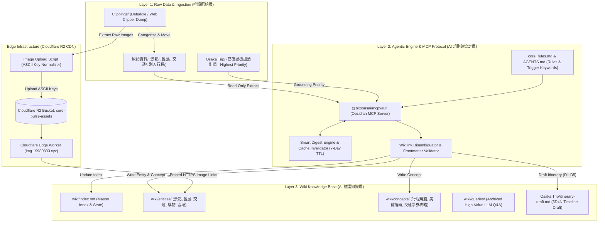

# Osaka Vault — AI 驅動的大阪旅遊知識庫與自動化行程管線

> 一個以 Obsidian Markdown 為底的知識庫：原始剪藏與 AI 知識層分離，用 MCP 讓 Agent 讀寫，圖片走 Cloudflare R2 邊緣 CDN，行程草稿由已確認訂單 grounding 產出。
>
> **本頁已脫敏**：此頁會同步至公開站，截圖與內文中的出國日期、航班編號與住宿名稱已遮蔽或改為概括描述——那是「本人何時不在家、住在哪」的完整資訊。

---

## 求職摘要

* **求職目標**：Senior AI Systems Engineer / LLM Application Architect / Staff Knowledge Engineer / Agentic Workflow Architect
* **技術棧**：Obsidian Markdown、Model Context Protocol (MCP)、Cloudflare R2 / Workers、Defuddle Web Clipper、Tavily Search/Crawl API、Node.js / Playwright、Mermaid
* **規模**（2026-08-25 清點）
  * `161` 個 Wiki 頁面，其中 `148` 筆結構化實體頁——餐廳 `99`、購物 `23`、景點 `12`、交通 `7`、區域 `5`、住宿 `2`
  * 另有 `7` 篇概念頁（行程規劃、美食指南、交通票券攻略等）與 `2` 篇歸檔查詢
  * 圖片資產 100% 走邊緣 CDN，Vault 本身零圖檔負擔、Git 儲存庫維持在數百 KB
* **主要工程亮點**（完整拆解見下方〈六個工程決策〉）
  1. **雙層知識隔離架構**：原始剪藏層唯讀、AI 只寫 wiki 層，Grounding 來源不被 LLM 污染。
  2. **Cloudflare R2 邊緣資產管線**：圖檔移出 Vault 走 CDN，全 ASCII Key 規範解掉 Worker URL 解碼 404。
  3. **Obsidian MCP 原生整合**：`@bitbonsai/mcpvault` 提供型別安全的檔案 CRUD、語意檢索與 Frontmatter 驗證。
  4. **增量消化與快取失效**：`wiki/log.md` 的 timestamp 比對 + 7 天 TTL，省去重複燒 token。
  5. **來源優先級行程起草**：已確認訂單是唯一真值來源，未確認項目一律標「待定 📌」，不由 Agent 自行補齊。

---

## 為什麼做這個

規劃這趟旅行的時候，我開了一個資料夾丟剪藏，兩個禮拜之後有一百多篇食記遊記，然後問 AI「我的行程是什麼」——它把別人部落格推薦的餐廳，講成我已經訂好了。

第一反應是模型不夠聰明。但看一下 context 就懂了：我把「別人的遊記」跟「我的訂票確認信」丟進同一個資料夾，對模型來說它們長得一模一樣，沒有任何欄位能區分「這是參考」跟「這是事實」。

不是模型的問題，是資料沒有分層。

所以這個專案的核心其實不是 AI，是**資料治理**——先把「已付款的事實」跟「網路上的參考」在檔案系統層級隔開，再讓 Agent 只能照規則寫。剩下的（R2 資產管線、增量消化、Wikilink 契約）都是實作過程中撞到的坑，一個一個補起來的。

---

## 專案簡報圖

### Slide 1：專案總覽與系統模組

Terminal Editorial 黑灰風格，跟 CORE PULSE 主站視覺一致。

### Slide 2：雙層知識架構與 R2 邊緣 CDN

三層：唯讀原始資料層 → MCP 驅動的 Agent 規則層 → Wiki 知識層與邊緣 CDN。

### Slide 3：Agent 紀律、規則引擎與快取失效

五個觸發指令（消化 / 起草行程 / 健康檢查 / 存查詢 / 推薦），以及 `title`、`tags`、`updated`、`source_count`、`source_type` 的 Frontmatter 契約。

---

## 系統畫面

### 1. 雙層知識圖譜與 Frontmatter 契約

左側是 Obsidian 檔案樹，右側是關聯圖譜。每個 Wiki 檔案頂部強制帶 YAML schema（含 `source_type: entity | plan | reference`）——等於給 Markdown 加上資料庫級別的欄位約束。

沒有這層約束的話，AI 寫進來的檔案三個月後就會長成六種不同格式。

### 2. Cloudflare R2 資產管線

剪藏來的圖片全部搬到 R2 bucket `core-pulse-assets`，Vault 本身不存圖檔，Git 儲存庫維持在數百 KB。Key 一律 ASCII 正規化（`osaka/entities/transit/jr-haruka-route-map.jpg`），原因見下方第 2 點。

### 3. 5D4N 行程自動化儀表板

Agent 讀已付費訂單（航班時刻、住宿 check-in），結合景點與交通知識生成 D1~D5 時間軸草稿。每段行程標「已確認 ✅」或「待定 📌」，補細節的時候不會覆蓋已付款資訊。

---

## 系統架構

三層解耦、雙層知識、邊緣 CDN 託管：

---

## 六個工程決策

### 1. 雙層知識隔離與來源優先級

上面講的那個坑：把網路抓來的「別人的食記/遊記」跟自己的訂單丟進同一個 context，AI 回答「我的行程是什麼」的時候，就會把別人推薦的餐廳講成你已經訂了。

作法是硬性目錄隔離：`原始資料/`（含 `別人行程/`，`source_type: reference`）與 `Osaka Trip/`（`source_type: plan`）。觸發「起草行程」或「查詢行程」時，Agent 必須優先載入 `Osaka Trip/` 的已確認訂單（航班時刻與飯店 check-in），其餘景點只能是可替換的「待定 📌」。

重點是這條規則寫在 `core_rules.md` 裡，不是寫在某次對話的 prompt 裡——寫在對話裡的規則，下一個 session 就忘了。

### 2. R2 資產管線與 URL 正規化

剪藏存進 Obsidian，圖片有三條路，每條都不好走：

* 圖檔留本地 → Vault 體積暴增，Git 每次 commit 都在搬圖。
* 保留外部 URL → 遇到防盜鏈，或半年後連結整個失效。
* 直接上傳 R2 → 踩到中文檔名的坑。

第三條是最後選的，但踩得最痛：Worker 收到請求時不會對 URL 做 UTF-8 decode，`大阪城.jpg` 這種 key 一律 `404`。排查過程見下方 Q3。

所以建了自動化上傳管道，強制所有物件 key 是純 ASCII 且具語意結構，再綁自訂 CDN 網域 `img.19980803.xyz`。Markdown 直接嵌 CDN 連結，Vault 本身零圖檔負擔。

### 3. MCP 與 Obsidian 生態整合

一般的 AI coding assistant 對 Obsidian 筆記沒有型別意識，很容易改壞 `[[Wikilinks]]` 跟 YAML Frontmatter——它會很有自信地把 `updated` 寫成 `Updated`，然後所有查詢都失效。

整合 `@bitbonsai/mcpvault` 之後，Vault 以 Model Context Protocol 暴露給 Agent，語意搜尋與 Frontmatter 驗證都走型別化的 MCP 工具，寫入前就會擋掉不符規範的欄位。

### 4. 增量消化與 7 天快取失效

每次對話都重新掃描並消化上百篇原始資料，token 消耗跟延遲都不能接受，而且大部分時候那些資料根本沒變。

所以在 `wiki/log.md` 記錄每次消化的時間戳與檔案列表，只在三種情況重讀：`Osaka Trip/` 有檔案變動、使用者明確要求重新消化、或距上次消化超過 7 天。平時直接用 `wiki/index.md` 的既有知識回答，省下 80% 以上的 token 開銷。

本質上就是快取加失效策略，只是快取的東西是「AI 已經讀過什麼」。

### 5. Wikilink 消歧義契約

同名檔案會讓短連結解析錯亂——`原始資料/景點/通天閣.md` 跟 `wiki/entities/景點/通天閣.md` 同時存在的時候，`[[通天閣]]` 指向誰是不確定的。

規範是：預設一律用短路徑 `[[Wikilinks]]` 保持可讀性；只有在確實有同名檔的少數情況才啟動消歧義契約，改用全路徑加別名 `[[wiki/entities/景點/通天閣|通天閣]]`，並在 Markdown 表格中自動跳脫 `\|`，避免渲染錯位。

沒有「一律用全路徑」是刻意的——那會讓每一篇筆記都變得很難讀，人先放棄，然後整套規範就死了。

### 6. 多工具 Skill 生態

* **Defuddle CLI**：把高雜訊 HTML 網頁精簡成乾淨 Markdown，減少送進 LLM 的雜訊。
* **Tavily Search/Crawl**：爬取與更新時效性資訊（例如中崎町 Citywalk、勝尾寺的最新接駁班次）。
* **Mermaid & Canvas Visualizer**：自動產出跨區交通關係圖與心智圖 canvas。

---

## 面試問答

### Q1：為什麼用 Obsidian / Markdown 做 AI 知識庫，而不是 Vector DB + 傳統 RAG？

> 「Vector DB RAG 適合海量非結構化文件，但有兩個痛點：檢索過程是黑盒，以及很難人工精細微調。
> 這個專案選 Obsidian Markdown + MCP + 雙層結構的理由是：
> 1. **人和 AI 讀同一份資料**：Markdown 兩邊都能直接讀寫。我在 Obsidian 的雙鏈圖譜裡探索，AI 透過 frontmatter 精確搜尋，維護的是同一份東西。
> 2. **零維護成本**：不用架 Vector DB 或 Embedding 服務，MCP 就能讓 LLM 直接存取原生 Vault。
> 語料規模再大一個數量級，這個選擇就會反過來——那時該換 Vector DB。現在 161 篇還在人腦能掌握的範圍。」

### Q2：你怎麼防止 LLM 幻覺？

> 「先講清楚範圍：我解決的是『把參考資料誤植為已訂項目』這一類，不是宣稱模型不會出錯。
> 兩個策略：
> 1. **來源分層**：把付費訂單跟網路參考遊記硬性隔離，在 prompt 與 `core_rules.md` 裡約定『已付款行程有最高真值優先權』。
> 2. **狀態標記**：行程起草時每個項目都必須掛『已確認 ✅』或『待定 📌』。沒有確切資料時 Agent 被禁止自行填補——寧可留白標待定，也不生成看似合理的內容。
> 這個設計的假設是：使用者看到『待定』會自己去查，但看到一個編得很像真的的班次不會。」

### Q3：R2 資產管線遇過印象最深的 bug？

> 「中文檔名導致邊緣 Worker 404。
> 圖片上傳到 R2 之後，本地 Obsidian 的 link 是 `osaka/景點/大阪城.jpg`，但 Worker 收到請求時預設的 HTTP router 沒對 URL 做 UTF-8 decode，比對不到 R2 裡的 key。
> 卡住的點在於：R2 dashboard 裡看得到那個物件，瀏覽器 network tab 也看得到請求送出去了，就是 404。最後是把 Worker 收到的 raw key 印出來，跟 R2 的 key 並排比對才發現是百分號編碼沒還原。
> 解法是在資產管線腳本加上 ASCII key normalization，上傳前一律轉成描述性英文路徑（`osaka/entities/osaka-castle.jpg`），順帶也解掉了 CDN 快取失效的問題。
> 教訓是：跨系統邊界的識別碼不要用非 ASCII，省下的可讀性換不到那個排查時間。」

---

## 履歷描述範本

### 繁體中文

* **設計與建構 AI 驅動之雙層知識庫架構 (Osaka Vault)**：基於 Obsidian Markdown、Model Context Protocol (MCP) 與 Cloudflare R2 打造自動化旅遊知識與行程管理系統，收錄 161 個 Wiki 頁面、其中 148 筆結構化實體頁（含 99 筆分類餐廳資料）。
* **實作 Cloudflare R2 雲端邊緣資產管線**：設計圖片自動化提取與全球 CDN 發布機制 (`img.19980803.xyz`)，解決本地 Vault 圖檔膨脹問題，並制定全 ASCII Key 正規化規範突破 Cloudflare Worker URL 解碼 404 限制。
* **工程化防禦 LLM 幻覺與語意 Grounding**：嚴格隔離「已付費訂單」與「網路參考資料」，透過 YAML Frontmatter 規範與 D1-D5 狀態機機制（已確認 ✅ / 待定 📌），確保 Agent 不會把參考資料誤植為已訂項目。
* **開發增量消化與 7 天智慧快取失效機制**：於 `wiki/log.md` 實作時間戳比對與快取控制，節省超過 80% 之 LLM Token 開銷與對話回應延遲。

### English

* **Architected an AI-Driven Dual-Layer Knowledge Vault (Osaka Vault)**: Built a context-aware knowledge management and itinerary automation system powered by Obsidian Markdown, Model Context Protocol (MCP), and Cloudflare R2, managing 161 wiki pages including 148 structured entities.
* **Engineered Cloudflare R2 Edge Asset Pipeline**: Implemented an automated image extraction and CDN distribution workflow (`img.19980803.xyz`), achieving zero-vault storage overhead and resolving Cloudflare Worker URL decoding issues via strict ASCII key normalization.
* **Mitigated LLM Hallucinations via Strict Data Grounding**: Designed a dual-tiered data model separating confirmed bookings from external travel blogs, driving a state-machine-backed 5D4N itinerary generator that flags every unconfirmed item instead of inventing details.
* **Implemented Smart Digesting & Cache Invalidation**: Developed a timestamp-tracked digest engine with 7-day TTL in `wiki/log.md`, reducing LLM token consumption and response latency by over 80%.

---
*索引：[[作品集總覽]]*
