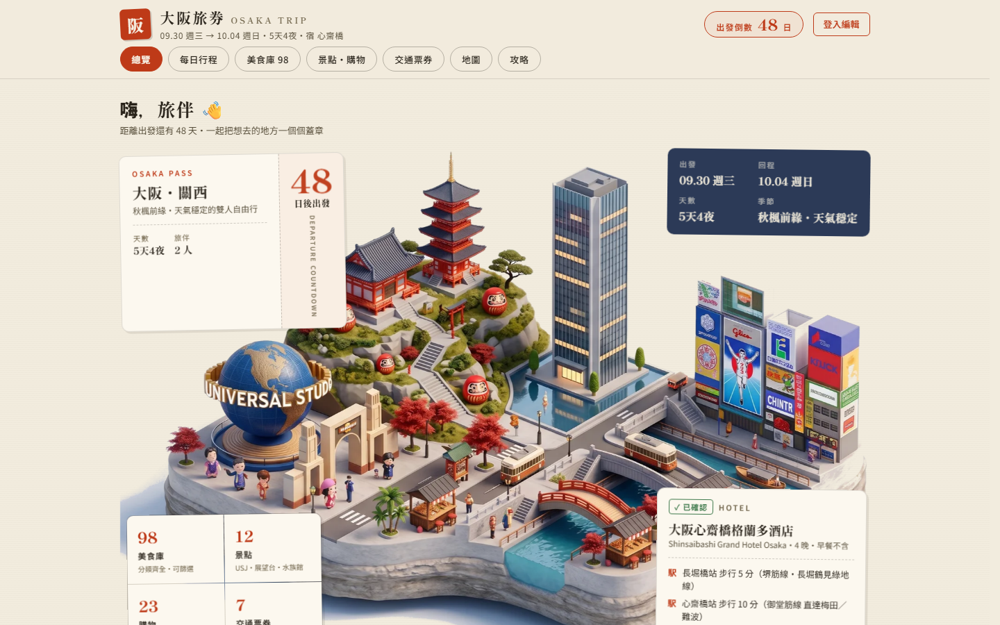
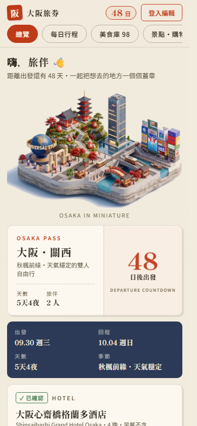
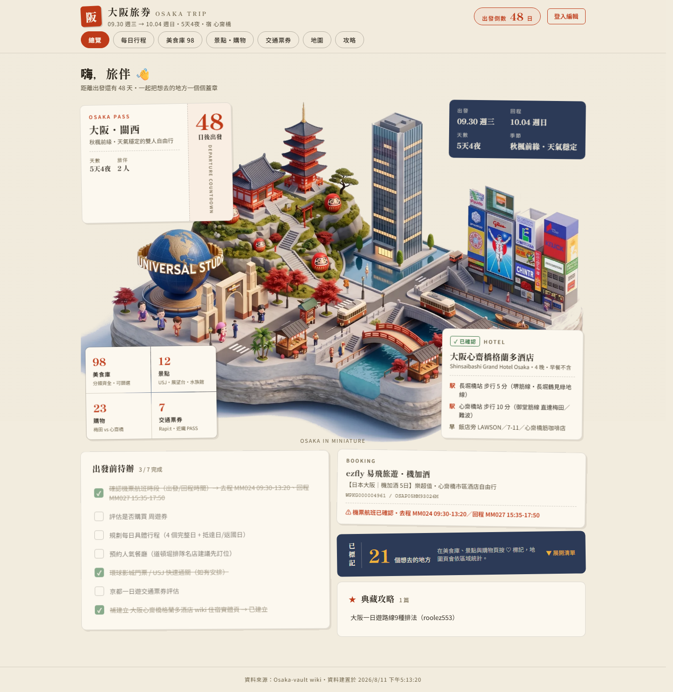
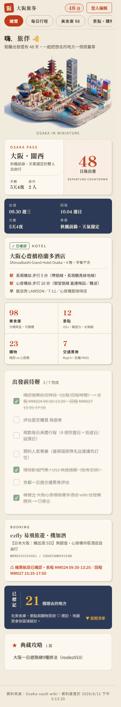

# 大阪旅券 OSAKA TRIP — 極速離線同步與和風手帳設計的全棧旅遊儀表板 (求職 Presentation 專案評析)

> **"Osaka Trip Dashboard is a production-ready Jamstack web application that combines Washi Editorial aesthetics, Zero-Latency Edge SSG, and Cloudflare D1 State Synchronization to solve real-world travel information clutter."**

---

## 🎯 Executive Summary (求職摘要與專案定位)

* **求職目標**: Senior Frontend Engineer / Full-Stack Web Architect / Jamstack Systems Specialist / UI/UX Systems Developer
* **專案名稱**: 大阪旅券 OSAKA TRIP (`Osaka-web`)
* **線上真實環境**: [https://osaka.19980803.xyz](https://osaka.19980803.xyz) （Cloudflare Pages 自訂網域）
* **備援網址**: [https://hsjinde.github.io/Osaka-web/](https://hsjinde.github.io/Osaka-web/) （GitHub Pages 雙部署）
* **專案儲存庫**: [hsjinde/Osaka-web](https://github.com/hsjinde/Osaka-web) (前端與 Worker) | [hsjinde/Osaka-vault](https://github.com/hsjinde/Osaka-vault) (Obsidian 知識庫源頭)
* **核心技術棧**: React 18, TypeScript, Vite, Tailwind CSS, Cloudflare Worker (Hono), Cloudflare D1 (Edge SQLite), Zod Validation, GitHub Actions CI/CD Pipeline, Vitest, Playwright.

---

## 📸 Real Production Screenshots (真實線上環境展示)

### 1. 桌機端極致首屏視覺 (Desktop Hero & Washi Editorial Interface)


> **設計觀點**:
> 捨棄傳統 SaaS/Notion 冰冷中性的樣板風格，以「御朱印帳手帳」為核心品牌意象。和紙紋理底色（`#F1EBDD`）、襯線標題（Shippori Mincho）與朱印紅（`#B23A1E`）完美結合，呈現典雅現代的和風質感。

---

### 2. 行動端單手操作體驗 (Mobile-First Handheld UX)


> **旅途優先 (Travel-First)**:
> 針對旅途中站在大阪街頭單手查行程的情境，提供膠囊形導航列（Chips）、大字級對比、微動畫回饋與 ≥36–44px 觸控點擊區域，確保極致順暢的流動查閱體驗。

---

### 3. 全頁面內容結構 (Desktop Full Page View)


---

### 4. 行動端完整頁面流轉 (Mobile Full Experience)


---

## 💡 專案緣起與產品痛點 (Problem Statement & Product Purpose)

在多人家族旅行時，傳統旅遊規劃常面臨以下顯著痛點：
1. **資訊極度分散**: 餐廳攻略、景點網址、飯店確認單散落在 LINE 群組訊息與私人筆記中，旅途中翻找極為耗時。
2. **網路連線不穩定與載入延遲**: 到了海外旅遊現場，行動網路常有延遲，需要一個手感極速、甚至支援離線緩存的介面。
3. **多人協同與跨裝置狀態同步問題**: 大家想去的地方不同、行程進度與待辦勾選狀況需要跨手機/桌機即時同步，但又不想讓隨意瀏覽的訪客污染主選清單。

### 💡 解決方案
**Osaka Trip Dashboard** 透過 Obsidian Markdown 作為資料庫（Single Source of Truth），經由自動化 CI/CD 建置管線轉化為極速 Static Web App；並搭配 Cloudflare Edge Worker 與 D1 資料庫，實現 **「無網頁刷新感、離線可備援、雙重權限防護」** 的跨裝置同步旅遊儀表板。

---

## 🏗️ 系統架構與資料管線 (System Architecture & Pipeline)

本專案採用現代 Jamstack 結合邊緣運算 (Edge Computing) 的高效解耦架構：

```mermaid
flowchart TD
    subgraph Source["Knowledge Layer (Obsidian)"]
        Vault["Osaka Vault (Markdown Files)"]
        EntityMD["wiki/entities/ (美食/景點/購物)"]
        ItineraryMD["wiki/dashboard/每日行程.md"]
        TodoMD["Osaka Trip/待辦.md"]
    end

    subgraph Pipeline["Build & Validation Pipeline"]
        GHActions["GitHub Actions (notify-dashboard)"]
        BuildScript["scripts/build-data.ts (Node.js)"]
        ZodValidator["Zod Schema Validation & Regex Parser"]
        JSONOutput["src/data/*.json (Type-Safe Data)"]
    end

    subgraph Hosting["Edge Distribution"]
        ViteBuild["Vite Static Production Bundle"]
        CFPages["Cloudflare Pages (Custom Domain)"]
        GHPages["GitHub Pages (Sync Backup)"]
    end

    subgraph EdgeState["Edge State Engine"]
        UserBrowser["User Mobile/Desktop Browser"]
        WorkerAPI["Cloudflare Worker (Hono Framework)"]
        EdgeD1["Cloudflare D1 (Edge SQLite Database)"]
        GHWriteback["GitHub REST API (Itinerary Commit Writeback)"]
    end

    Vault --> GHActions
    GHActions --> BuildScript
    BuildScript --> ZodValidator
    ZodValidator --> JSONOutput
    JSONOutput --> ViteBuild
    ViteBuild --> CFPages & GHPages

    UserBrowser <-->|1. Read Static Content (0ms)| CFPages
    UserBrowser <-->|2. Fetch/Put Favorites & Todos| WorkerAPI
    WorkerAPI <-->|3. Edge SQL Queries| EdgeD1
    WorkerAPI -.->|4. Direct Markdown Edit Writeback| GHWriteback
```

---

## 🛠️ 關鍵工程亮點與技術挑戰 (Engineering Highlights)

### 1. 獨創和風手帳設計系統 (Washi Editorial Design System)
* **Creative North Star —「大阪旅券・御朱印帳」**:
  * **字體雙軌架構**: 標題與大數字使用經典襯線體 `Shippori Mincho` 營造手帳儀式感；正文與 UI 標籤採用 `Noto Sans TC` 確保閱讀可讀性。
  * **Strict Constraint — The One Seal Rule**: 朱印紅（`#B23A1E`）作為唯一的主聲音色，畫面上填色面積嚴格控制在 **≤10%**（僅用於主行動、當前分頁、極重要警示標記）。
  * **The No-Grey Rule**: 拒絕低飽和發灰的沉悶色彩與死板中性灰，使用墨色 (`#29231A`) 與暖茶梯度，輔以 1.8% 橫向紙紋。
  * **狀態感官互動**: 蓋章進場 (`stampIn`)、愛心彈跳 (`heartPop`) 與同步呼吸動態 (`sealPulse`)，完全支援 `prefers-reduced-motion` 降級處理。

### 2. 雙重模式離線韌性狀態機 (Offline-Resilient Dual-Mode State Engine)
* **公開唯讀與授權寫入 (Read-Only & Auth Split)**:
  * 訪客免輸入密碼即可即時讀取遠端 Cloudflare D1 中的最新同步狀態。
  * 設定通行密碼後，瀏覽器持有 Bearer Token，發起 HTTP `PUT` 請求更新 D1。
* **離線與網路故障容錯 (Offline Fallback)**:
  * 若旅途中連線中斷或 Worker 暫時無法連通，狀態將自動儲存於 `localStorage`（離線模式），連線恢復後自動補送。

### 3. Zod 牆與 CI/CD 格式守門者 (Type-Safety & Build Integrity)
* **嚴格的型別保護門檻**:
  * 編輯 Obsidian 時，建置腳本 `scripts/build-data.ts` 會針對所有 Markdown 進行 Frontmatter 與正文解析，若欄位格式不符合 Zod Schema（如日期非 `YYYY-MM-DD` 或缺少必填屬性），CI/CD 立即拋錯並回報精準行號，確保生產環境資料 100% 穩定。

### 4. 兩階段 API 雙向回寫 (GitHub API Content Splice Writeback)
* 系統不只可以將收藏與待辦記在 Edge D1，當主編在前端調整每日行程結構時，Cloudflare Worker 可透過 GitHub REST API 以 Base64 與 SHA 防衝突機制，精準切換 Markdown 文字（`spliceItinerary`）並 Commit 回儲存庫，自動觸發重新部署！

---

## 🧪 軟體測試與工程品質 (Testing & Quality Assurance)

本專案具備完整自動化測試網格，確保重構與功能擴充時毫不妥協：

* **前端 Store & Parser 測試**: **54 個 Vitest 測試套件** 覆蓋資料剖析、狀態切換與狀態轉化。
* **Worker API 測試**: **4 個 Vitest Worker API 測試** 驗證 Hono 路由、Bearer 權限與 D1 SQL 操作。
* **無障礙規範 (Accessibility)**: 達 WCAG AA 對比度標準（正文對比 ≥4.5:1），觸控目標大小控制在 ≥36–44px。

---

## 📈 評析總結與求職競爭力 (Conclusion & Value Proposition)

作為一位求職者，**Osaka Web** 展示了以下的核心工程實力與思維特質：

1. **產品導向的前端架構思維 (Product-Minded Engineering)**:
   不盲目追隨主流 UI 樣板，而是深入解析使用情境（關西街頭、單手持手機、弱網情境），打造出獨一無二的「手帳風高效儀表板」。
2. **現代 Jamstack & Edge Full-Stack 掌控力**:
   能精確融合 SSG (Static Generation)、Cloudflare Edge Serverless (Worker/D1) 與 Client State Machine，實現極致載入速度與流暢互動。
3. **高標準的設計系統與工程規範**:
   具備獨立撰寫 `DESIGN.md` 與 `PRODUCT.md` 規範能力，從色調階級、字體搭配到無障礙 WCAG 規範皆面面俱到。
4. **自動化管線與品質測試紀律**:
   從 Git Commit 觸發 CI/CD、Zod 欄位強檢核，到雙重 Unit Test 覆蓋，展現專業軟體工程師應有的嚴謹作風。

---
*文件產生時間: 2026-08-13 | 撰寫於 `D:\my-note\Osaka_Web_Portfolio_Presentation.md`*
