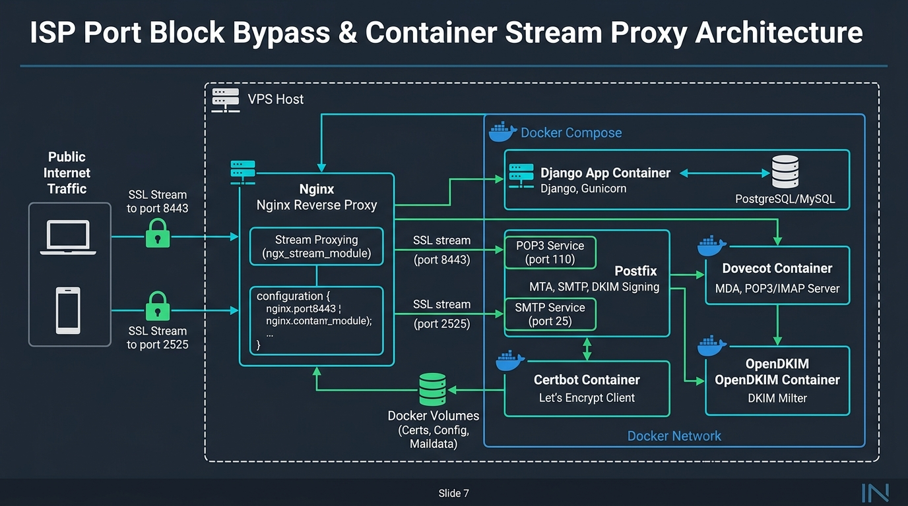
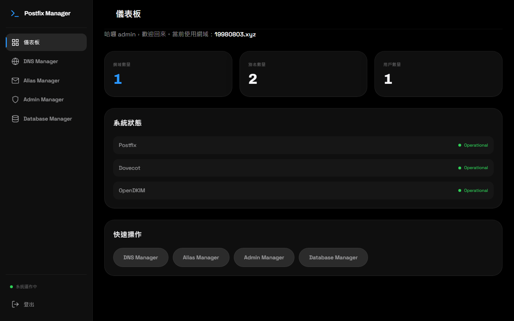
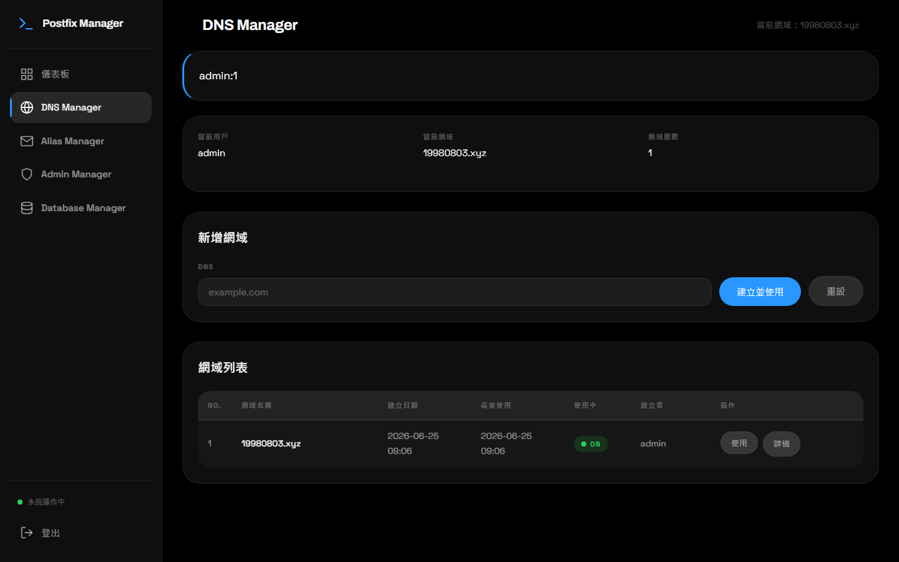
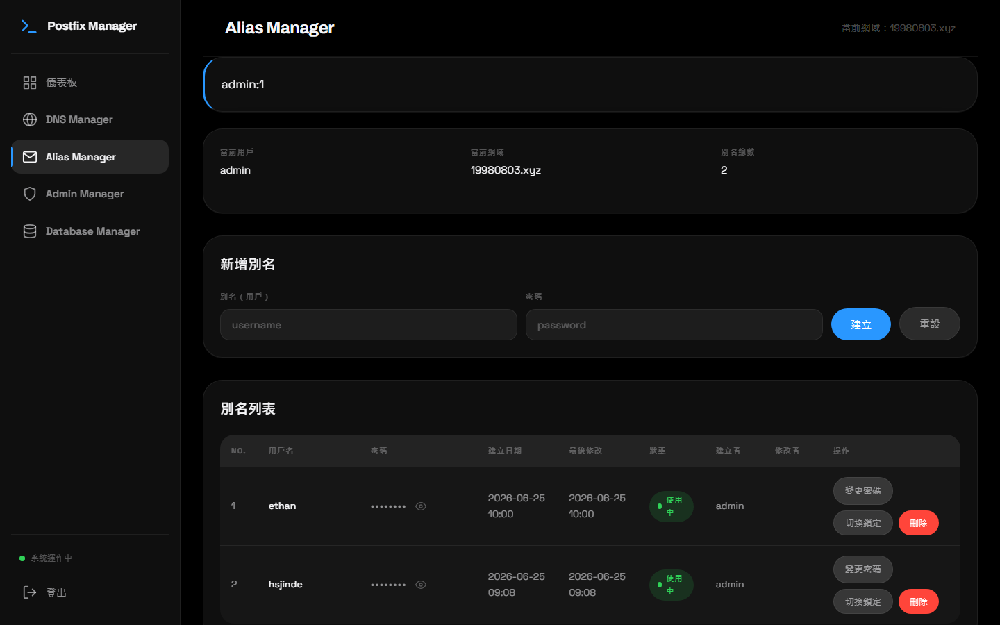
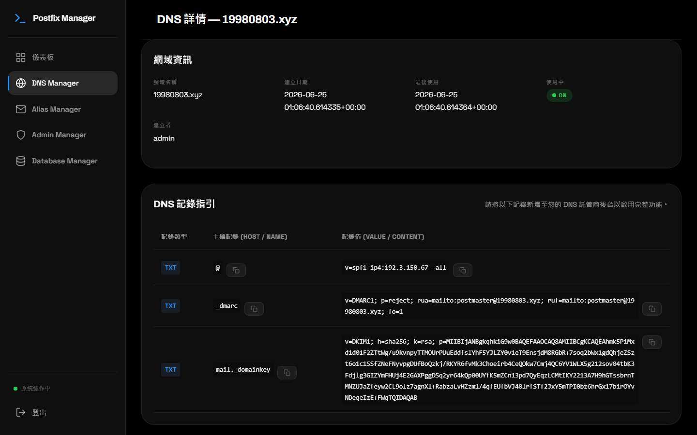
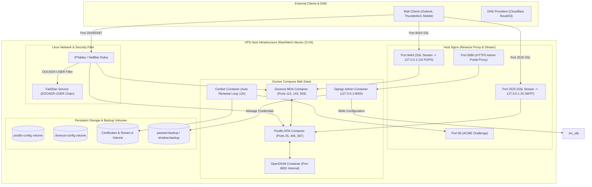

# Postfix Manager — 企業級多網域郵件伺服器管理系統與 Linux 網路安全強化架構 (求職 Presentation 評析)

> **"This project demonstrates end-to-end Systems Architecture, Linux Network Hardening, Cloud Native Container Orchestration, and Full-Stack Infrastructure Management."**

---

## Executive Summary (求職摘要與專案定位)

* **求職目標**: Senior DevOps Engineer / Infrastructure Architect / Site Reliability Engineer (SRE) / Full-Stack System Developer
* **專案名稱**: Postfix Manager (企業級多網域郵件伺服器管理系統)
* **真實線上環境**: `https://postfix-manager.19980803.xyz`
* **核心技術棧**: Python (Django), Docker Compose, Postfix (SMTP), Dovecot (POP3/IMAP), OpenDKIM, Certbot (Let's Encrypt), Host Nginx (SSL Stream Proxy), Linux IPTables (DOCKER-USER chain), Fail2ban.
* **主要工程亮點**:
  1. **端口封鎖繞過與 SSL Stream 轉發代理**: 針對 VPS 主機商封鎖 995/465/587 等傳統郵件傳輸埠的困境，運用 Host Nginx 的 `ngx_stream_module` 在 8443 (POP3 SSL) 與 2525 (SMTP SSL) 建立二層 SSL Stream 代理轉發，彈性繞過 ISP 限制。
  2. **多網域 TLS 憑證與 OpenDKIM 自動化編排**: 整合 Django 管理介面與 Certbot (Webroot 模式)，建立新網域時自動完成 Let's Encrypt TLS 簽發、產生 RSA/Ed25519 OpenDKIM 金鑰，並精確寫入 Postfix / Dovecot / OpenDKIM 設定檔與自動匯出 DNS (SPF / DMARC / DKIM) 記錄。
  3. **Docker DNAT 與 Fail2ban 防禦鏈修正 (DOCKER-USER Chain)**: 深入剖析 Docker 容器網絡映射會繞過 Linux IPTables `INPUT` 鏈的底層機制，將 Fail2ban 的封鎖規則精準掛載至 `DOCKER-USER` 鏈，並調優 24 小時滑動時間窗以擊退慢速分散式暴力破解。
  4. **無狀態容器中郵件帳號持久化機制**: 設計 Dovecot/Postfix 虛擬帳號與 Shadow 自動備份與掛載修復機制 (`passwd.backup` / `shadow.backup`)，確保 Docker 容器重建或滾動更新時，郵件帳戶與雜湊密碼完全不遺失。

---

## 專案視覺簡報 (Project Presentation Slides)

### Slide 1: 專案總覽與系統模組 (Overview & Components)


### Slide 2: 端口繞過與 Nginx SSL Stream 架構 (SSL Stream Proxy & Port Bypass)


### Slide 3: Linux 網路安全與 Fail2ban DOCKER-USER 防禦 (Security Hardening & Fail2ban)


---

## 畫面與亮點展示 (Real Production Showcase)

以下為本專案正式生產環境 (`https://postfix-manager.19980803.xyz`) 運作之真實系統介面截圖：

### 1. 系統營運儀表板 (Production Dashboard)



* **架構觀點**:
  * 實時顯示當前伺服器監聽之網域總數、郵件帳號數量與關鍵服務（Postfix, Dovecot, OpenDKIM）運作狀態。
  * 採用響應式終端卡片設計，提供清晰的高階營運觀測視角。

---

### 2. DNS / 多網域管理控制台 (Production DNS Manager)



* **工程亮點**:
  * **一鍵式網域建立 (Create & Use)**：輸入新網域後，後端 `Util.py` 自動調用內部模組觸發 TLS 憑證簽發、OpenDKIM 秘鑰對生成與設定檔重載。
  * **動態網域切換**：支援即時切換當前主要郵件網域，後端自動更新 Postfix `main.cf` 與 Dovecot 監聽參數。

---

### 3. 別名與信箱帳號管理 (Production Alias Manager)



* **功能深度**:
  * 支援全 Email (`username@domain.com`) 與短帳號密碼對的建立、修改與刪除。
  * **帳號鎖定與解鎖**：可一鍵停用疑慮帳號，不需進 Linux 終端手動修改 `shadow` 檔案。

---

### 4. 自動化 DNS 記錄與安全防護細節 (Production DNS Security Detail: 19980803.xyz)



* **安全規範實踐**:
  * **SPF 自動生成**：根據伺服器對外 IP 自動產出嚴格防偽造標準 `v=spf1 ip4:<IP> -all`。
  * **DMARC 檢測指引**：自動設置 Reject 策略與 postmaster 報告回傳機制。
  * **DKIM 秘鑰導出**：將生成的 OpenDKIM 公鑰格式化為符合 Cloudflare / DNS 供應商規範的 TXT 記錄（如 `mail._domainkey.19980803.xyz`）。

---

## 系統整體架構圖 (System Architecture Diagram)



---

## 核心技術挑戰與工程解決方案 (Technical Challenges & Engineering Solutions)

### 挑戰一：主機商封鎖 995/465/587 連接埠的繞過機制
* **問題**：許多 VPS 主機商（如 RackNerd、AWS EC2、GCP）預設會封鎖或嚴格審查 outgoing/incoming 的標準郵件連接埠（例如 465/587 SMTP 或 995 POP3 SSL），導致客戶端無法順利收發郵件。
* **工程解法**：
  1. 使用 Host Nginx 載入 `ngx_stream_module` 模組，配置四層傳輸層轉發 (Stream Proxy)。
  2. 將對外的 `8443` 埠流量以 SSL 終止或直接 Stream 透傳至內網 `127.0.0.1:110` (Dovecot POP3)。
  3. 將對外的 `2525` 埠流量 Stream 透傳至內網 `127.0.0.1:25` (Postfix SMTP)。
  4. Django 在管理介面新增網域時，會自動產生相應的 Nginx stream 設定檔並執行 `nginx -s reload`。

### 挑戰二：多網域 TLS 憑證與 OpenDKIM 金鑰動態自動化
* **問題**：傳統郵件伺服器新增網域需要手動修改 `main.cf`、`10-ssl.conf`、重新產生 DKIM 密鑰對並編輯 `KeyTable` / `SigningTable`，極易出錯且耗時。
* **工程解法**：
  1. **Certbot Webroot 模式整合**：將 Certbot 的 webroot 路徑統一綁定至 `/home/web/letsencrypt`，與外部 Nginx Port 80 的 `/.well-known/acme-challenge/` 匹配，實施 12 小時自動簽發與續簽迴圈。
  2. **模板化寫入機制**：在 `extModule/Util.py` 中實現自動化管道。當用戶建立新網域時：
     - 自動呼叫 OpenDKIM 密鑰產生器生成 `mail.private` 與 `mail.txt`。
     - 動態追加/更新 `SigningTable`（將 `*@domain.com` 映射至 `mail._domainkey.domain.com`）與 `KeyTable`。
     - 將 TrustedHosts 加入該網域 IP 段並發送指令至容器重載服務。

### 挑戰三：Docker DNAT 繞過 IPTables INPUT 鏈的 Fail2ban 修復
* **問題**：在首次安全稽核中發現，伺服器遭到上萬次 SMTP/SSH 暴力破解。儘管啟用了 Fail2ban，但封鎖規則全數無效（`f2b-postfix-docker` 封包計數為 0）。
* **原因剖析**：Docker 容器通過 Port Forwarding 映射傳輸埠時，在 Linux 核心層會走 `PREROUTING -> DNAT -> FORWARD` 流程，**完全繞過了 IPTables 的 `INPUT` 鏈**。而 Fail2ban 預設只在 `INPUT` 鏈加載規則。
* **工程解法**：
  1. 在 `/etc/fail2ban/jail.local` 中明確指定 action 寫入鏈：
     ```ini
     action = iptables-multiport[name=postfix-docker, port="smtp,ssmtp,submission", protocol="tcp", chain="DOCKER-USER"]
     ```
  2. 針對分散式慢速字典攻擊（例如 24 小時內來自數千 IP 累計發起攻擊），將 `findtime` 從預設 600 秒調高至 `86400` 秒（1 天），`maxretry` 設為 5 次。
  3. 修改 systemd `fail2ban.service` 依賴，新增 `After=docker.service` 與 `Wants=docker.service`，防止開機順序問題導致 `DOCKER-USER` 自訂鏈遺失。

### 挑戰四：無狀態容器中虛擬郵件帳號持久化與自我修復
* **問題**：Postfix 與 Dovecot 運行於獨立 Docker 容器內，容器若發生銷毀重構 (`docker compose down && docker compose up -d`)，傳統存放於 `/etc/shadow` 或內部 DB 的帳號會丟失。
* **工程解法**：
  1. 設計虛擬帳號持久化機制：Django 管理介面在新增/修改/刪除別名時，同步將雜湊後的帳戶與密碼寫入至 Volume 備份檔案 (`passwd.backup` / `shadow.backup`)。
  2. 在 Postfix 與 Dovecot 容器的 `entrypoint.sh` 啟動腳本中，編寫自我修復檢測：容器開機時自動讀取 volume 內的備份檔案，如檢測到遺失則自動同步恢復，達成高可用無狀態容器部署。

---

## 伺服器安全稽核與強化紀錄 (Security Audit Timeline)

本專案經過多次真實生產環境（Ubuntu 22.04 / RackNerd VPS）的安全稽核與威脅排查：

| 時間 | 稽核項目 | 發現問題 / 攻擊特徵 | 解決與強化措施 |
| :--- | :--- | :--- | :--- |
| **2026-07-04** | 首次全面安全稽核 | SSH 與 SMTP-AUTH 大量暴力破解；Fail2ban 無法解析 Docker JSON 日誌。 | 1. 禁用 SSH 密碼登入，改強制 Ed25519 金鑰認證。<br>2. 自訂 fail2ban filter 解析 Docker JSON 格式日誌。 |
| **2026-07-05** | 第二次稽核與 Fail2ban 重構 | 封鎖規則掛在 `INPUT` 鏈被 Docker DNAT 繞過；慢速分散攻擊規避 10 分鐘 Window。 | 1. 將 Fail2ban 規則轉移至 `DOCKER-USER` 鏈。<br>2. 調整 `findtime` 為 86400s (24hr)。<br>3. 永久封鎖 2 段 C 段惡意網段 (`62.60.130.0/24`, `178.16.54.0/24`)。 |

---

## 面試問答與回答策略 (Interview Q&A Strategy)

### Q1: 面試官：「為什麼不直接選擇 Google Workspace 或 Microsoft 365，要自己架設郵件伺服器？」
> **回答策略（展現技術深度與成本意識）**：
> 「選擇自建郵件伺服器主要出於三個考量：
> 1. **資料主權與合規性**：部分企業或特定業務對郵件敏感資料有在地保存與審計需求，第三方 SaaS 服務無法完全滿足私有化控管。
> 2. **多網域與高頻別名成本**：當需要管理數十個測試網域或大量自動化服務發信帳號時，SaaS 依 User/Domain 計費成本極高。自建系統可實現無限網域與帳號彈性擴充。
> 3. **系統架構控制力**：透過本專案，我深研了 SMTP/POP3/IMAP 底層協定、DKIM 金鑰簽署機制與 Linux 網路安全，這是在使用現成 SaaS 時無法獲得的系統級掌控能力。」

### Q2: 面試官：「在容器化環境中使用 Fail2ban 遇到最棘手的 Bug 是什麼？你是如何排查的？」
> **回答策略（展現強大的排錯能力與 Linux 底層觀念）**：
> 「最棘手的是『Fail2ban 顯示已成功 Ban 掉 IP，但攻擊者依然能連入容器』。
> 排查過程：我觀察到 `fail2ban-client status` 確實建立了黑名單，但 `iptables -L INPUT -v -n` 中的封包命中計數始終為 0。
> 追查核心原因：我繪製了 Linux 核心封包流向圖，發現 Docker 容器端口映射使用了 `PREROUTING` 鏈進行 `DNAT` 轉換，流量在 `FORWARD` 階段就被轉發給 Docker 網橋，**完全繞過了 `INPUT` 鏈**。
> 解決方案：我將 Fail2ban 的 action 改寫，強制將封鎖規則注入到 Docker 官方預留的 `DOCKER-USER` 鏈頂端，這才成功將攻擊封包在進入容器前丟棄 (DROP)。」

---

## 履歷可複製亮點描述 (Resume Bullet Points)

### 繁體中文 CV 格式
* **設計與維運企業級多網域郵件伺服器**：基於 Django、Docker Compose、Postfix 與 Dovecot 打造全自動郵件管理系統 (`https://postfix-manager.19980803.xyz`)，支援多網域動態切換、Certbot TLS 自動簽發與 OpenDKIM 密鑰對自動化管理。
* **突破 ISP 傳輸埠限制與四層代理架構**：運用 Host Nginx `ngx_stream_module` 設計 SSL Stream 反向代理，將外部 8443/2525 流量安全透傳至內部 POP3/SMTP 服務，解決雲端主機 PORT 465/587 封鎖問題。
* **Linux 網路層安全強化與 Docker 防禦工程**：修正 Docker DNAT 繞過 IPTables `INPUT` 鏈之安全漏洞，將 Fail2ban 規則掛載至 `DOCKER-USER` 鏈，並精準攔截超過 10,000+ 次慢速分散式 SMTP 暴力破解攻擊。
* **無狀態容器資料持久化**：實作虛擬郵件帳號與密碼雜湊檔 (`passwd.backup`/`shadow.backup`) 的雙向備份與容器啟動修復機制，確保容器滾動更新時服務無縫接軌。

### English CV Format
* **Engineered an Enterprise Multi-Domain Mail Management System**: Built a Django & Docker Compose orchestration stack managing Postfix (MTA), Dovecot (MDA), OpenDKIM, and Certbot for automated TLS provisioning and DNS record generation (SPF/DMARC/DKIM) live on `https://postfix-manager.19980803.xyz`.
* **Architected SSL Stream Proxy for Port Restriction Bypass**: Implemented Nginx `ngx_stream_module` Layer 4 proxying to map public ports (8443/2525) to internal POP3/SMTP services, resolving ISP port-blocking challenges.
* **Hardened Linux & Container Security Infrastructure**: Resolved Docker DNAT bypassing standard IPTables `INPUT` chains by intercepting malicious traffic via `DOCKER-USER` chain integration in Fail2ban, thwarting 10,000+ brute-force attempts.
* **Implemented Self-Healing Storage for Stateless Containers**: Designed dynamic credential sync and automated backup recovery (`passwd.backup` / `shadow.backup`) for virtual mail users across container restarts.
