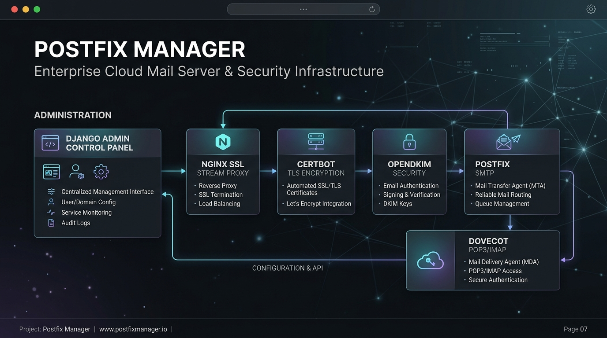
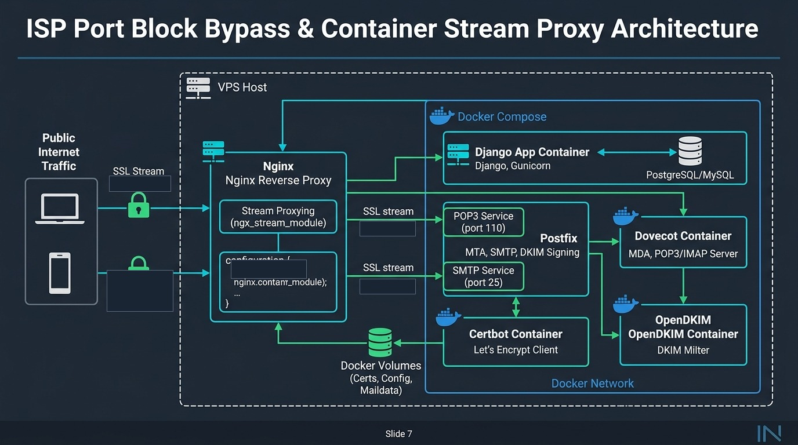
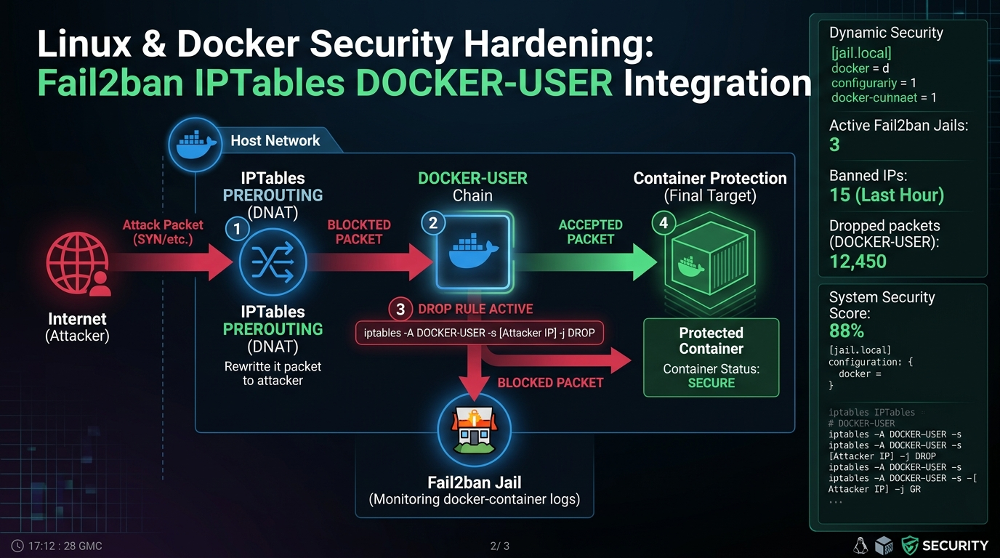
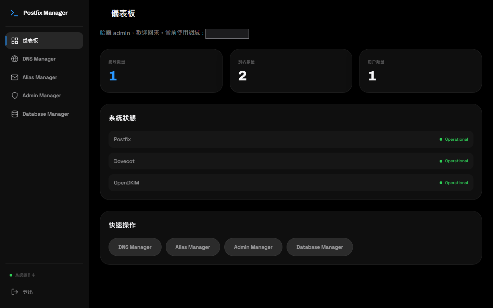
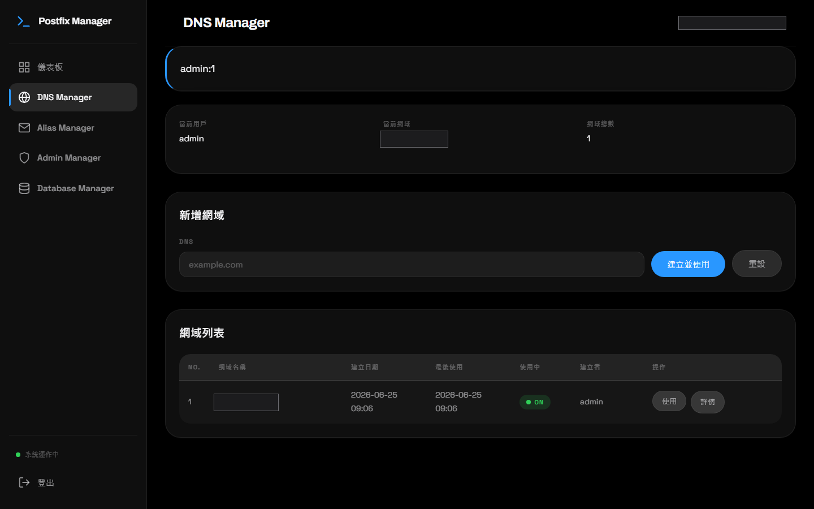
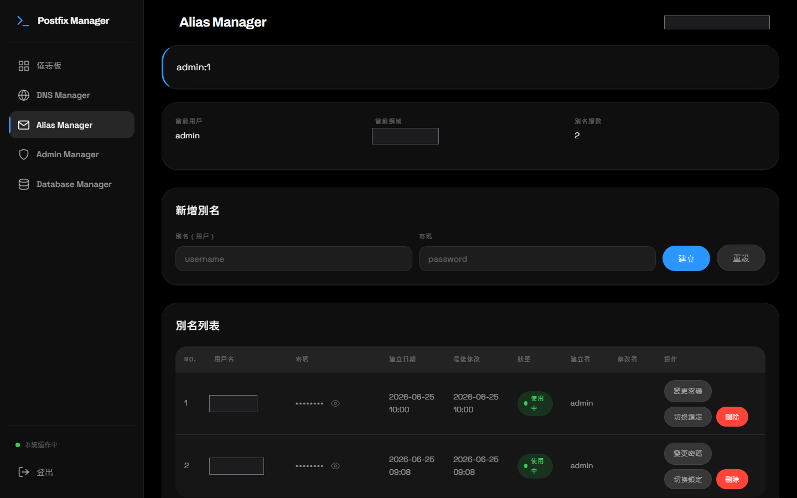
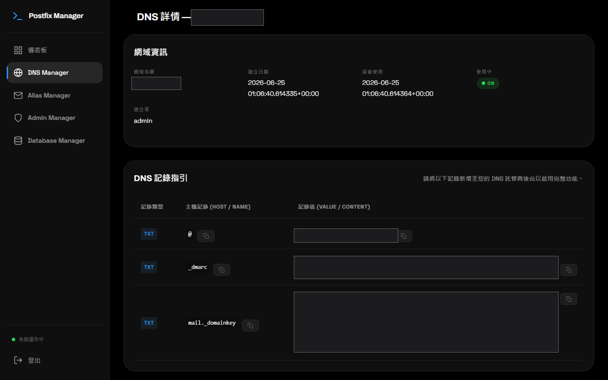
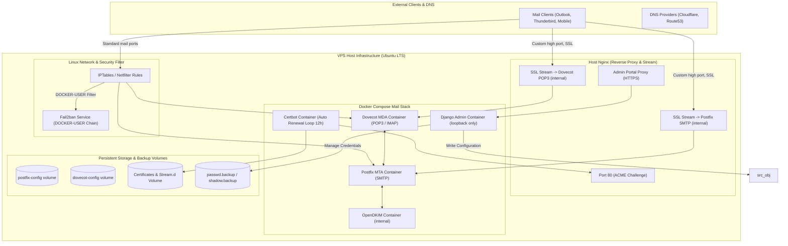

# Postfix Manager — 多網域郵件伺服器管理系統與 Linux 網路安全強化架構

> 自架郵件伺服器的管理層：Django 介面負責新增網域時的 TLS 簽發、DKIM 金鑰與設定檔編排，底層以 Docker Compose 跑 Postfix / Dovecot / OpenDKIM。
>
> **本頁已脫敏（文字 + 圖片）**：管理介面網址、對外埠與內網服務的精確映射、主機商與 OS 版本、封鎖網段抽換為概念性描述；截圖中的網域、對外 IP、郵件帳號名與架構圖上的埠號以實心色塊遮蔽。面試時可口頭補回細節。

---

## 求職摘要

* **求職目標**：Senior DevOps Engineer / Infrastructure Architect / Site Reliability Engineer (SRE) / Full-Stack System Developer
* **運行狀態**：自有網域生產環境長期運行中（管理介面走 HTTPS 反向代理，不對外公開路徑）
* **技術棧**：Python (Django)、Docker Compose、Postfix (SMTP)、Dovecot (POP3/IMAP)、OpenDKIM、Certbot、Host Nginx (SSL Stream Proxy)、IPTables (DOCKER-USER chain)、Fail2ban
* **主要工程亮點**（完整拆解見下方〈四個工程決策〉）
  1. **端口封鎖繞過**：Nginx `ngx_stream_module` 四層 SSL Stream 代理，繞過主機商封鎖的郵件埠。
  2. **多網域 TLS 與 OpenDKIM 自動化編排**：新增網域一鍵完成憑證簽發、金鑰產生、設定檔寫入與 DNS 記錄匯出。
  3. **Docker DNAT 與 Fail2ban 防禦鏈修正**：把封鎖規則從被繞過的 `INPUT` 鏈移到 `DOCKER-USER` 鏈。
  4. **無狀態容器中的帳號持久化**：虛擬帳號與密碼雜湊雙向備份，容器重建自我修復。

---

## 專案簡報圖

### Slide 1：專案總覽與系統模組


### Slide 2：端口繞過與 Nginx SSL Stream 架構


### Slide 3：Linux 網路安全與 Fail2ban DOCKER-USER 防禦


---

## 系統畫面

以下皆為生產環境實際運作的管理介面。

### 1. 營運儀表板



顯示當前監聽的網域總數、郵件帳號數量，以及 Postfix / Dovecot / OpenDKIM 三個服務的運作狀態。

### 2. DNS 與多網域管理



輸入新網域後，後端 `Util.py` 自動串起 TLS 憑證簽發、OpenDKIM 金鑰對生成與設定檔重載。也支援即時切換當前主要網域，Postfix `main.cf` 與 Dovecot 監聽參數會同步更新。

### 3. 別名與信箱帳號管理



支援全 Email 與短帳號兩種形式的建立、修改、刪除。要停用可疑帳號直接在介面上鎖定，不必進 Linux 終端改 `shadow`。

### 4. 自動化 DNS 記錄



SPF 依伺服器對外 IP 自動產出 `v=spf1 ip4:<IP> -all`；DMARC 預設 reject 策略並設定 postmaster 回報；DKIM 公鑰格式化成 DNS 供應商可直接貼上的 TXT 記錄（`mail._domainkey.<domain>`）。

---

## 系統架構



---

## 四個工程決策

### 1. 繞過主機商的郵件埠封鎖

多數 VPS 主機商（AWS EC2、GCP 與各家低價 VPS）預設封鎖或嚴格審查 465/587 SMTP 與 995 POP3 SSL，客戶端根本連不進來。

作法是讓 Host Nginx 載入 `ngx_stream_module` 做四層轉發：挑未被封鎖的高位埠當對外入口，以 SSL 終止或直接 stream 透傳到 loopback 上的 Dovecot 與 Postfix。郵件客戶端（Outlook / Thunderbird / 手機）只需改連接埠設定，協定行為完全不變。Django 新增網域時會自動產生對應的 Nginx stream 設定檔並 `nginx -s reload`。

### 2. 多網域 TLS 與 OpenDKIM 自動化

傳統做法新增一個網域要手改 `main.cf`、`10-ssl.conf`、重產 DKIM 金鑰對、編輯 `KeyTable` 與 `SigningTable`——步驟多且容易漏。

* **Certbot webroot 整合**：webroot 統一綁到 `/home/web/letsencrypt`，對應外部 Nginx port 80 的 `/.well-known/acme-challenge/`，12 小時一輪自動簽發與續簽。
* **模板化寫入**（`extModule/Util.py`）：建立網域時自動產生 `mail.private` 與 `mail.txt`，更新 `SigningTable`（`*@domain.com` → `mail._domainkey.domain.com`）與 `KeyTable`，把網域 IP 段加進 TrustedHosts，最後送指令重載容器服務。

### 3. Fail2ban 被 Docker DNAT 繞過

首次安全稽核時發現伺服器遭上萬次 SMTP/SSH 暴力破解，Fail2ban 明明啟用了，但封鎖規則完全沒作用——`f2b-postfix-docker` 的封包計數是 0。

原因在 Linux 核心的封包路徑：Docker 做 port forwarding 時走 `PREROUTING → DNAT → FORWARD`，**完全不經過 `INPUT` 鏈**，而 Fail2ban 預設只往 `INPUT` 掛規則。

修法三件事：

1. `jail.local` 明確指定 action 寫入的 chain（關鍵是 `chain="DOCKER-USER"`，不是預設的 `INPUT`）：
   ```ini
   action = iptables-multiport[name=postfix-docker, port="<mail ports>", protocol="tcp", chain="DOCKER-USER"]
   ```
2. 對付分散式慢速字典攻擊（24 小時內數千 IP 輪流試），`findtime` 從預設 600 秒拉到 `86400`，`maxretry` 設 5。
3. systemd 加上 `After=docker.service` 與 `Wants=docker.service`，避免開機順序造成 `DOCKER-USER` 鏈遺失。

### 4. 無狀態容器中的帳號持久化

Postfix 與 Dovecot 跑在獨立容器裡，一旦 `docker compose down && up`，存在 `/etc/shadow` 或容器內 DB 的帳號就沒了。

作法是雙向備份加自我修復：Django 在新增/修改/刪除別名時，同步把雜湊後的帳戶密碼寫進 volume 備份檔（`passwd.backup` / `shadow.backup`）；容器的 `entrypoint.sh` 開機時檢查，發現帳號遺失就自動從備份還原。

---

## 安全稽核紀錄

生產環境（Ubuntu LTS / VPS）的兩次稽核與排查：

| 時間 | 稽核項目 | 發現問題 / 攻擊特徵 | 解決與強化措施 |
| :--- | :--- | :--- | :--- |
| **2026-07-04** | 首次全面安全稽核 | SSH 與 SMTP-AUTH 大量暴力破解；Fail2ban 無法解析 Docker JSON 日誌。 | 1. 禁用 SSH 密碼登入，改強制 Ed25519 金鑰認證。<br>2. 自訂 fail2ban filter 解析 Docker JSON 格式日誌。 |
| **2026-07-05** | 第二次稽核與 Fail2ban 重構 | 封鎖規則掛在 `INPUT` 鏈被 Docker DNAT 繞過；慢速分散攻擊規避 10 分鐘 window。 | 1. 將 Fail2ban 規則轉移至 `DOCKER-USER` 鏈。<br>2. 調整 `findtime` 為 86400s (24hr)。<br>3. 針對兩段持續攻擊的 /24 網段實施永久封鎖。 |

---

## 面試問答

### Q1：為什麼不用 Google Workspace 或 Microsoft 365，要自己架？

> 「三個考量：
> 1. **資料主權**：部分業務對郵件資料有在地保存與稽核需求，第三方 SaaS 無法完全滿足私有化控管。
> 2. **成本結構**：要管數十個測試網域或大量自動化發信帳號時，SaaS 依 user/domain 計費會很貴，自建可以彈性擴充。
> 3. **掌控力**：做完這個專案我摸熟了 SMTP/POP3/IMAP 協定、DKIM 簽署機制與 Linux 網路層——這是用現成 SaaS 得不到的。」

### Q2：容器化環境用 Fail2ban 遇過最棘手的 bug？

> 「『Fail2ban 顯示已經 ban 掉 IP，但攻擊者照樣連得進容器』。
> 排查是這樣：`fail2ban-client status` 確實有建黑名單，但 `iptables -L INPUT -v -n` 的封包命中計數始終是 0——規則存在卻沒有流量經過它。
> 我把 Linux 核心的封包流向畫出來，才發現 Docker 的 port 映射走 `PREROUTING` 做 `DNAT`，流量在 `FORWARD` 階段就轉給 Docker 網橋了，完全繞過 `INPUT` 鏈。
> 解法是把 Fail2ban 的 action 改寫，強制把封鎖規則注入 Docker 官方預留的 `DOCKER-USER` 鏈頂端，攻擊封包才會在進入容器前被 DROP。」

---

## 履歷描述範本

### 繁體中文

* **設計與維運多網域郵件伺服器**：基於 Django、Docker Compose、Postfix 與 Dovecot 打造全自動郵件管理系統，支援多網域動態切換、Certbot TLS 自動簽發與 OpenDKIM 密鑰對自動化管理。
* **突破 ISP 傳輸埠限制與四層代理架構**：運用 Host Nginx `ngx_stream_module` 設計 SSL Stream 反向代理，將自訂高位埠流量安全透傳至內部 POP3/SMTP 服務，解決雲端主機 PORT 465/587 封鎖問題。
* **Linux 網路層安全強化與 Docker 防禦工程**：修正 Docker DNAT 繞過 IPTables `INPUT` 鏈之安全漏洞，將 Fail2ban 規則掛載至 `DOCKER-USER` 鏈，攔截超過 10,000+ 次慢速分散式 SMTP 暴力破解攻擊。
* **無狀態容器資料持久化**：實作虛擬郵件帳號與密碼雜湊檔 (`passwd.backup`/`shadow.backup`) 的雙向備份與容器啟動修復機制，確保容器滾動更新時服務無縫接軌。

### English

* **Engineered a Multi-Domain Mail Management System**: Built a Django & Docker Compose orchestration stack managing Postfix (MTA), Dovecot (MDA), OpenDKIM, and Certbot for automated TLS provisioning and DNS record generation (SPF/DMARC/DKIM), running in production on self-owned domains.
* **Architected SSL Stream Proxy for Port Restriction Bypass**: Implemented Nginx `ngx_stream_module` Layer 4 proxying to map custom high ports to internal POP3/SMTP services, resolving ISP port-blocking challenges.
* **Hardened Linux & Container Security Infrastructure**: Resolved Docker DNAT bypassing standard IPTables `INPUT` chains by intercepting malicious traffic via `DOCKER-USER` chain integration in Fail2ban, thwarting 10,000+ brute-force attempts.
* **Implemented Self-Healing Storage for Stateless Containers**: Designed dynamic credential sync and automated backup recovery (`passwd.backup` / `shadow.backup`) for virtual mail users across container restarts.

---
*索引：[[作品集總覽]]*
