# 我如何用 PostfixManager 架設自己的郵件伺服器

> [!quote] 為什麼要自己架郵件伺服器？
> 在這個一切都雲端化的時代，為什麼還要自己架設郵件伺服器？對我來說，這不僅是技術挑戰，更是對資料主權的追求。擁有自己的郵件伺服器，意味著完全掌控自己的通訊資料，不受任何第三方服務的限制。

最近發現了一個超實用的開源專案 — **[PostfixManager](https://github.com/hsjinde/mail-server)**，讓架設郵件伺服器變得意外地簡單。今天想跟大家分享我的使用心得與完整操作流程。

---

## 一、初見 PostfixManager

第一次看到這個專案時，我被它的簡潔設計吸引住了。不像傳統郵件伺服器架設需要手動編輯一堆設定檔，PostfixManager 提供了一個完整的 Web 管理介面，讓你可以用滑鼠點點點就完成大部分設定。

### 它能做什麼？

簡單來說，PostfixManager 幫你自動化處理以下服務：

| 服務 | 用途 | 為什麼重要 |
|------|------|------------|
| **Postfix** | SMTP 郵件傳輸 | 負責郵件的發送與接收 |
| **Dovecot** | IMAP/POP3 服務 | 讓你的郵件用戶端可以連線 |
| **OpenDKIM** | 數位簽章 | 證明郵件真的是你發的，不是偽造的 |
| **Certbot** | SSL/TLS 憑證 | 加密傳輸，保護隱私 |

> [!tip] 最吸引我的地方
> 它會**自動檢查並安裝**缺少的套件，不用自己一個個 `apt install`，對新手超級友善！

### 系統架構一覽

這是整個系統的運作流程圖：

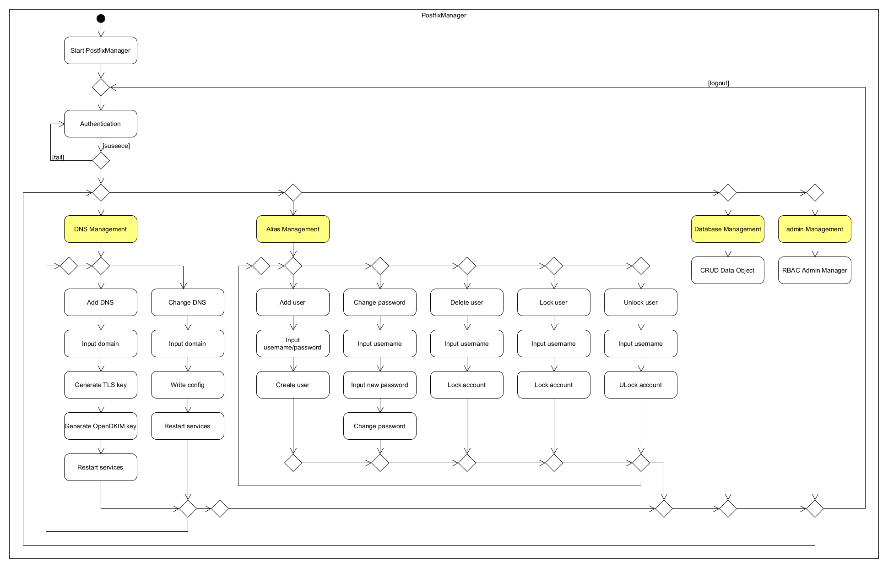

從圖中可以看到，整個系統分為幾個主要模組：
- **DNS Management**：管理域名與 DNS 記錄
- **Alias Management**：建立與管理郵件帳號
- **Database Management**：資料庫備份與還原
- **Admin Management**：管理員帳號管理

---

## 二、安裝過程：比我想像中簡單

### 準備環境

我的測試環境：
- **作業系統**：Ubuntu 20.04
- **Python**：3.8.10
- **伺服器**：一台基本的 VPS

> [!warning] 事前提醒
> 開始之前，請確認你的伺服器有 `sudo` 權限，並且以下埠號未被占用：
> - 25 (SMTP)
> - 465 (SMTPS)
> - 587 (Submission)
> - 993 (IMAPS)
> - 995 (POP3S)

### 檔案結構

下載專案後，資料夾長這樣：

```
Your Folder/
├── PostfixManager         ← 主程式
├── start_postfix.sh       ← 一鍵啟動腳本
├── requirements.txt       ← Python 依賴
└── db.sqlite3             ← 資料庫
```

### 啟動安裝腳本

只需要兩行指令：

```bash
chmod +x PostfixManager start_postfix.sh 
sudo ./start_postfix.sh
```

腳本會自動檢查系統環境，這是安裝流程：

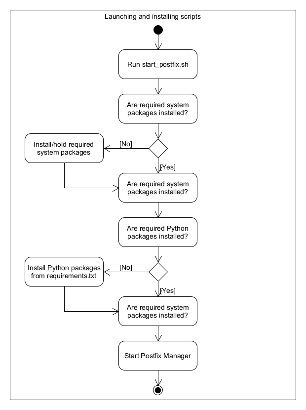

> [!note] 我的實際經驗
> 腳本執行時會自動安裝缺少的套件，整個過程大約需要 5-10 分鐘，取決於網路速度。建議在網路穩定的環境下執行。

### Postfix 初始設定

執行腳本後，會出現 Postfix 的設定畫面：

**第一步：選擇郵件伺服器類型**

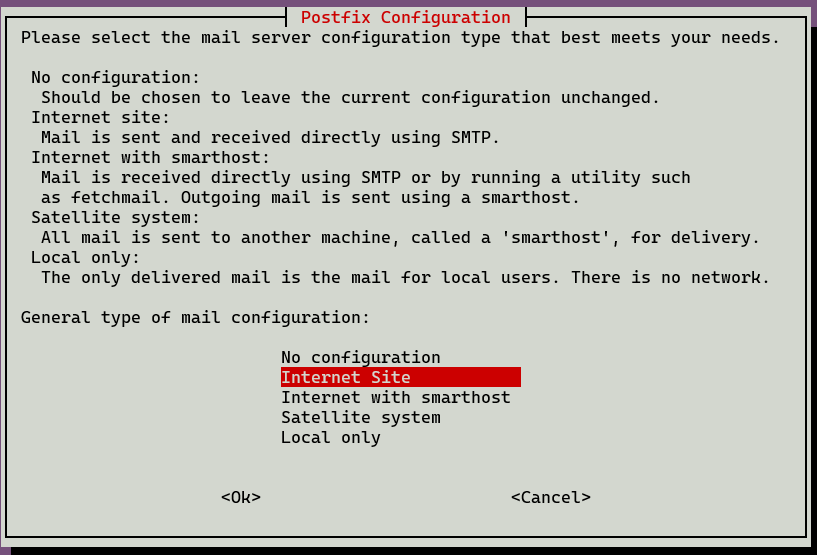

這裡要選擇 **Internet Site**，這樣郵件才能直接透過 SMTP 發送與接收。

**第二步：設定系統郵件名稱**

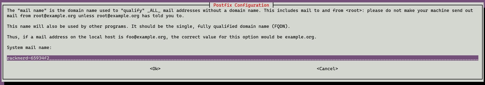

輸入你的完整網域名稱，例如 `mail.yourdomain.com`。

### 啟動成功！

看到這個畫面就代表成功了：

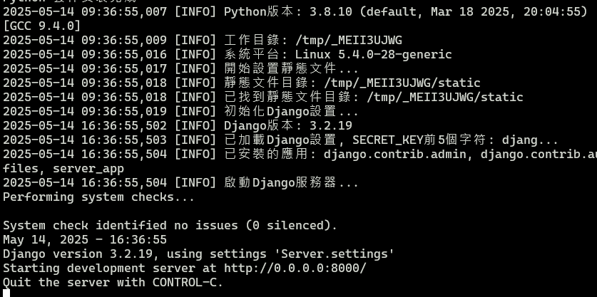

> [!success] 成功標誌
> 看到 `Starting development server at http://0.0.0.0:8000/` 就可以準備登入管理介面了！

---

## 三、管理介面初體驗

### 登入系統

開啟瀏覽器，進入 `http://你的伺服器IP:8000`，會看到登入畫面：

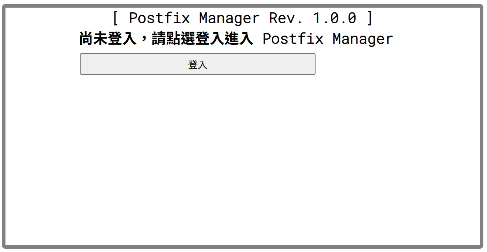

點擊「登入」後輸入預設帳號密碼：

| 欄位 | 預設值 |
|------|--------|
| Username | `admin` |
| Password | `Aa123456` |

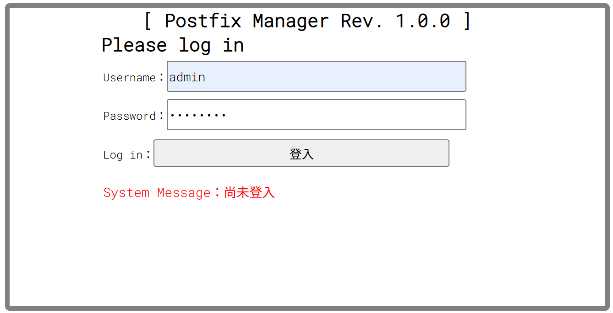

> [!danger] 安全第一！
> **登入後第一件事就是改密碼！** 預設密碼太危險了，任何人都可以猜出來。

### 修改管理員密碼

1. 進入管理後台，找到 admin 帳號：

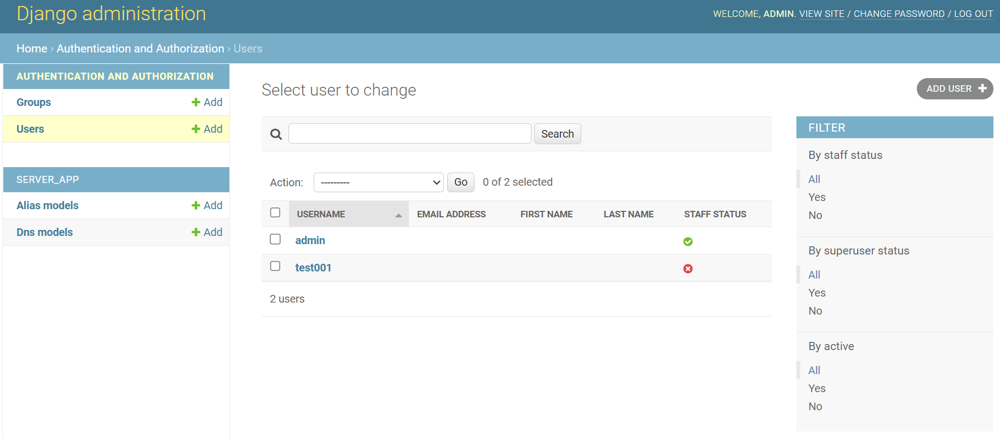

2. 點擊密碼欄位的連結：

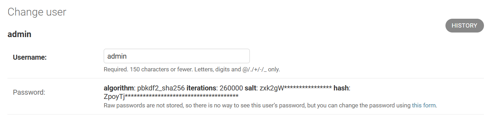

3. 輸入新密碼：

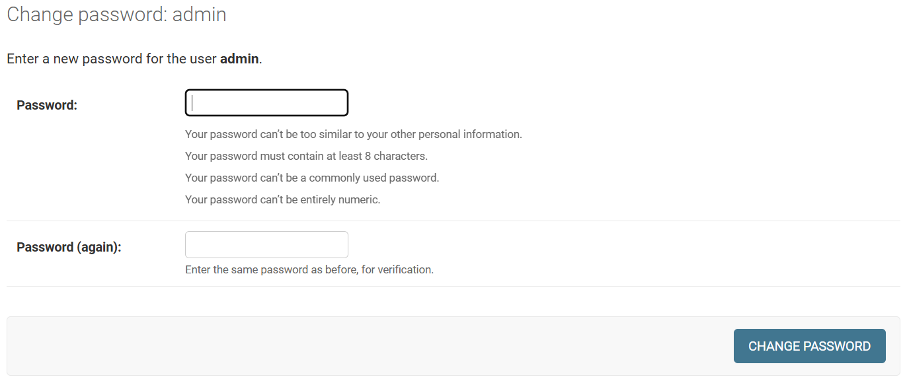

密碼要符合以下規則：
- ✅ 至少 8 個字元
- ✅ 不能太簡單（如 12345678）
- ✅ 不能與個人資訊太相似

---

## 四、域名管理：讓郵件有「家」

### 什麼是域名管理？

簡單說，就是告訴世界「我的郵件伺服器在哪裡」。這需要設定 DNS 記錄，讓其他郵件伺服器知道如何找到你。

### 主介面長這樣

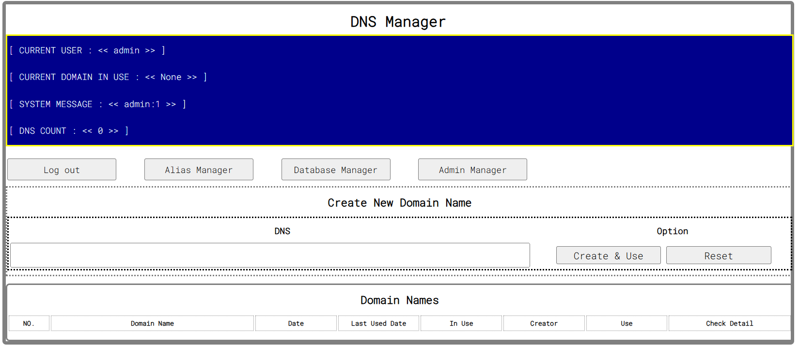

畫面上方會顯示：
- **CURRENT USER**：目前登入的帳號
- **CURRENT DOMAIN IN USE**：正在使用的域名
- **SYSTEM MESSAGE**：系統訊息
- **DNS COUNT**：已管理的域名數量

### 新增域名

輸入你想使用的域名，點擊「Create & Use」：

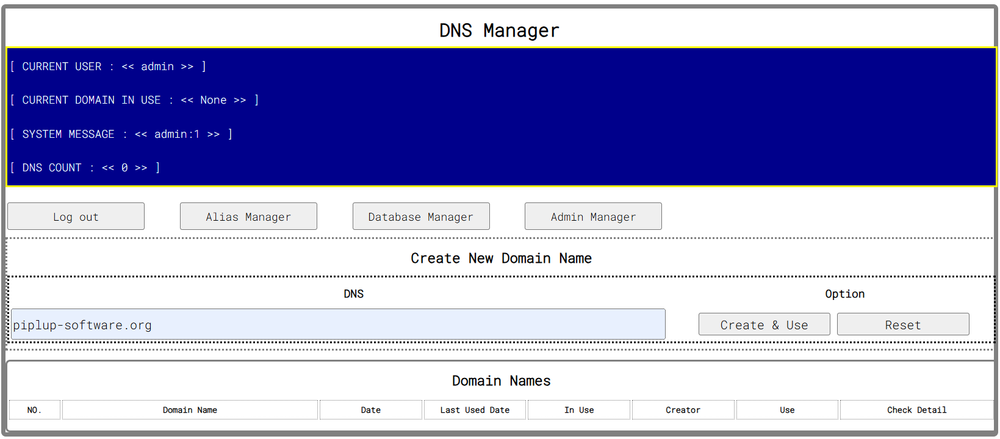

建立成功後會看到：

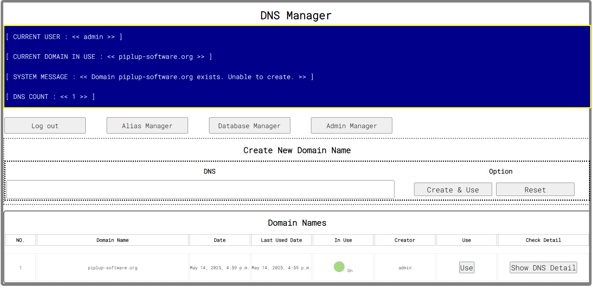

### 最重要的部分：DNS 記錄設定

系統會自動生成需要的 DNS 記錄，這是範例：


你需要設定以下幾種記錄：

| 記錄類型 | 用途 | 重要程度 |
|----------|------|----------|
| **A Record** | 指向伺服器 IP | ⭐⭐⭐⭐⭐ |
| **MX Record** | 指定郵件伺服器 | ⭐⭐⭐⭐⭐ |
| **SPF (TXT)** | 防止郵件偽造 | ⭐⭐⭐⭐ |
| **DKIM (TXT)** | 數位簽章驗證 | ⭐⭐⭐⭐ |
| **DMARC (TXT)** | 郵件驗證政策 | ⭐⭐ |

### 以 Cloudflare 為例的設定教學

> [!example] 實際操作範例
> 以下是我在 Cloudflare 上的設定步驟：

**1. 新增 A Record**


> ⚠️ **超級重要**：郵件伺服器的 A Record **一定要關閉 Cloudflare 代理**（灰色雲朵圖示），否則郵件會無法正常運作！

**2. 新增 MX Record**


Priority 設為 10，數字越小優先級越高。

**3. 新增 DMARC 記錄**


Name 填 `_dmarc`，Content 貼上系統產生的內容。

**4. 新增 DKIM 記錄**


Name 填 `mail._domainkey`，這是 DKIM 簽章的標準格式。

**5. 新增 SPF 記錄**


SPF 記錄告訴世界哪些伺服器可以代表你的域名發信。

### 驗證 DNS 設定

設定完成後，用這些指令檢查：

```bash
# 檢查 A 記錄
nslookup mail.yourdomain.com

# 檢查 MX 記錄
nslookup -type=MX yourdomain.com

# 檢查 TXT 記錄
nslookup -type=TXT yourdomain.com 8.8.8.8
nslookup -type=TXT _dmarc.yourdomain.com 8.8.8.8
nslookup -type=TXT mail._domainkey.yourdomain.com 8.8.8.8
```

> [!info] 耐心等候
> DNS 記錄通常需要 **1-24 小時** 才會完全生效，不要太心急，泡杯咖啡等一下吧 ☕

### 切換使用中的域名

如果有多个域名，可以點擊「Use」按鈕切換：

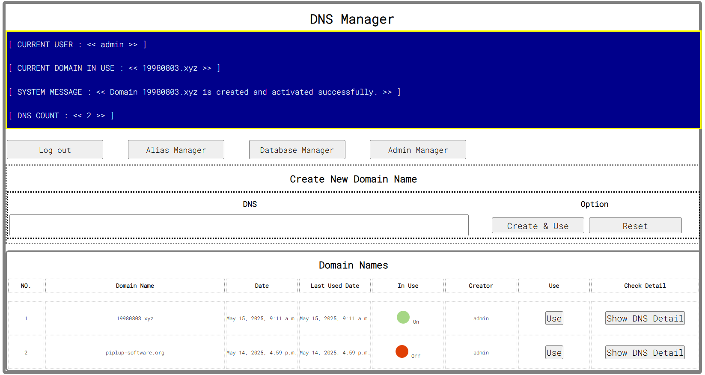

---

## 五、建立郵件帳號：Alias Management

### 什麼是 Alias？

Alias 就是你的郵件帳號，例如 `user1@yourdomain.com`。你可以建立多個帳號給不同用途使用。

### 主介面

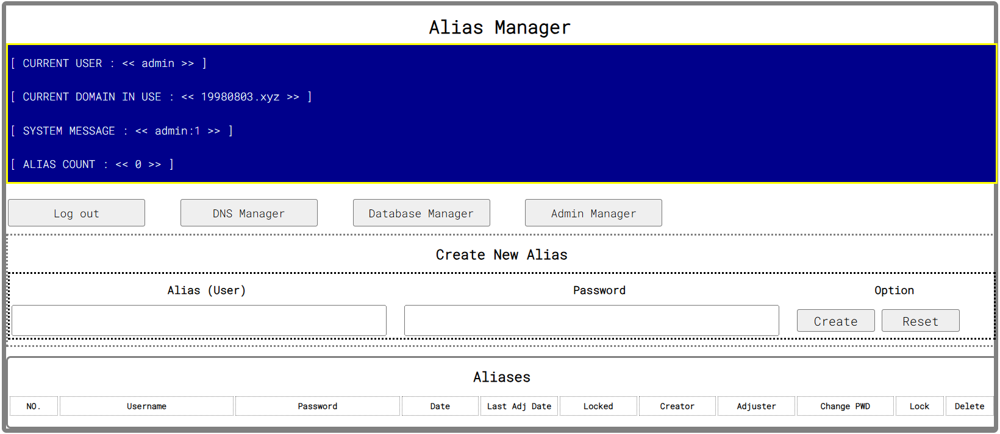

### 新增帳號

輸入帳號名稱與密碼，點擊「Create」：

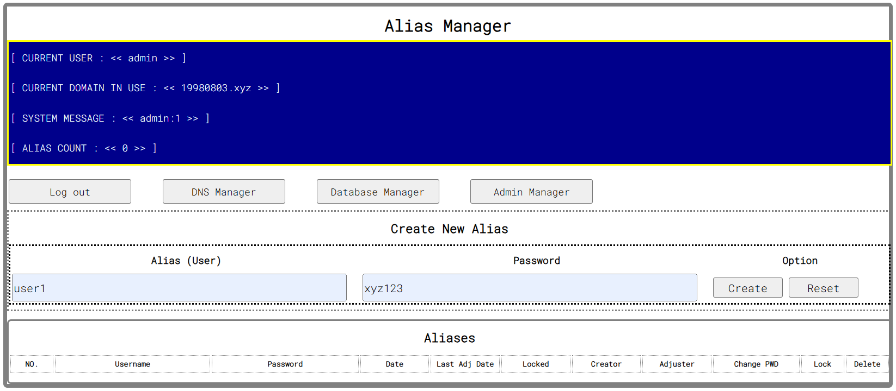

建立成功後會顯示在列表中：

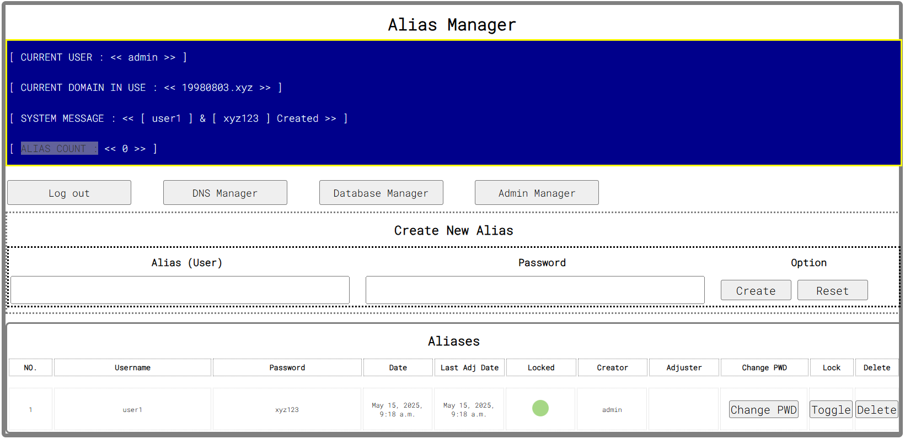

### 管理帳號功能

#### 更改密碼

點擊「Change PWD」：

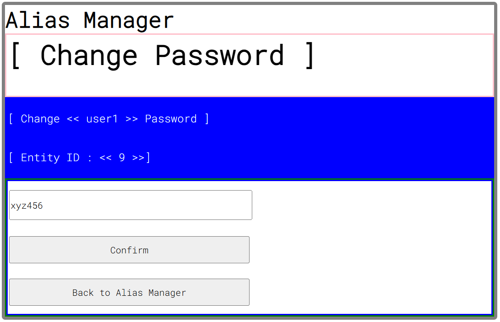

#### 鎖定/解鎖帳號

有時候需要暫時停用某個帳號，可以用鎖定功能：

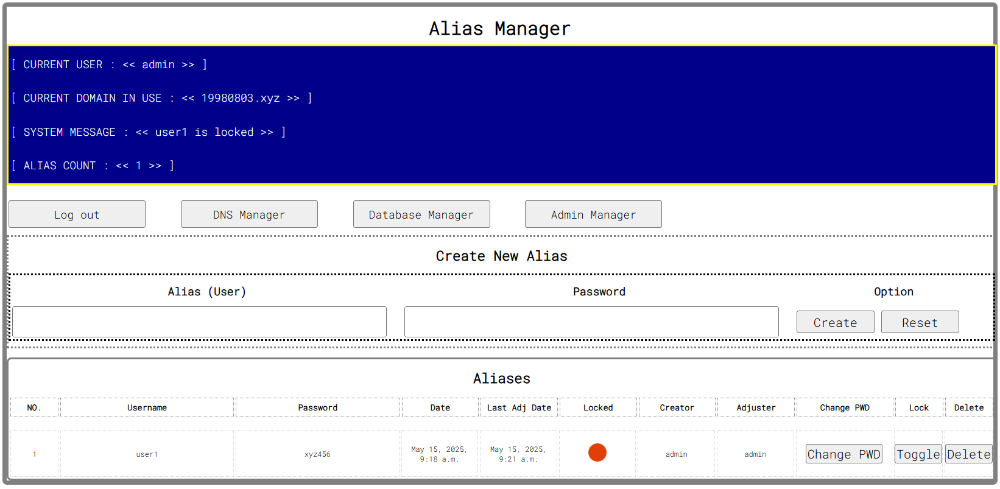

狀態指示：
- 🟢 **綠色圓點**：帳號正常運作中
- 🔴 **紅色圓點**：帳號已鎖定

解鎖後恢復正常：

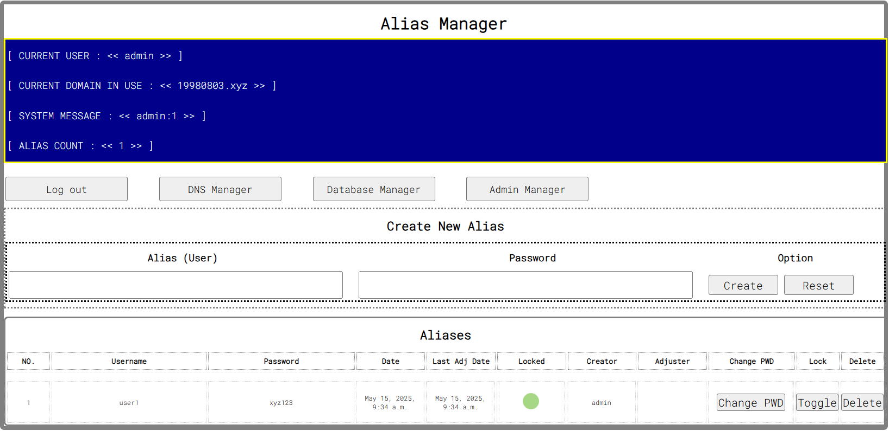

#### 刪除帳號

> [!danger] 警告
> 刪除帳號是**不可逆**的操作，請謹慎執行！

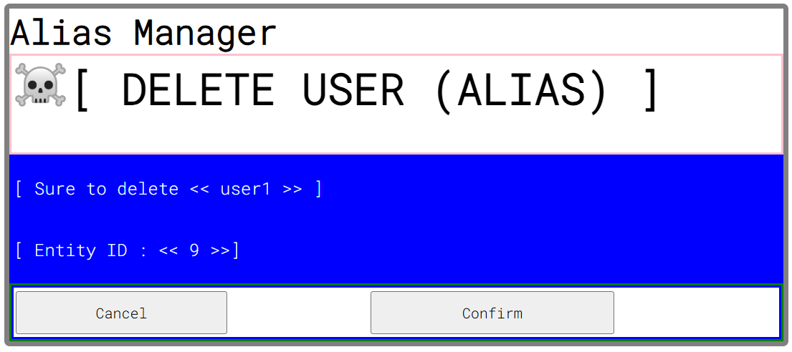

---

## 六、設定郵件用戶端：以 Outlook 為例

帳號建立好後，接下來要在你的郵件軟體上設定，這樣才能收發信。

### Outlook 設定步驟

**步驟 1：新增資料檔**

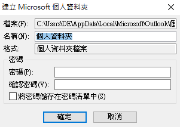

開啟 Outlook → 工具 → 帳戶設定 → 資料檔 → 新增

**步驟 2：選擇郵件服務類型**

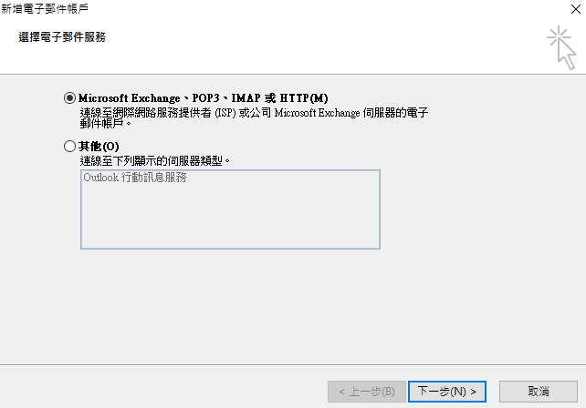

選擇「網際網路電子郵件」

**步驟 3：手動設定**

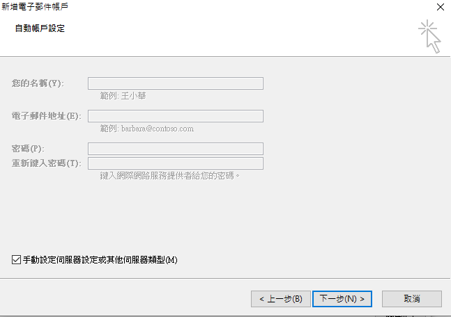

勾選「手動設定伺服器或其他伺服器類型」

**步驟 4：輸入帳號資訊**

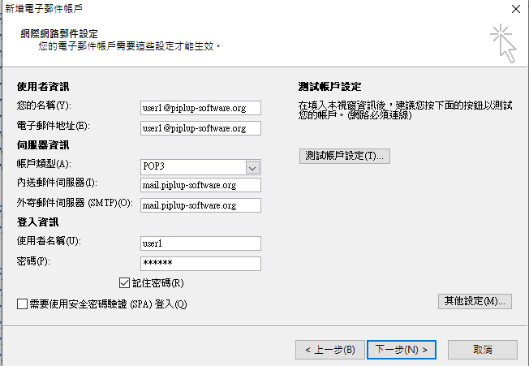

| 欄位 | 設定值 |
|------|--------|
| 您的名稱 | 你想顯示的名字 |
| 電子郵件地址 | `user1@yourdomain.com` |
| 帳戶類型 | **IMAP**（推薦）或 POP3 |
| 內送郵件伺服器 | `mail.yourdomain.com` |
| 外寄郵件伺服器 | `mail.yourdomain.com` |
| 使用者名稱 | `user1` |
| 密碼 | 你設定的密碼 |

**步驟 5：進階設定（重要！）**

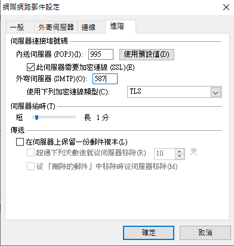

這裡的設定很關鍵：

| 設定項目 | 值 | 說明 |
|----------|-----|------|
| 內送伺服器 (POP3) | **995** | 勾選「此伺服器需要加密連線」 |
| 外寄伺服器 (SMTP) | **587** | 選擇 TLS 加密 |

> [!tip] 加密方式說明
> - **SSL/TLS**：全程加密，最安全
> - **STARTTLS**：連線後升級為加密，也推薦使用

**步驟 6：完成測試**

設定完成後，Outlook 會自動測試連線。如果看到成功訊息，恭喜你！🎉

### 建立自訂資料夾

為了方便管理郵件，可以建立自訂資料夾：

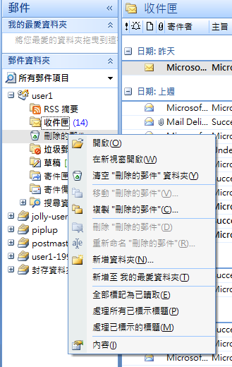

右鍵點選帳號名稱 → 新增資料夾

建議建立：
- 📥 收件匣
- 📤 寄件備份
- 📁 公司郵件
- ⭐ 重要郵件

---

## 七、我的使用心得與建議

### 優點

1. **安裝超簡單**：一鍵腳本搞定大部分設定
2. **介面直覺**：Web 管理介面對新手友善
3. **功能完整**：DKIM、SPF、DMARC 都有支援
4. **開源免費**：不用花錢就能擁有自己的郵件伺服器

### 需要注意的地方

1. **IP 信譽問題**：新 IP 發信可能被當成垃圾郵件，需要時間建立信譽
2. **DNS 設定要仔細**：一步錯可能導致郵件無法送達
3. **定期備份**：記得備份 `db.sqlite3` 資料庫檔案
4. **安全性**：定期更新密碼，留意系統更新

### 給新手的建議

> [!tip] 我的血淚經驗
> 
> 1. **先用測試域名練習**：不要一上來就用主要域名
> 2. **DNS 設定完等一天再測試**：不要急，給 DNS 時間生效
> 3. **發測試信給自己**：確認收發都正常
> 4. **檢查垃圾郵件夾**：有時候自己的信也會被當成垃圾信
> 5. **記錄所有設定**：把 DNS 記錄、密碼等記下來，以免忘記

---

## 八、常見問題 FAQ

### Q: 執行腳本時出現權限不足？

**A:** 記得加 `sudo`：
```bash
sudo ./start_postfix.sh
```

### Q: 缺少某些套件？

**A:** 可以手動安裝：
```bash
sudo apt update
sudo apt install -y postfix dovecot-core dovecot-imapd dovecot-pop3d opendkim opendkim-tools certbot
```

### Q: PostfixManager 無法啟動？

**A:** 檢查三件事：
1. 檔案是否存在於同一資料夾
2. 是否有執行權限：`chmod +x PostfixManager`
3. Python 版本是否為 3.8.10

### Q: 郵件發不出去？

**A:** 檢查清單：
- [ ] DNS 記錄是否正確
- [ ] 防火牆是否開放埠號
- [ ] SSL 憑證是否有效
- [ ] DKIM/SPF/DMARC 是否設定

### Q: 如何備份資料？

**A:** 兩種方式：
1. 使用 Web 介面的資料庫管理功能
2. 直接複製 `db.sqlite3` 檔案

---

## 結語

架設自己的郵件伺服器曾經讓我覺得是高不可攀的技術挑戰，但 PostfixManager 讓這件事變得意外地簡單。透過這個工具，我不仅學會了郵件伺服器的運作原理，更體會到「資料主權」的重要性。

> [!abstract] 總結
> 
> 如果你也想要：
> - ✅ 完全掌控自己的郵件資料
> - ✅ 學習郵件伺服器技術
> - ✅ 擁有無限的郵件帳號
> - ✅ 不受第三方服務限制
> 
> 那麼 PostfixManager 絕對值得你一試！

### 延伸閱讀

- [Postfix 官方文件](http://www.postfix.org/documentation.html)
- [Dovecot 設定指南](https://doc.dovecot.org/)
- [OpenDKIM 說明](http://opendkim.org/)
- [Let's Encrypt 憑證申請](https://letsencrypt.org/)
- [專案 GitHub](https://github.com/hsjinde/mail-server)

---

*感謝閱讀！如果這篇文章對你有幫助，歡迎分享給需要的朋友。有任何問題也歡迎到 GitHub 提出 Issue 或討論。*

**Happy Self-Hosting! 🚀**
